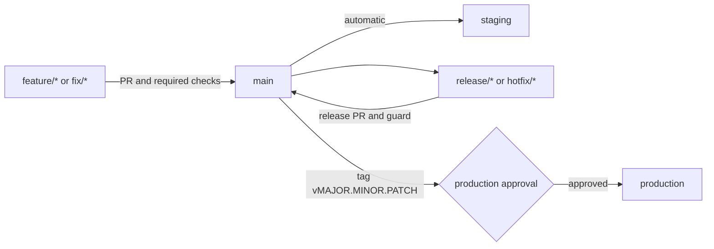

# 分支管理与自动化部署

本文档是 Health Platform 分支管理与自动化部署规则的权威说明。项目采用轻量 trunk-based development，不长期维护 `develop` 或 `staging` 环境分支。

## 分支模型

| 分支 | 用途 | 生命周期 | 部署行为 |
|---|---|---|---|
| `main` | 唯一集成主干，必须始终可部署 | 长期 | 合并后自动部署 staging |
| `feature/<scope>-<desc>` | 功能开发 | PR 合并后删除 | 不自动部署 |
| `fix/<scope>-<desc>` | 常规缺陷修复 | PR 合并后删除 | 不自动部署 |
| `release/<version>` | 准备版本文件和发布说明 | 发布后删除 | 不自动部署 |
| `hotfix/<version>` | 生产紧急修复 | 发布后删除 | 不自动部署 |

分支名使用英文小写和连字符。`release/*` 与 `hotfix/*` 的版本必须为 `MAJOR.MINOR.PATCH`，例如 `release/1.2.0`。

## 日常开发规则

1. 从最新 `main` 创建 `feature/*` 或 `fix/*`。
2. 使用 Conventional Commits 提交，代码与测试一并修改。
3. 创建目标为 `main` 的 Pull Request，不直接推送 `main`。
4. `backend-tests` 和 `frontend-build` 必须通过，且至少一名非提交者审批。
5. 合并后删除短期分支；优先使用 squash merge 保持主干历史清晰。
6. `main` 合并成功会自动构建镜像，并将该提交部署到 staging。

推荐的 `main` GitHub Ruleset 或 Branch Protection：

| 设置 | 要求 |
|---|---|
| Require a pull request before merging | 启用 |
| Required approvals | 至少 1 |
| Dismiss stale approvals | 启用 |
| Require status checks | `backend-tests`、`frontend-build` |
| Require branches to be up to date | 启用 |
| Require conversation resolution | 启用 |
| Block force pushes and deletions | 启用 |
| Include administrators / no bypass | 建议启用 |

`release-pr-guard` 只在 `release/*` 或 `hotfix/*` PR 上运行，因此不应配置为所有 PR 的全局 required check；发布类 PR 必须等待该检查成功。

## 自动化部署规则

### PR 校验

- 工作流：`.github/workflows/pr-validation.yml`
- 触发：所有目标为 `main` 的 PR。
- 门禁：后端 Pytest、前端生产构建。
- 附加门禁：`release/*` 与 `hotfix/*` 校验版本文件、变更日志和 release notes。
- 结果：仅校验，不部署。

### Staging

- 工作流：`.github/workflows/deploy-staging.yml`
- 触发：提交合并或推送到 `main`；也支持手动重部署。
- 环境：GitHub `staging` Environment。
- 镜像：自动部署固定引用 `sha-<full-commit-sha>`，避免可变标签造成版本漂移。
- 验证：等待 Kubernetes rollout 完成，再执行 Playwright 用户旅程回归。
- 并发：同一分支仅保留最新 staging 部署。

手动运行时，只有明确选择 `skip_build=true` 才会部署输入的已有 `image_tag`。该能力用于回滚或重部署，操作人必须记录目标 SHA/tag 与原因。

### Production

- 工作流：`.github/workflows/release-production.yml`
- 触发：推送 `vMAJOR.MINOR.PATCH` 标签，或手动输入同格式的已有标签。
- 前置校验：标签提交必须可从 `origin/main` 到达；Tag、`VERSION`、`CHANGELOG.md` 和 release notes 必须一致。
- 环境：GitHub `production` Environment，必须配置审批人和禁止自审。
- 镜像：使用版本标签构建，Kubernetes 部署同一版本标签。
- 验证：等待 rollout 完成，再执行生产 Playwright 回归并保存测试产物。
- 并发：生产发布不自动取消，避免部署过程被后续运行中断。

## 发布流程

1. 确认目标提交已合并到 `main`，且 staging 部署及回归成功。
2. 从最新 `main` 创建 `release/<version>`；紧急修复使用 `hotfix/<version>`。
3. 更新 `VERSION`、`CHANGELOG.md` 和 `docs/releases/RELEASE_NOTES_v<version>.md`。
4. 创建目标为 `main` 的 PR，等待常规 CI、`release-pr-guard` 和评审通过。
5. 合并后从最新 `main` 创建 annotated tag：`git tag -a v<version> -m "Release v<version>"`。
6. 推送 tag，等待 production Environment 审批。
7. 审批后核对 rollout、生产 E2E、镜像标签与线上版本接口。

禁止在功能分支上打生产标签，也禁止为绕过审批而直接调用 Kubernetes 部署脚本。

## Hotfix 与回滚

Hotfix 仍走 PR、版本校验和新版本标签，不覆盖旧标签。生产回滚优先重新运行 `Release Production` 并输入已验证的旧版本标签；回滚后立即创建修复 PR，确保 `main` 与生产状态重新收敛。

Staging 可通过 `Deploy Staging` 的 `skip_build=true` 和不可变 SHA 标签回滚。生产与 staging 的回滚都必须在 PR、Issue 或发布记录中说明原因、目标版本和验证结果。

## GitHub 配置清单

仓库管理员需要在 GitHub Settings 中完成以下一次性配置：

1. 为 `main` 创建保护规则，并按“日常开发规则”设置 required checks。
2. 创建 `staging` Environment，仅允许 `main` 分支部署，无需人工审批。
3. 创建 `production` Environment，仅允许 `v*.*.*` 标签部署，至少一名审批人并启用 Prevent self-review。
4. 将 `KUBE_CONFIG`、`KUBE_CONTEXT`、`GHCR_READ_TOKEN`、`DATABASE_URL` 和 `JWT_SECRET` 分环境保存为 Environment secrets。
5. 将 `CORS_ORIGINS` 保存为 Environment variable，禁止在工作流或仓库文件中写入密钥。

详细变量说明见 [GitHub 环境配置指南](GITHUB-ENVIRONMENT-SETUP.md)。规则变更后运行 `python -m pytest tests/test_deploy_workflow.py -q`，确保仓库中的自动化契约未被破坏。