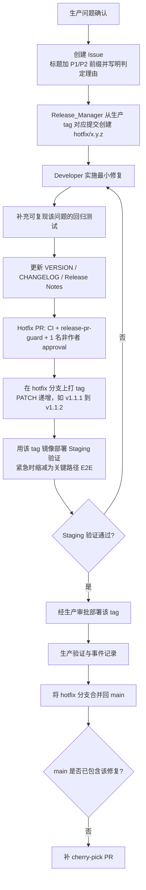

# Hotfix 流程设计草案（待讨论，尚未生效）

| 项 | 内容 |
|---|---|
| 状态 | **草案 / 待讨论**——未纳入正式流程规范，**禁止**据此执行生产操作 |
| 来源 | 由《Health Platform 项目工作流程与角色分工》v2.3–v2.6 的第 14 章拆出 |
| 拆出原因 | 团队当前聚焦 Issue 主线（新需求开发）流程；Hotfix 为低频场景，设计尚有未决问题，留在主规范中会放大冲突面并干扰主线阅读 |
| 拆出日期 | 2026-08-14 |

> **重要**：本草案规则**一律不生效**。定稿前，生产紧急问题**必须**按主规范 14.1 的过渡约定处理。

---

## 待讨论的关键问题

| # | 问题 | 备选方案 | 影响 |
|---|---|---|---|
| 1 | Hotfix 是否需要独立于常规发布的通道？ | ①不需要，紧急时走常规流程加急；②需要独立通道 | 若选①，本草案大部分内容可废弃 |
| 2 | tag 是否允许指向非 `main` 可达提交？ | ①不允许（规则单一）；②允许，作为唯一例外 | 选②将引入 tag 校验的双判定逻辑 |
| 3 | "先发布后回合" vs "先合并后发布" | 前者避免夹带未发布功能，后者流程简单 | 直接决定分支与 tag 策略 |
| 4 | 是否允许 Hotfix 携带数据库迁移？ | ①一律禁止；②仅限可逆且向后兼容 | 决定草案 14.4.6 是否保留 |
| 5 | Staging 验证能否缩减或跳过？ | ①不可跳过；②可缩减为关键路径；③极端情况可跳过并事后补 | 与 12.0 底线项的关系需一并确定 |
| 6 | 所需工程能力的投入意愿 | B-27（workflow 支持 hotfix tag）、B-28（digest 固定）、B-29（环境锁） | 无这些能力则草案不可执行 |

> **建议讨论顺序**：先定第 1 题。若结论为"不需要独立通道"，第 2～5 题自动消解，本草案可直接归档。

---

## 以下为原第 14 章内容（保留备查，不生效）

## 14. Hotfix 流程（v2 新增）

用于生产环境已发生或必然发生的严重问题，需绕过常规排期的最小修复。

### 14.1 适用与不适用

| 适用 | 不适用 |
|---|---|
| 生产 P1/P2 缺陷（判定见 2.1.5） | P3 缺陷、体验优化、新功能（走正常流程） |

### 14.2 流程



### 14.3 强制规则

1. hotfix 分支**必须**基于**当前生产版本 tag 所指向的提交**创建，而非最新 `main`。
2. **发布顺序必须是"先发布、后回合"**（v2.3 修正）：tag **必须**打在 **hotfix 分支**的提交上，并以该 tag 部署生产；**待生产验证通过后**，再将 hotfix 分支合并回 `main`。
   > **禁止**先合并到 `main` 再在 `main` 上打 tag——`main` 可能已包含尚未发布、未经门禁三验证的功能变更，那样会把它们随紧急修复一起带上生产。这是 v2.2 的缺陷。
3. 门禁一**可**豁免（不要求 `stage:reviewed`），但**必须**创建 Issue 并事后补齐需求与验收记录，最迟 `[待确认: 建议 2 个工作日]`。
4. 门禁二与门禁三**禁止**豁免，但 hotfix 的**执行顺序**与常规发布不同：
   - 打 tag 之前，Hotfix PR **必须**已满足门禁二的**全部检查条件**——required checks 全绿、至少 1 名非作者 approval、所有 conversation 已解决；
   - 此时**仅"合并"这一动作被推迟**到生产验证之后，检查条件本身一项都不减；
   - 门禁三（production Environment 审批）照常执行，不得豁免。
5. hotfix **必须**在生产验证通过后 `[待确认: 建议 1 个工作日]` 内合并回 `main`。若合并产生冲突或 `main` 已独立修复，`Release_Manager` **必须**确认修复语义已存在于 `main`，否则**必须**补一个 cherry-pick PR。**禁止**遗留只存在于生产而不在 `main` 的修复。
6. hotfix 版本号**必须**为 PATCH 递增（如 `1.1.1` → `1.1.2`）。
7. 修复**必须**附带能复现原问题的回归测试；确无法自动化时**必须**在 PR 中说明并记录手工验证证据。
8. **12.0 前置条件核对**：Hotfix 发布同样受 12.0 约束。`Release_Manager` **必须**在 Hotfix PR 描述中填写等价核对清单（逐项：已关闭 / 在有效期内 / 证据链接），**禁止**因紧急而跳过。失效项的处理**必须**按 **12.0.1 豁免边界**执行——底线项**一律不得**以"承担风险"方式绕过。
9. **Staging 验证方式**：hotfix tag 构建出的镜像**必须**先部署到 staging 验证，且**必须**验证的是**该 tag 的同一镜像**（按 digest 比对），**禁止**用 `main` 的 staging 镜像代替。
   - 由 `DevOps_Engineer` 通过手动触发部署（`workflow_dispatch` 指定 tag）完成，配置见附录 B-25；
   - 验证**失败**时：**禁止**继续生产部署，**必须**删除该 tag、在 hotfix 分支上继续修复，并重新走第 6～8 步；重新发布时版本号**必须**继续 PATCH 递增（如 `1.1.2` 失败后用 `1.1.3`），**禁止**复用已删除的版本号；
   - 紧急情况下**可**将 staging 验证缩减为关键路径 E2E，但**禁止**完全跳过；确因环境不可用而无法验证时，**必须**由 `[待确认: 安全负责人或 Release_Manager 上级]` 书面批准，并记入事件复盘。

### 14.4 Hotfix Staging 验证 Runbook

#### 14.4.0 Runbook 前置条件（未满足则禁止使用本 Runbook）

> Runbook 依赖构建产物，而构建来自 Release Production workflow。**该 workflow 必须先支持 hotfix tag，否则本 Runbook 无法启动。**

| # | 前置条件 | 责任人 | 未满足时 |
|---|---|---|---|
| 1 | Release Production workflow 已按 **12.1** 实现"二选一"tag 校验（接受基于已发布生产 tag 的 `hotfix/*` 分支 tag）——**B-27** | `DevOps_Engineer` | 走 14.4.4 **备用构建路径** |
| 2 | staging 与 production 的 kube context 已配置且可访问 | `DevOps_Engineer` | 禁止执行，先修复访问 |
| 3 | 12.0 底线项（12.0.1）全部有效 | `Release_Manager` | **禁止**继续发布 |

> **说明**：v2.5 的 Runbook 默认 hotfix tag 可触发构建，但当时 workflow 仍只接受 `main` 可达 tag——本节修正该缺口：**B-27 未完成时必须走 14.4.4**，不得假设构建会成功。

#### 14.4.1 执行前检查

```cmd
:: 1) 确认操作的是正确集群与 namespace
kubectl config current-context
kubectl -n <staging-namespace> get deploy backend frontend

:: 2) 确认自己具备部署权限
kubectl -n <staging-namespace> auth can-i update deployment

:: 3) 获取环境锁（见 14.4.3），确认当前无其他部署或回滚在执行
kubectl -n <staging-namespace> get configmap deploy-lock -o yaml
```

#### 14.4.2 主流程

| 步骤 | 动作 | 执行人 | 校验点 |
|---|---|---|---|
| 1 | 在 `hotfix/x.y.z` 分支打 tag 并推送 | `Release_Manager` | tag 已推送 |
| 2 | Release Production workflow 校验 tag 与版本文件，**构建并推送镜像到 GHCR** | 自动 | 记录 backend **与** frontend **两个** digest |
| 3 | workflow 在 production Environment 审批处暂停 | 自动 | **禁止**在第 4～6 步完成前批准 |
| 4 | **获取环境锁**并**快照当前镜像**（回退用） | `DevOps_Engineer` | 锁已持有；旧 digest 已记录 |
| 5 | 用第 2 步的 digest 部署 staging | `DevOps_Engineer` | Pod `imageID` 与目标 digest 一致 |
| 6 | 执行关键路径 E2E，导出报告 | `QA_Engineer` | 报告链接附于 Hotfix PR |
| 7 | 批准生产部署 | production 审批人 | **必须**确认生产使用的 digest 与第 5 步一致 |
| 8 | **释放环境锁**并将 staging 恢复到 `main` 最新构建 | `DevOps_Engineer` | 锁已释放 |
| 9 | 生产验证通过后合并 Hotfix PR 回 `main` | `Release_Manager` | 见 14.3-5 |

```cmd
:: 第 4 步：快照当前镜像（失败恢复用，必须先做）
kubectl -n <staging-ns> get deploy backend  -o jsonpath="{.spec.template.spec.containers[0].image}" > working\prev-be.txt
kubectl -n <staging-ns> get deploy frontend -o jsonpath="{.spec.template.spec.containers[0].image}" > working\prev-fe.txt

:: 第 5 步：按 digest 部署（backend 与 frontend 都必须按 digest）
kubectl -n <staging-ns> set image deployment/backend  backend=ghcr.io/<org>/<repo>-backend@<BE_DIGEST>
kubectl -n <staging-ns> set image deployment/frontend frontend=ghcr.io/<org>/<repo>-frontend@<FE_DIGEST>
kubectl -n <staging-ns> rollout status deployment/backend  --timeout=5m
kubectl -n <staging-ns> rollout status deployment/frontend --timeout=5m

:: 第 5 步校验：实际运行的 imageID 必须包含目标 digest
kubectl -n <staging-ns> get pods -l app=backend  -o jsonpath="{.items[*].status.containerStatuses[*].imageID}"
kubectl -n <staging-ns> get pods -l app=frontend -o jsonpath="{.items[*].status.containerStatuses[*].imageID}"
```

> `rollout status` **必须**带 `--timeout`（建议 5m）。超时视为失败，转 14.4.5。

#### 14.4.3 环境锁（可执行的互斥机制）

10.1.1 规定了"禁止并发"，本节给出**具体实现**，否则该规则不可执行。

```cmd
:: 获取锁（已存在则说明有人在操作，禁止继续）
kubectl -n <staging-ns> create configmap deploy-lock ^
  --from-literal=holder=<你的账号> ^
  --from-literal=purpose=hotfix-<version> ^
  --from-literal=since=<yyyy-mm-ddThh:mm>

:: 释放锁
kubectl -n <staging-ns> delete configmap deploy-lock
```

1. 创建失败（锁已存在）时**禁止**继续，**必须**联系锁持有人。
2. 锁持有超过 `[待确认: 建议 2 小时]` 未释放，由 `DevOps_Engineer` 核实后强制释放并记录。
3. 自动部署 workflow **必须**在启动时检查该锁（B-21 一并实现）。
4. **禁止**在持有锁期间执行生产回滚；回滚优先级更高时，**必须**先释放 staging 锁。

#### 14.4.4 备用构建路径（B-27 未完成时使用）

workflow 尚不接受 hotfix tag 时，**禁止**为绕过校验而修改 tag 指向。改用受控手工构建：

```cmd
:: 在 hotfix 分支的确切 commit 上本地构建并推送，产出 digest
git checkout hotfix/<version>
git rev-parse HEAD
docker build -t ghcr.io/<org>/<repo>-backend:hotfix-<version> -f Dockerfile.backend .
docker push ghcr.io/<org>/<repo>-backend:hotfix-<version>
docker inspect --format="{{index .RepoDigests 0}}" ghcr.io/<org>/<repo>-backend:hotfix-<version>
docker build -t ghcr.io/<org>/<repo>-frontend:hotfix-<version> -f Dockerfile.frontend.nonroot .
docker push ghcr.io/<org>/<repo>-frontend:hotfix-<version>
docker inspect --format="{{index .RepoDigests 0}}" ghcr.io/<org>/<repo>-frontend:hotfix-<version>
```

**约束：** ①构建**必须**在干净工作区、由 `DevOps_Engineer` 执行；②commit SHA、两个 digest **必须**记入 Hotfix PR；③生产部署**必须**使用同一 digest；④本路径**仅限** B-27 完成前使用，每次使用记入附录 B 并推动 B-27 关闭。

#### 14.4.5 失败恢复

| 失败点 | 动作 |
|---|---|
| 部署失败 / rollout 超时 | 用 14.4.2 第 4 步的快照恢复：`kubectl set image` 回旧 digest → `rollout status` 确认 → **验证服务可用** → 释放锁 |
| E2E 验证失败 | **取消或拒绝**暂停中的生产审批 → 恢复 staging 旧镜像 → 释放锁 → 删除该 tag → 在 hotfix 分支继续修复，版本号继续 PATCH 递增（**禁止**复用已删除版本号） |
| 恢复本身失败 | 立即升级至 `[待确认: 升级对象]`；**禁止**在 staging 未恢复的情况下继续生产发布 |

> 任何失败恢复完成后，**必须**确认锁已释放，并在 Hotfix PR 中记录时间线。

#### 14.4.6 带数据库迁移的 Hotfix

| 情形 | 规则 |
|---|---|
| 迁移**可逆**且向后兼容 | **可**执行，但**必须**在 staging 完整验证迁移 + 回滚两个方向 |
| 迁移**不可逆**，或含破坏性变更（删列/删表/重命名） | **禁止**以 Hotfix 形式发布。**必须**走常规发布流程，或先用**不含迁移的最小代码修复**止血，迁移留到下一个常规版本 |
| 无法判断可逆性 | 按"不可逆"处理 |

执行迁移的 Hotfix **必须**在部署前完成备份并验证可恢复（12.0 第 2 项，属**底线项**，不可豁免）。

---

