# Health Platform 项目工作流程与角色分工（v3.5）

| 项 | 内容 |
|---|---|
| 文档版本 | v3.5 |
| 文档状态 | **试运行（Trial）**——见下方"生效方式" |
| 试运行起始 | 2026-08-14 |
| 文档 Owner | `[待确认: 流程 Owner 姓名/角色]` |
| 复核周期 | 每季度复核一次，或在 CI/CD、分支策略、角色定义变更后 5 个工作日内更新 |
| 适用范围 | Health Platform 仓库的全部需求、代码、文档、发布变更 |
| **本版聚焦** | **Issue 主线（新需求开发）**。Hotfix 流程暂缓，见第 14 章与 `HOTFIX-DRAFT.md` |

**生效方式（v2.3 新增）：** 本文档当前为**试运行**状态。

| 条款类别 | 试运行期间 | 说明 |
|---|---|---|
| 三道门禁（1.1）、分支模型、PR 要求、回滚流程、**Hotfix 过渡约定（14.1）** | **立即强制生效** | 不依赖新增工具即可执行。*注：Hotfix 的完整流程尚未定稿，见第 14 章* |
| 依赖配套设施的条款（标签体系、Issue/PR 模板、看板、一键回滚 workflow、扫描 job） | 按"**应**"执行，配套完成后自动升级为"必须" | 清单见附录 B |
| 首次生产发布 | 见 **12.0 生产发布前置条件**——未全部满足**禁止**执行首次生产部署 | 硬阻塞 |

试运行转正式生效的条件（**全部满足**）：

1. 附录 B 中标记 **[发布阻塞]** 的项目全部关闭；
2. 附录 B-19（**[活动阻塞]**，1.2 审批人全部指定）已关闭；
3. 由文档 Owner 宣布并更新本表。

> **在 B-19 关闭之前**：1.2 中审批人仍为 `[待确认]` 的事项，其对应活动**禁止开始**（见 1.2 配置规则第 1 条）。按 E.1 逐项对照，当前状态如下：

| 活动 | 依赖 E.1 项 | 未填写时的状态 |
|---|---|---|
| 需求分析、编写 Issue 与 AC | — | ✅ 可开展 |
| 编码、单元测试、组件级 E2E | — | ✅ 可开展 |
| PR 创建与代码评审（门禁二） | — （任一非作者 reviewer 即可，无需预先指定审批人） | ✅ 可开展 |
| **需求评审** | E.1-1 | ⛔ 受阻 |
| **开发前就绪审核（门禁一）** | E.1-4 | ⛔ 受阻 |
| **复杂需求的设计评审 / 计划评审** | E.1-2、E.1-3 | ⛔ 受阻 |
| **Staging 准出** | E.1-5 | ⛔ 受阻 |
| **业务验收与 Issue 关闭** | E.1-6 | ⛔ 受阻 |
| **版本发布与生产部署** | E.1-7、E.1-8、E.1-9 | ⛔ 受阻 |
| **Hotfix 受理**（依赖严重度复核） | E.1-10 | ⛔ 受阻 |
| **安全豁免受理 / 生产数据脱敏使用** | E.1-11、E.1-12 | ⛔ 受阻 |

> **结论（v3.2 收窄）**：B-19 未关闭时，**可以进行的编码工作仅限以下两类**：
>
> | 允许编码的情形 | 依据 |
> |---|---|
> | 已达到 `stage:reviewed` 的**存量** Issue（在本规范试运行前已通过就绪审核者） | 门禁一已完成 |
> | 符合 7.5 例外条件的**无 Issue 小型修复**（`fix/<slug>`：仅文案/样式/笔误、不涉及 API 与数据库、≤ 约定行数） | 7.5 |
>
> **除上述两类外，新需求禁止开始编码**——因为门禁一（E.1-4）尚无指定审批人，无法产生 `stage:reviewed`。
> 简言之：**存量工作可继续推进到 PR 合入，新需求可以分析和撰写文档，但不能通过评审、不能进入开发、不能发布。** **待指定人员汇总见附录 E。**

> 本文档描述 Health Platform 从需求提出、开发实现、测试验证、发布上线、生产回归到回滚的端到端协作流程。
> 本文档是流程的**唯一权威来源**。当本文档与个别 agent/prompt 文件描述冲突时，以本文档为准，并由文档 Owner 在 5 个工作日内消除冲突。

---

## 目录

| # | 章节 | 谁必读 |
|---|---|---|
| 0 | [阅读约定](#0-阅读约定)：措辞等级、角色术语、问责边界、兼任规则、环境基线 | 全体（首次阅读必看） |
| 1 | [流程总览、门禁总表与审批人总表](#1-流程总览) | 全体 |
| 2 | [核心角色与职责](#2-核心角色与职责) | 全体 |
| 2.1 | [复杂度、Issue stage、标签总表与严重度](#21-需求复杂度与状态模型) | 全体（最常查） |
| **2.2** | **[Issue 全生命周期总表](#22-issue-全生命周期总表主线速查)——19 个主环节 + 2 个条件子环节、简繁对照、时间线示例** | **全体（先读这一节）** |
| 3 | 阶段一：需求提出与产品澄清 | Product_Manager |
| 4 | 阶段二：需求评审 | Requirement_Reviewer、Product_Manager |
| 5 | 阶段三：架构设计 | System_Architect |
| 6 | 阶段四：计划拆解 | Tech_Lead_Planner |
| 7 | 文档协作、分支模型与 Issue 关联 | 全体 |
| 8 | 阶段五：功能开发 | Developer、QA_Engineer |
| 9 | 阶段六：PR 校验与代码审查（门禁二） | Developer、Reviewer |
| 10 | 阶段七：Staging 部署与回归 | QA_Engineer、DevOps_Engineer |
| 11 | 阶段八：版本发布准备 | Release_Manager |
| 12 | 阶段九：生产部署与上线验证（含 **12.0 生产发布前置条件**） | Release_Manager、DevOps_Engineer |
| 13 | **回滚流程** | Release_Manager、DevOps_Engineer |
| 14 | Hotfix 流程（**暂缓，待专题讨论**） | 了解过渡约定即可 |
| 15 | **需求变更与状态回退** | Product_Manager、Developer |
| 16 | **安全与合规要求** | 全体 |
| 17 | 端到端泳道图 | 全体 |
| 18 | 分支策略与 Git 流 | Developer、Release_Manager |
| 19 | 检查清单（可直接用作 Issue/PR 模板） | 全体 |
| A | 附录 A：设计决策与取舍 | 有疑问时查阅 |
| B | 附录 B：待确认项与改进计划 | 文档 Owner |
| E | **附录 E：待指定人员登记表**（关闭 B-19 用） | 文档 Owner、各审批人 |
| C | 附录 C：相关文档索引 | 全体 |
| D | 附录 D：变更记录 | 全体 |

### 按角色快速导航（"我该看哪几节"）

| 我的角色 | 必读章节 | 我的检查清单 |
|---|---|---|
| **所有人（首次）** | **0、1.1、2.1、2.2** | — |
| `Product_Manager` | 0、2.1、3、4.1、7.7–7.9、15 | 19.1 |
| `Requirement_Reviewer` | 0、2.1、4 | 19.1 |
| `System_Architect` | 0、2.1、5、7.2–7.4 | 19.1 |
| `Tech_Lead_Planner` | 0、2.1、6、7.2–7.4 | 19.1 |
| `Development_Readiness_Reviewer` | 0、1.1、2.1、7.1、7.5 | 19.1 |
| `Developer` | 0、2.1、7.5–7.9、8、9、18 | 19.2、19.3 |
| `QA_Engineer` | 0、8.2、10.3、10.4 | 19.3、19.4 |
| `Release_Manager` | 0、11、12、13、14 | 19.4、19.5 |
| `DevOps_Engineer` | 0、9.1、10、12、13、16 | 19.4、19.5 |

### 常用缩写

| 缩写 | 含义 |
|---|---|
| AC | Acceptance Criteria，验收标准 |
| DRR | `Development_Readiness_Reviewer` 的简称（仅口头使用，文档中用全称） |
| E2E | End-to-End 端到端测试（本项目使用 Playwright） |
| 门禁 | 不满足条件即不允许推进的强制检查点，全流程共三道（见 1.1） |
| 里程碑 | Issue stage 所表示的、已经完成的阶段性成果（见 2.1.2） |
| GHCR | GitHub Container Registry，镜像仓库 |
| rollout | Kubernetes 滚动发布过程 |
| Ruleset | GitHub 仓库规则集，用于强制分支保护与合并门禁 |

---

## 0. 阅读约定

### 0.1 措辞等级（全文统一）

| 措辞 | 含义 | 违反后果 |
|---|---|---|
| **必须** / **禁止** | 强制约束，无例外。技术手段（Ruleset、CI、脚本）应尽可能强制执行 | 变更被门禁拦截或必须回退 |
| **应** | 默认要求。允许偏离，但必须在 Issue 或 PR 描述中书面说明理由 | 需评审人书面认可 |
| **可** | 可选做法，团队或个人自行判断 | 无 |

> 本文档正文只描述"做什么、谁做、判定标准"。设计取舍与理由集中在**附录 A**，待改进项集中在**附录 B**。

### 0.2 角色术语表（全文只使用左列正式名称）

| 正式名称 | 曾用/口语称呼（本文档中禁止再使用） | 承载形式 |
|---|---|---|
| `Product_Manager` | PM、产品 | Agent + 人 |
| `Requirement_Reviewer` | 需求审批角色、需求审批负责人、需求评审人 | Agent + 人 |
| `System_Architect` | 架构师 | Agent + 人 |
| `Tech_Lead_Planner` | TL、计划拆解人 | Agent + 人 |
| `Development_Readiness_Reviewer` | 就绪审核人、DRR | Agent + 人 |
| `Developer` | 开发、研发 | Agent + 人 |
| `QA_Engineer` | QA / Playwright 测试角色、测试 | Agent + 人 |
| `Release_Manager` | 发布负责人、RM | Agent + 人 |
| `DevOps_Engineer` | DevOps、运维、CI/CD | 人 |
| GitHub PR Review | 代码评审 | 平台流程（非 Agent） |

### 0.3 Agent 与人的问责边界

1. 上表中标注 "Agent + 人" 的角色，其**产出**（文档、评审意见、计划）**可**由 AI Agent 生成。
2. 任何**门禁决定**（需求评审结论、开发前就绪结论、PR approval、发布审批、回滚决定）**必须**由自然人作出并署名，禁止由 Agent 单独裁定。
3. 每个 Issue **必须**存在一个自然人 **Issue Owner**（默认为创建该 Issue 的 `Product_Manager`），对该需求的最终交付结果负责。
4. Agent 产出的内容**必须**由该角色对应的自然人复核后再提交 PR；PR 作者对内容负责，"由 Agent 生成"不构成免责理由。

### 0.4 角色兼任与小团队降级规则

1. 一人**可**兼任多个角色（如同时是 `Product_Manager` 与 `Developer`）。
2. **禁止**降级的项（无论团队多小）：
   - PR **必须**获得至少一名**非 PR 作者的自然人** approval；
   - `stage:reviewed` **必须**由非该 Issue 编码实现者的自然人设置；
   - 生产环境审批人**必须**与 tag 创建人不同。
3. 若团队规模无法满足上述任一条，**必须**在附录 B 登记为已知风险，并由 `[待确认: 审批人]` 书面接受，禁止默默绕过。

### 0.5 环境基线

| 项 | 基线 |
|---|---|
| 本地开发操作系统 | `[待确认: Windows / macOS / Linux]`。本文档命令示例以 Windows CMD 给出（注释符 `::`）；其他平台等价命令见 `docs/DEVELOPMENT.md` |
| 后端本地端口 | 5000（被占用时**应**通过环境变量覆盖，并同步前端代理配置） |
| 前端本地端口 | 3000（同上） |

### 0.6 流程标准的三层结构

| 层级 | 唯一职责 | 当前权威载体 |
|---|---|---|
| 1. 流程政策 | 定义角色责任、状态、门禁、必填内容与判定标准 | 本文档 |
| 2. Agent Contract | 将适用于单个角色的规则提炼为精简、可直接执行的指令 | `.github/agents/pilotRole_*.agent.md` |
| 3. 产物模板 | 只定义文档结构和占位内容，不新增或改写流程政策 | `docs/templates/*.template.md` |

执行规则：

1. 治理与维护时按 **流程政策 > Agent Contract > 产物模板** 判断冲突。
2. Agent Contract 必须自包含该角色执行任务所需的规则；**禁止**要求 Agent 在每次运行时通读本文档。
3. 流程或模板变更后，Owner 必须同步受影响的 Agent Contract，并由 Eval 验证三层内容一致；未通过 Eval 的配置禁止合入。
4. Agent Contract 必须使用精确的产物模板路径，禁止使用无法定位的“标准模板”等表述。
5. README、历史需求文档和示例只用于导航或参考，**不得**定义新的流程、状态、门禁或必填项。

---

## 1. 流程总览

Health Platform 采用"需求可追踪 + 轻量主干开发 + PR 校验 + Staging 自动部署 + Tag 驱动生产发布 + 明确回滚"的工作方式。

```mermaid
flowchart LR
    A[Product_Manager<br/>需求澄清与价值定义]
    B[Requirement_Reviewer<br/>需求本身评审]
    Q{complexity}
    C[System_Architect<br/>技术设计]
    D[Tech_Lead_Planner<br/>实施计划拆解]
    M[Development_Readiness_Reviewer<br/>门禁一：进入编码]
    E[Developer + QA_Engineer<br/>编码、单元测试与 E2E]
    G[门禁二：PR Review + CI]
    H[Deploy Staging<br/>自动构建并部署测试环境]
    S[QA_Engineer<br/>Staging 准出<br/>技术可用性]
    V[Issue Owner<br/>业务验收<br/>AC 满足度]
    I[Release_Manager<br/>双证据核对<br/>与版本发布准备]
    J[门禁三：生产审批]
    K[Release Production<br/>Tag 触发生产部署]
    L[Post Deploy E2E<br/>生产回归与报告]
    R[回滚判定]

    A --> B --> Q
    Q -- simple --> M
    Q -- complex --> C --> D --> M
    M --> E --> G --> H --> S --> V --> I --> J --> K --> L --> R
```

### 1.1 门禁总表（全流程仅三道强制门禁）

| 门禁 | 位置 | 判定人（自然人） | 判定依据 | 技术强制手段 |
|---|---|---|---|---|
| **门禁一：进入编码** | 创建 `feature/*`、`fix/*` 分支之前 | `Development_Readiness_Reviewer` | 需求评审已通过；简单需求 Issue 稳定可测；复杂需求 requirement/design/plan 已批准并合入 `main` | Issue 标签 `stage:reviewed` |
| **门禁二：合入 main** | PR 合并之前 | 至少 1 名非作者 reviewer | required checks 全绿 + 人工 approval + 所有 conversation 已解决 | GitHub Ruleset / Branch Protection |
| **门禁三：进入生产** | 生产部署执行之前 | production Environment 审批人 | ①tag 与版本文件校验通过；②**Staging 准出结论**（10.4.1）与**各 Issue 业务验收结论**（10.4.2）两份证据齐备；③**12.0 前置条件全部已关闭且在有效期内**（核对载体见 12.0） | GitHub Environment 审批 |

> 除以上三道外，**禁止**任何角色自行增设阻塞性门禁；`Requirement_Reviewer` 的评审结论是门禁一的输入，不是独立门禁。

### 1.2 审批人总表（谁对什么拍板）

每项审批**必须**由自然人作出并留痕。审批人**禁止**审批自己产出的内容（审批独立性）。

| 审批事项 | 主审批人 | 替补审批人 | 留痕位置 | 升级对象（超时或争议） |
|---|---|---|---|---|
| 需求评审结论 | `Requirement_Reviewer` | `[待确认]` | docs PR review 或 Issue 评论 | `[待确认: 上一级管理者]` |
| 设计文档 | `[待确认: 建议非本人的资深工程师或 Tech_Lead_Planner]` | `[待确认]` | docs PR review | `[待确认: 上一级管理者]` |
| 实施计划 | `[待确认: 建议 System_Architect 或 Developer 代表]` | `[待确认]` | docs PR review | `[待确认: 上一级管理者]` |
| 开发前就绪（门禁一） | `Development_Readiness_Reviewer` | `[待确认]` | Issue 评论 + `stage:reviewed` | `[待确认: 上一级管理者]` |
| 代码合并（门禁二） | 任一非作者 reviewer | 同左 | PR approval | `Tech_Lead_Planner` → `[待确认]` |
| Staging 准出 | `QA_Engineer` | `[待确认]` | Issue 或 Release PR 评论 | `Release_Manager` |
| 业务验收 / Issue 关闭 | Issue Owner | `[待确认]` | Issue 评论 | `[待确认: 上一级管理者]` |
| 版本号与发布范围 | `Release_Manager` | `[待确认]` | Release PR | `[待确认: 上一级管理者]` |
| 生产部署（门禁三） | production Environment 审批人（≠ tag 创建人） | `[待确认]` | GitHub Environment 审批记录 | `[待确认: 上一级管理者]` |
| 回滚决定 | `Release_Manager` | `[待确认: 替补决策人]`（见 13.2、12.0-4） | 事件记录 | `[待确认: 上一级管理者]` |
| **未验收代码处置方式选择**（10.4.4 A/B/C） | `Release_Manager` | `[待确认]` | Release Manifest | `[待确认: 上一级管理者]` |
| **feature flag 默认关闭状态确认**（10.4.4-C） | `[待确认: 安全负责人]` | `[待确认]` | Release Manifest | `[待确认: 上一级管理者]` |
| **P1/P2 严重度判定复核**（2.1.5） | `[待确认: 建议 Release_Manager]` | `[待确认: 建议 QA_Engineer]` | Issue 评论（须写明判定理由） | `[待确认: 上一级管理者]`；争议期间**按就高不就低执行** |
| 安全豁免（如带 High 漏洞合并） | `[待确认: 安全负责人]` | `[待确认]` | PR 评论，须写明理由与关闭期限 | `[待确认: 上一级管理者]` |
| 生产数据脱敏使用 | `[待确认: 安全负责人]` | `[待确认]` | 书面记录 | `[待确认: 上一级管理者]` |

**审批人配置规则（v2.4 强化）：**

1. **未配置审批人的事项，其对应活动禁止开始**——不是"发布前补上"即可。例如设计审批人未指定时，**禁止**开始复杂需求的设计评审；安全负责人未指定时，**禁止**受理任何安全豁免申请。
2. **审批独立性**：任何人**禁止**审批自己产出的内容，也**禁止**作为自己产出内容的升级对象。
3. **文档 Owner 不作为默认升级对象**：仅当文档 Owner 与该事项的产出人、审批人均无关时，才可作为兜底升级对象；否则**必须**升级至 `[待确认: 上一级管理者]`。
4. 每个审批事项**必须**同时指定**主审批人**与**替补审批人**；主审批人 `[待确认: 建议 1 个工作日]` 内不可达时，由替补行使，并在留痕中注明原因。
5. 本表 `[待确认]` 项的关闭进度见附录 B-19（标记为 **[活动阻塞]**，非仅发布阻塞）。

---

## 2. 核心角色与职责

"责任边界"列统一描述**该角色禁止做的事**；能力范围写在"主要职责"列。

| 角色 | 主要职责 | 关键产出 | 责任边界（禁止事项） |
|---|---|---|---|
| `Product_Manager` | 澄清业务问题、定义用户价值、确定范围与验收标准，创建并维护 GitHub Issue；担任 Issue Owner | 简单需求的 Issue，或复杂需求的 `req-*.md` | 禁止在需求文档中规定数据库表结构、API 签名等实现细节；禁止直接推送 `main` |
| `Requirement_Reviewer` | 审核需求本身的清晰度、范围、风险和验收标准 | 需求评审结论、澄清问题、风险清单 | 禁止设置 `stage:reviewed`；禁止以设计/计划的完备性作为需求评审的驳回理由 |
| `System_Architect` | 根据需求进行系统设计，识别数据库、API、后端、前端、测试影响面 | 技术设计文档 `design-*.md` | 禁止直接提交实现代码；禁止修改任何 Issue stage |
| `Tech_Lead_Planner` | 把设计拆成可执行、可测试、按依赖排序的开发任务；复杂需求 plan 成文后将 Issue 置为 `stage:analyzed` | 实施计划 `plan-*.md`、阶段验收步骤 | 除 `stage:analyzed` 外禁止修改 Issue stage；禁止交付粒度大于 1 人日且无验证方式的任务 |
| `Development_Readiness_Reviewer` | 执行门禁一，审核 Issue 及适用的 requirement/design/plan | 就绪结论、阻塞项清单、stage 转换 | 禁止代替需求评审、设计评审或代码评审；禁止在阻塞项未关闭时放行 |
| `Developer` | 按已批准来源实现后端、前端、单元测试与组件级 E2E；创建 PR | 源码变更、Pytest 用例、组件级 E2E、PR | 禁止在 Service 层写业务逻辑与数据库查询（须在 Manager 层）；禁止在门禁一未通过时开始编码；禁止自行合并未获他人 approval 的 PR |
| `QA_Engineer` | 设计跨模块用户旅程测试、编写与维护旅程级 Playwright 用例、给出 **Staging 技术准出结论**（10.4.1） | E2E 测试计划、旅程级用例、测试报告、Staging 准出结论 | 禁止以未记录在 Issue/AC 中的期望作为阻塞理由（须先回退需求变更流程）；**禁止在准出中判定 AC 满足度**（属 Issue Owner 的业务验收，见 10.4.2） |
| GitHub PR Review（平台流程） | 在 GitHub.com 审查 PR 的正确性、风险、测试证据和可维护性 | 人工 approval、Review 评论、合并决定 | 禁止以 Copilot Code Review 结果替代人工 approval |
| `Release_Manager` | 决定语义化版本，确定并冻结发布范围，**核对双证据（10.4.3）**，**对未验收代码选择处置方式（10.4.4）**，创建 `release/*` 分支与 Release Manifest，更新版本文件与发布说明，在 Release PR 合并后创建 tag | VERSION、CHANGELOG、Release Notes、Release Manifest、Release PR、Git tag | 禁止直接推送 `main`；禁止在 Release PR 合并前创建 tag；禁止自行审批生产环境；**禁止仅从 Manifest 移除条目以规避未验收代码**（10.4.4）；禁止复用已作废版本号（12.0.2） |
| `DevOps_Engineer` | 维护 GitHub Actions、Ruleset、Environment、镜像构建、Kubernetes 部署与回归流水线 | Staging/Production 部署、运行日志、制品报告、Ruleset 配置 | 禁止将生产 Secrets 写入仓库或非 Environment 作用域；禁止关闭 Ruleset 以放行单个 PR |

---

## 2.1 需求复杂度与状态模型

需求复杂度、流程阶段、文档进度是**三个正交维度**，禁止混用。

### 2.1.1 复杂度标签（二选一，必填）

| 标签 | 判定标准（满足任一即为 complex） |
|---|---|
| `complexity:simple` | 不涉及数据库结构变更、不新增/变更对外 API、不涉及跨模块协作、无发布风险争议，且可在 1 个 PR 内交付 |
| `complexity:complex` | 涉及数据库结构变更 / 新增或不兼容变更 API / 跨模块协作 / 多人并行实现 / 存在发布或验收争议 |

### 2.1.2 Issue stage（四个，且仅有四个）

**命名约定（v2.1 确立，全文唯一解释）：**

1. 所有 stage 均为**过去式**，表示**该里程碑已经完成**，而不是"正在进行"。
2. 因此，**"当前正在做什么" = 当前 stage 的下一个里程碑**。例如 Issue 处于 `stage:drafted`，含义是"登记已完成、分析尚未完成"，即**正在分析**。
3. stage **只表达里程碑，不表达是否有人在动手**。"是否已有人接手编码"由 **assignee + GitHub Projects 看板列**表达，**禁止**为此新增 stage。

| # | issue stage | 含义（已完成的里程碑） | 客观达成标准 | 期间正在发生 | 转换决策人 |
|---|---|---|---|---|---|
| 1 | `stage:drafted` | 需求已登记 | 具备标题、问题陈述、至少 1 条 AC 草案、已标注 complexity（见 3.1） | 需求分析：简单需求细化 AC；复杂需求编写 req/design/plan | `Product_Manager`（创建 Issue 时即置为本状态） |
| 2 | `stage:analyzed` | 需求分析已完成并**提交评审** | 简单需求：AC 完整可测并已提交评审；复杂需求：req（**含 3.2 全部必填模块**）/design/plan **三份均已成文并提交相应评审** | 评审与就绪审核 | 简单需求：`Product_Manager` **提交需求评审时**；复杂需求：`Tech_Lead_Planner` **提交计划评审时** |

> **转换时点统一规则（v3.1 明确）**：`stage:analyzed` 由「**提交评审**」这一动作触发，**与评审结果无关**。评审通过不再另行设置 stage；评审退回则按 4.1 回退至 `stage:drafted`。
> 这样「分析完成」与「评审结论」两件事各自独立：stage 表达前者，评审结论表达后者。
| 3 | `stage:reviewed` | **全部**评审与开发前就绪审核已通过（= 门禁一） | 简单需求：需求评审通过 + 就绪审核通过；复杂需求：需求/设计/计划三项评审均通过 + docs PR 已合入 `main` + 就绪审核通过 | 排期与编码（是否已开工看 assignee/看板） | `Development_Readiness_Reviewer`（唯一） |
| 4 | `stage:developed` | **全部** AC 对应的实现代码已合入 `main` | 见下方"触发规则" | Staging 验证、业务验收、等待发布 | `Developer`（在最后一个实现 PR 合并后手工设置；自动化须满足触发规则） |

**状态流转：**

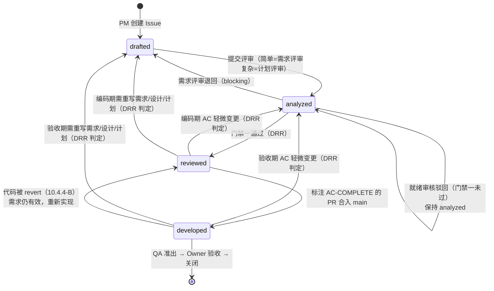

**`stage:developed` 触发规则（v2.3 新增，防止误判）：**

1. **只有** `feature/*` 或 `fix/*` 分支的 PR 合并**才可能**触发本状态。docs PR、release PR、hotfix PR、follow-up PR **一律不触发**。
2. **`Refs` 关键字不触发本状态**——`Refs` 的含义是"相关"，不代表交付完成。
3. 一个 Issue 拆成多个实现 PR 时，**只有** `Developer` 在 PR 描述中显式标注 `AC-COMPLETE: #<issue>` 的那一个 PR 合并后才置为 `developed`。
4. 若自动化无法可靠判定，**必须**保持手工设置。**禁止**用"合并即打标"的粗规则代替。
5. **标签体系尚未落地期间的替代证据**（试运行期适用）：在 GitHub 标签尚未建好之前，`stage:developed` 的等价证据为——**该 PR 描述中的 `AC-COMPLETE: #<issue>` 行 + Issue 中由 `Developer` 留下的"全部 AC 代码已合入"评论（含该 PR 链接）**。两者齐备即视同已达成本状态；标签建好后**必须**回填历史 Issue。

**关于 `stage:developed` 之后：** Issue 不再新增 stage。发布状态由 Release Notes 与版本号追踪；Issue 由 Issue Owner 在业务验收通过后关闭（见 7.9）。

**退回规则：** 任何退回**必须**回到"未完成的那个里程碑"对应的状态，并在 Issue 中写明理由与责任人。**禁止**在退回时保留更高的 stage。

**各类退回的目标状态（v3.3 统一，唯一口径）：**

| 触发 | 目标 stage | 决定人 | 依据 |
|---|---|---|---|
| 需求评审退回（blocking） | → `drafted` | `Requirement_Reviewer` | 4.1 |
| **门禁一驳回** | **保持 `analyzed`**（分析已完成，只是就绪条件未满足） | `Development_Readiness_Reviewer` | 7.1 |
| 编码期间 AC 变更 | `analyzed` 或 `drafted`，**按影响面由 DRR 决定** | `Development_Readiness_Reviewer` | 15.2 |
| **业务验收阶段 AC 变更** | `analyzed` 或 `drafted`，**按影响面由 DRR 决定**（与编码期间同一规则） | `Development_Readiness_Reviewer` | 15.2、10.4.2 |
| **代码被 revert**（10.4.4 方式 B） | → `reviewed`（需求与就绪结论仍有效，仅代码不在 `main`；`AC-COMPLETE:` 随之失效） | `Release_Manager` 决定 revert，`Developer` 改 stage | 10.4.4 |

> **判定原则**（供 DRR 使用）：仅 AC 措辞澄清或小幅补充 → `analyzed`；需重写需求、设计或计划 → `drafted`。

### 2.1.3 标签总表与分期落地

**第一阶段（当前生效）只使用 6 个标签**，其余标签定义在案但暂不启用，以降低执行负担。

| 标签组 | 标签 | 第一阶段 | 用途 |
|---|---|---|---|
| `complexity:*` | `complexity:simple`、`complexity:complex` | **启用** | 流程分叉开关：决定是否需要 req/design/plan 与 docs PR |
| `stage:*` | `stage:drafted`、`stage:analyzed`、`stage:reviewed`、`stage:developed` | **启用** | 里程碑与门禁一信号 |
| `doc:*` | `doc:req-approved`、`doc:design-approved`、`doc:plan-approved` | 不启用 | 复杂需求的三项评审进度（见 2.1.4） |
| `priority:*` | `priority:P1`、`priority:P2`、`priority:P3` | 不启用 | 缺陷与需求的严重度（见 2.1.5） |

> **原则**：标签只在"没有其他地方能表达该信息"时才新增。凡 GitHub 已原生记录的信息（PR 审批、assignee、看板列、里程碑），**禁止**再用标签重复记账。

### 2.1.4 文档评审进度标签（第二阶段启用）

**第一阶段做法**：复杂需求的三项评审结论**以 docs PR 上的 approval 与 review 评论为唯一证据**，不在 Issue 上打标签。门禁一由 `Development_Readiness_Reviewer` 直接查阅该 docs PR 的审批记录。

**理由**：审批行为本身已记录在 docs PR 上，再往 Issue 打一遍标签属于双重记账，且两处容易不一致。

**第二阶段启用条件**：当同时在途的 `complexity:complex` 需求经常超过 `[待确认: 建议 5 个]`，导致仅凭 docs PR 难以在看板上一览进度时，启用下表标签，由对应角色在评审通过时追加：

| 文档标签 | 含义 | 添加人 |
|---|---|---|
| `doc:req-approved` | 需求文档已通过 `Requirement_Reviewer` 评审 | `Requirement_Reviewer` |
| `doc:design-approved` | 设计文档已评审通过 | `System_Architect` 的评审人 |
| `doc:plan-approved` | 实施计划已评审通过 | `Tech_Lead_Planner` 的评审人 |

### 2.1.5 严重度定义（定义即刻生效，标签第二阶段启用）

> **重要**：`priority:*` **标签**第一阶段不启用，但下表的**判定标准立即生效**——10.4 的 Staging 准出、13.1 的回滚触发、14.1 的 Hotfix 适用范围均依赖它。**禁止**因未启用标签而跳过严重度判定。

| 严重度 | 判定标准 | 第一阶段如何记录 |
|---|---|---|
| **P1** | 核心功能不可用、数据错误或丢失、安全漏洞、影响全部或大部分用户 | 在 Issue 标题前加 `[P1]`，并在正文首行写明判定理由与判定人 |
| **P2** | 主要功能受损但有可接受的临时规避方式，或影响部分用户 | 同上，前缀 `[P2]` |
| **P3** | 次要问题、体验瑕疵、无规避成本 | 无需标注 |

严重度由发现人初判，由 **1.2 表中"P1/P2 严重度判定复核"的主审批人**复核确认；主审批人不可达时由替补复核。

**争议处理**：复核结论有争议时，**必须**先按**就高**的等级执行（例如 P2 与 P1 争议时按 P1 处理），再走 1.2 的升级路径裁定。**禁止**因争议未决而暂停回滚判定或 Hotfix 响应。

> **约束**：stage 表达里程碑。**禁止**新增 `stage:design`、`stage:plan`、`stage:implementation-ready`、`stage:developing` 等状态。
> 具体 label 操作**可**由确定性脚本或客户端命令执行，但**必须**依据对应角色作出的书面决定，且脚本执行人不改变问责归属。

> **关键约束**：进入编码之前，Issue **必须**已达到 `stage:reviewed`。只有 `Development_Readiness_Reviewer` 可作出该决定。对于 `complexity:complex`，其**必须**确认 requirement/design/plan 文档已存在、已批准、内容与 Issue 一致且互不矛盾。

### 2.1.6 评审响应时限（SLA）

| 环节 | 首次响应时限 |
|---|---|
| 需求评审（`Requirement_Reviewer`） | `[待确认: 建议 2 个工作日]` |
| 开发前就绪审核（`Development_Readiness_Reviewer`） | `[待确认: 建议 1 个工作日]` |
| PR Review | `[待确认: 建议 1 个工作日]` |
| 生产环境审批 | `[待确认: 建议 4 小时内]` |

超时未响应时，Issue Owner **应**在 Issue 中 @ 对应角色并抄送 `[待确认: 升级对象]`。

---

## 2.2 Issue 全生命周期总表（**主线速查**）

> 本节是**新需求开发的唯一主线索引**。一个 Issue 从提出到发布要经过的全部环节都在这一张表里。
>
> **定位说明（v3.1 修正）**：**只读本节即可理解完整主线**；但**执行具体环节时，必须遵循「详见」列指向的规则与对应检查清单**——complexity 判定标准、审批独立性、blocking 退回路径、PR 必填字段与 required checks、独立 E2E PR 的合入顺序、Release Manifest 与 12.0 前置条件、验收失败与需求变更处理等，均以对应章节为准。本节**不是**独立执行手册。
>
> **环节口径**：下表共 **19 个主环节**，另有 **2 个子环节**（**2b** 建 Draft PR——复杂需求**必经**；**9b** 旅程级 E2E——由「是否影响关键用户旅程」触发，**与复杂度无关，简单需求同样可能触发**），**子环节不计入主环节编号**。因此：简单需求走 **16 个主环节**（跳过 4、5、6），复杂需求走 **19 个主环节 + 必经的 2b**；两者均**可能**触发 9b。

### 2.2.1 主线总表

| # | 环节 | 触发条件 | 负责人 | 输入 | 关键动作 | 产出 | 完成判定 | stage 变化 | 详见 |
|---|---|---|---|---|---|---|---|---|---|
| 1 | 需求登记 | 想法达到 3.1 的客观标准 | `Product_Manager` | 业务想法 | 创建 Issue，写标题、问题陈述、AC 草案，判定 complexity | GitHub Issue | Issue 含 ≥1 条 AC 且已标 complexity | → `stage:drafted` | 3.1 |
| 2 | 需求分析 | Issue 已登记 | `Product_Manager` | Issue | **简单**：细化 AC，完成后提交评审<br>**复杂**：建 `docs/*` 分支写 `req-*.md` | 完整 AC 或需求文档 | 简单：AC 完整可测；复杂：**3.2 全部必填模块齐备** | **简单需求提交评审时 → `analyzed`**；复杂需求保持 `drafted` | 3.2 |
| 2b | 建 Draft PR | **仅复杂需求，必经**；req 提交后**立即** | `Product_Manager` | req 文档 | 创建 **Draft** docs PR 作为评审载体 | Draft PR | PR 已创建 | 保持 `drafted` | 7.2 |
| 3 | 需求评审 | 已提交评审 | `Requirement_Reviewer` | Issue 或 Draft PR | 按 4.2 检查项审核，给出通过/有条件通过/退回 | 评审结论 | 无 blocking 问题（**由 1.2 指定的独立审批人**给出） | **不变**（提交时已置；退回则回 `drafted`） | 4 |
| 4 | 架构设计 | 仅复杂需求，需求评审通过 | `System_Architect` | req 文档 | 向同一分支追加 `design-*.md`，在同一 PR 上评审 | 设计文档 | **由 1.2 指定的独立审批人**批准（作者不得自批） | 保持 `drafted` | 5、1.2 |
| 5 | 计划拆解 | 仅复杂需求，设计通过 | `Tech_Lead_Planner` | req + design | 追加 `plan-*.md`（任务 ≤1 人日），**提交计划评审时置 stage** | 实施计划 | **由 1.2 指定的独立审批人**批准（作者不得自批） | **提交评审时 → `analyzed`** | 6、1.2 |
| 6 | 文档合入 | 仅复杂需求，三项评审通过 | `Tech_Lead_Planner` | Draft PR | 转 Ready for review → 门禁二 → 合入 `main` | 文档进入 `main` | PR 已合并 | 保持 `analyzed` | 7.2 |
| 7 | **门禁一：开发前就绪** | 上一环节完成 | `Development_Readiness_Reviewer` | Issue（+文档） | 核对齐备性、一致性、阻塞项 | 就绪结论 | 无未关闭阻塞项 | → `stage:reviewed` | 7.1 |
| 8 | 认领与建分支 | 门禁一通过 | `Developer` | Issue | 设 assignee、看板移入 In Progress；从最新 `main` 建 `feature/*` | 功能分支 | 分支已推送 | 保持 `reviewed` | 7.5、8.3 |
| 9 | 编码与自测 | 分支已建 | `Developer` | Issue 或文档 | Manager 层 → Service 层 → 前端；补 Pytest 与组件级 E2E；本地验证 | 代码 + 测试 | 本地验证通过 | 保持 `reviewed` | 8.1、8.4 |
| 9b | 旅程级 E2E | **变更影响关键用户旅程**（与复杂度无关，简单需求同样可能触发） | `QA_Engineer` | 实现分支 | 新增/修复旅程级用例，随同一 PR 合入 | E2E 用例 | 用例可通过 | 保持 `reviewed` | 8.2 |
| 10 | 创建 PR | 编码完成 | `Developer` | 分支 | 按 8.6 填描述；关联 `Refs #<issue>`；完成全部 AC 时加 `AC-COMPLETE:` | PR | 描述项齐全 | 保持 `reviewed` | 8.6 |
| 11 | **门禁二：合入 main** | PR 已创建 | 非作者 reviewer | PR | required checks 全绿 + 人工 approval + conversation 全解决 → squash merge | 代码进入 `main` | 已合并 | 若标 `AC-COMPLETE:` → `stage:developed` | 9 |
| 12 | Staging 自动部署 | `main` 更新 | 自动 / `DevOps_Engineer` | `main` | 构建镜像 → 部署 staging → 跑 E2E 回归 | 部署 + 测试报告 | rollout 成功且 E2E 通过 | **保持当前 stage**（部分交付的 Issue 仍为 `reviewed`） | 10 |
| 13 | **Staging 准出**（技术可用性） | 部署与回归完成 | `QA_Engineer` | 测试报告 | 按 **10.4.1** 判定，**不涉及 AC** | 准出结论 | 部署成功 + E2E 通过 + 无未关闭 P1/P2 + **功能可访问可操作**（冒烟级） | 保持当前 stage | 10.4.1 |
| 14 | **业务验收**（AC 满足度） | **QA 准出通过后** | Issue Owner | Staging 环境 | 逐条确认 AC，留验收结论 | 验收结论 | 全部 AC 满足（Issue 须已为 `developed`） | 保持 `developed` | 7.9、10.4.2 |
| 15 | 关闭 Issue | 验收通过 | Issue Owner | Issue | **手工关闭**（禁用自动关闭关键字） | 已关闭 Issue | 已关闭 | 终态 | 7.9 |
| 16 | 确定发布范围并**预核对**双证据 | 决定发版 | `Release_Manager` | 准出 + 验收结论 | 冻结范围（建 `release/*` 即冻结点）；逐个 Issue 预核对双证据；**证据缺失者按 10.4.4 选择推迟/revert/flag 关闭，禁止仅从 Manifest 移除** | 发布范围清单 + 处理决定 | 冻结提交中**不含**未验收且未处置的代码 | — | 10.4.3、**10.4.4**、11.1.1 |
| 17 | 创建 Manifest 与 Release PR，合入 `main` | 发布范围已确定 | `Release_Manager` | 发布范围清单 | 定版本号（11.1 机械规则）→ 更新 VERSION/CHANGELOG/Release Notes → **写 Release Manifest**（含双证据链接、12.0 核对结论）→ 创建 Release PR → **门禁二** → squash merge 合入 `main` | Release PR 已合入 | release guard 通过且已合并 | — | 11、11.1.1、9 |
| 18 | **创建 tag 并通过门禁三** | Release PR 已合入 `main` | `Release_Manager`（建 tag）→ production 审批人（审批） | 合并提交 | `Release_Manager` 在该合并提交上创建 `vX.Y.Z` tag（11.3）→ workflow 校验 tag 与版本文件、构建镜像 → **门禁三审批**：核对双证据与 **12.0 前置条件** | tag + 审批记录 | 审批通过（建 tag 人 ≠ 审批人） | — | 11.3、1.1、12 |
| 19 | 生产部署与验证 | 门禁三审批通过 | 自动 / `DevOps_Engineer` | tag 镜像 | 部署 → rollout → 生产 E2E → 回填发布结论与版本号 | 上线 + 报告 | rollout 与生产 E2E 均通过（失败转 13 章回滚） | — | 12、13 |

### 2.2.2 简单需求 vs 复杂需求：主线差异

| 环节 | `complexity:simple` | `complexity:complex` |
|---|---|---|
| 需求载体 | Issue 正文与评论 | `req-*.md` + `design-*.md` + `plan-*.md` |
| 分支 | 无需 docs 分支 | `docs/<issue>-<slug>` |
| 评审次数 | 1 次（需求） | 3 次（需求、设计、计划），在同一 Draft PR 上 |
| 进入 `analyzed` 的时点 | `Product_Manager` **提交需求评审时** | `Tech_Lead_Planner` **提交计划评审时** |
| 触发方式 | 均由「**提交评审**」动作触发，与评审结果无关（2.1.2） | 同左 |
| 门禁一核对 | Issue 稳定、可验收、可测试 | 三项评审结论齐全 + docs PR 已合入 `main` |
| 主环节数 | **16 个**（跳过 4、5、6；不涉及 2b） | **19 个主环节 + 子环节 2b（必经）** |
| 子环节 2b（建 Draft PR） | 不适用 | **必经** |
| 子环节 9b（旅程级 E2E） | **可能触发**——由「是否影响关键用户旅程」决定，与复杂度无关 | 同左 |

### 2.2.3 时间线示例

> **重要**：以下 Day 编号**仅表示环节的先后顺序**，**不是 SLA、不是交付承诺、也不是工期估算**。实际耗时取决于需求规模与团队排期，评审时限见 2.1.6。
> 两条示例均**结束于 Issue 关闭**；其后的发布尾段为所有需求共用，见 2.2.3.3。

#### 2.2.3.1 简单需求示例（如「修正登录页文案」）

```
Day 1  PM 创建 Issue，写 AC，标 complexity:simple        → stage:drafted
Day 1  PM 细化 AC，提交需求评审（提交动作触发）           → stage:analyzed
Day 2  Requirement_Reviewer 评审通过（stage 不变）
Day 2  Development_Readiness_Reviewer 门禁一通过          → stage:reviewed
Day 2  Developer 认领，从 main 建 feature/123-login-copy
Day 3  编码 + Pytest + 组件级 E2E，本地验证
Day 3  创建 PR（Refs #123 + AC-COMPLETE: #123）
Day 3  门禁二：CI 绿 + 1 名非作者 approval → squash merge → stage:developed
Day 3  Staging 自动部署 + E2E 回归
Day 4  QA 准出（仅技术可用性，10.4.1）
Day 4  Issue Owner 在准出后逐条验收 AC（10.4.2）→ 手工关闭 Issue
```

#### 2.2.3.2 复杂需求示例（如「健康趋势看板」）

```
Day 1   PM 创建 Issue，标 complexity:complex              → stage:drafted
Day 1   建 docs/123-health-trend 分支，提交 req-*.md
Day 1   立即创建 Draft docs PR（评审载体）
Day 3   Requirement_Reviewer 在该 PR 上评审通过           （仍 drafted）
Day 5   System_Architect 追加 design-*.md，评审通过       （仍 drafted）
Day 7   Tech_Lead_Planner 追加 plan-*.md，提交计划评审     → stage:analyzed
Day 7   计划评审通过（stage 不变）→ Draft 转 Ready → 门禁二 → docs PR 合入 main
Day 8   门禁一通过                                        → stage:reviewed
Day 8   Developer 从最新 main 建 feature/123-health-trend（自带最新文档）
Day 9-14 分阶段实现：DB/模型 → API → 前端；QA 同步补旅程级 E2E
Day 15  PR（Refs #123 + AC-COMPLETE: #123）→ 门禁二 → 合入 → stage:developed
Day 15  Staging 部署 + E2E 回归
Day 16  QA 准出（10.4.1）→ Issue Owner 验收 AC（10.4.2）→ 关闭 Issue
```

#### 2.2.3.3 发布尾段（所有需求共用，可批量发布多个 Issue）

```
环节16  确定发布范围：建 release/x.y.z（= 范围冻结点）
        逐个 Issue 预核对 QA 准出 + 业务验收
        双证据不齐备时，必须按 10.4.4 三选一：推迟发布 / revert / 已审批 flag 关闭
        禁止仅从 Manifest 移除条目（代码已在冻结提交中）
环节17  定版本号（11.1 机械规则）→ 更新 VERSION/CHANGELOG/Release Notes
        写 Release Manifest（双证据链接 + 12.0 核对结论 + 范围冻结时间）
        创建 Release PR → 门禁二（CI + 非作者 approval + release guard）→ 合入 main
环节18  Release_Manager 在合并提交上创建 vX.Y.Z tag
        workflow 校验 tag/版本文件 → 构建镜像 → 门禁三审批（建 tag 人 ≠ 审批人）
环节19  生产部署 → rollout → 生产 E2E → 回填发布结论与各 Issue 版本号
```

> 一次发布**可**包含多个已验收的 Issue。**未通过业务验收的 Issue 不能靠「移出 Manifest」处理**——其代码已在冻结提交中，**必须**按 **10.4.4** 选择推迟 / revert / 已审批 flag 关闭。

### 2.2.4 主线上的三个常见错误

| 错误 | 后果 | 正确做法 |
|---|---|---|
| 门禁一未通过就开始编码 | 返工风险高，且违反 7.5 | 等 `stage:reviewed` 再建分支 |
| 复杂需求等三份文档写完才建 PR | 需求评审无处留痕 | req 提交后**立即**建 Draft PR（7.2） |
| 用 `Closes #123` 关联 PR | Issue 在业务验收前被自动关闭 | 一律用 `Refs`，完成时加 `AC-COMPLETE:`（7.8） |

---

## 3. 阶段一：需求提出与产品澄清

`Product_Manager` 是流程入口，负责把一个想法转成可执行、可验收、可追踪的需求。

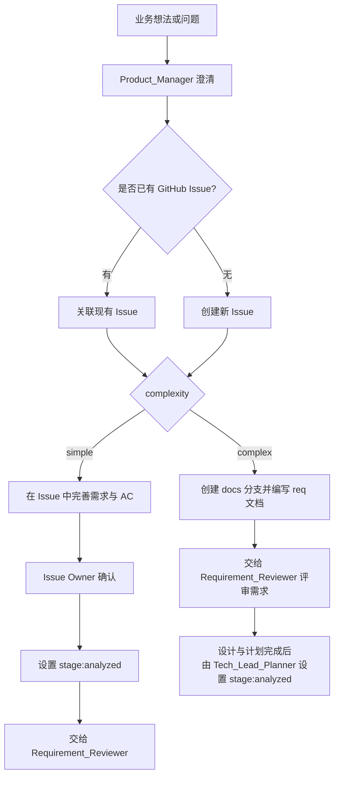

### 3.1 Issue 创建的客观触发条件

满足以下**全部**条件时**必须**创建 Issue（取代原"值得持续跟踪的最小信息量"这一主观标准）：

- 有明确的标题与问题陈述；
- 至少 1 条可验收标准（AC）草案；
- 已判定 `complexity:simple` 或 `complexity:complex`；
- 预计工作量大于 `[待确认: 建议 0.5 人日]`，或需要一人以上参与。

未达标的想法保留在讨论渠道，**禁止**创建空壳 Issue 占位。

### 3.2 需求文档必备模块（`complexity:complex`）

| 模块 | 内容 | 必填 |
|---|---|---|
| 背景与价值 | 用户故事、业务价值、目标用户 | 必须 |
| 范围与边界 | In-Scope、Out-of-Scope | 必须 |
| 验收标准 | 可测试的 AC 条目，每条可映射到至少 1 个测试 | 必须 |
| 非功能要求 | 性能、安全、国际化、审计、可用性 | 必须（不适用项须显式写"不适用 + 理由"） |
| 数据与隐私 | 涉及的字段、来源、生命周期、隐私分级 | 涉及个人健康数据时必须 |
| 发布与回滚预期 | 灰度要求、回滚可接受代价 | 必须 |

**唯一需求模板：** `docs/templates/requirement-v3.5.template.md`

- 模板只负责承载本节规定的结构，不得新增流程政策。
- 新的复杂需求必须从该模板生成 `docs/requirements/req-<slug>.md`。
- `docs/requirements/` 中的历史文件仅是历史记录，不得作为新需求的格式标准。
- README 只提供导航；与本节或模板不一致时，以本节为准。

---

## 4. 阶段二：需求评审

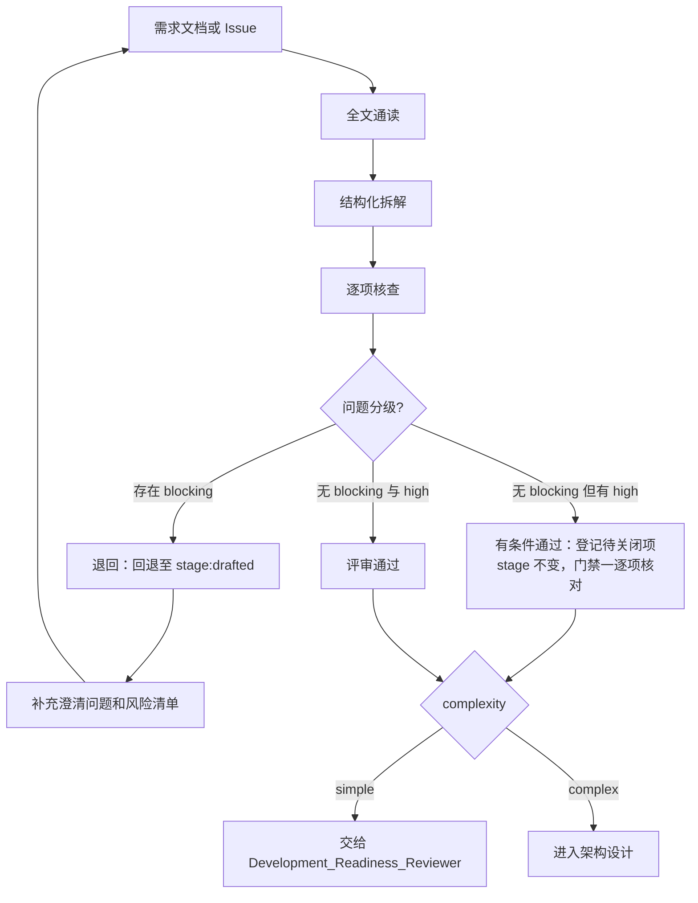

### 4.1 评审结论的三种取值（必须显式选择其一）

| 结论 | 含义 | 后续动作 |
|---|---|---|
| 通过 | 无 blocking 与 high 问题 | 在 Issue（简单需求）或 docs PR（复杂需求）上留下书面通过结论；进入下一环节 |
| 有条件通过 | 无 blocking，存在 high 问题但可在开发前关闭 | 同上，并在 Issue 中登记待关闭项；门禁一必须逐项核对 |
| 退回 | 存在 blocking 问题 | **回退至 `stage:drafted`**（简单需求从 `analyzed` 回退；复杂需求本就在 `drafted`，保持不变），由 Issue Owner 修订后重新提交 |

**重新提交后的 stage（v3.2 明确，按复杂度区分）：**

| 复杂度 | 重新提交时 | stage |
|---|---|---|
| `complexity:simple` | 重新提交**需求评审**时 | → `stage:analyzed` |
| `complexity:complex` | 重新提交**需求评审**时 | **保持 `stage:drafted`**（设计与计划尚未完成） |
| `complexity:complex` | 重新提交**计划评审**时 | → `stage:analyzed` |

> 与 2.1.2 一致：`analyzed` 的触发点是「**该复杂度对应的最后一项评审被提交**」——简单需求是需求评审，复杂需求是计划评审。

问题分级统一使用 blocking / high / medium / low 四级；**禁止**使用其他分级词。
退回时**必须**在 Issue 中写明理由、阻塞项与责任人。

### 4.2 评审检查项

| 检查项 | 目标 |
|---|---|
| 业务目标 | 是否明确、可量化 |
| 范围边界 | 是否存在范围蔓延 |
| 用户角色与权限 | 是否覆盖正常路径和异常路径 |
| 数据定义 | 字段、来源、生命周期、隐私分级是否清楚 |
| 验收标准 | 是否能逐条映射到测试 |
| 发布与回滚 | 是否具备可操作性 |

---

## 5. 阶段三：架构设计（仅 `complexity:complex`）

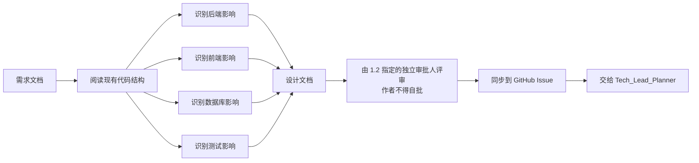

### 5.1 项目技术边界（生效版本 v3.5，随技术栈变更同步更新）

| 层级 | 技术与约束 |
|---|---|
| 后端 | Python、Flask、SQLAlchemy、JWT |
| 前端 | React 18、Ant Design 5、ECharts、i18next |
| 测试 | Pytest、Playwright |
| 部署 | Docker、Kubernetes、GitHub Actions |
| 架构分层 | Client → Service → Manager → Models |

> **强制规则**：Service 层**必须**只处理 HTTP 请求、参数校验和响应；数据库查询与业务逻辑**必须**放在 Manager 层。跨层调用在 PR Review 中作为 blocking 问题处理。

### 5.2 数据库变更的额外要求

设计文档涉及数据库结构变更时**必须**包含：

1. 迁移脚本方案与执行方式（`[待确认: 迁移工具，如 Alembic]`）；
2. 迁移与应用部署的先后顺序；
3. **向后兼容策略**：新版本部署期间旧版本实例必须仍可运行（禁止一次性删除列/表，删除操作须拆到后续版本）；
4. 迁移的回滚方式，或明确声明"不可逆"及其风险接受人。

**参考路径：** `docs/architecture/architecture.md`、`docs/DEVELOPMENT.md`

---

## 6. 阶段四：计划拆解（仅 `complexity:complex`）

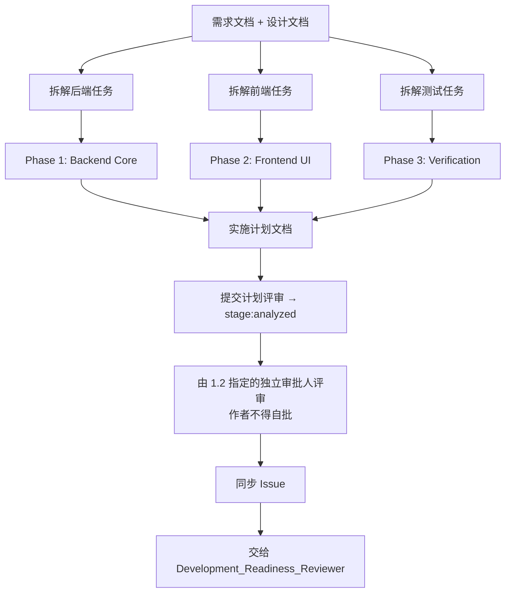

### 6.1 计划拆解原则（可核对标准）

| 原则 | 客观判定标准 |
|---|---|
| 可执行 | 每个任务包含"改哪些文件/模块 + 完成后如何验证" |
| 粒度可控 | 单个任务预计工作量 ≤ 1 人日；超出必须再拆 |
| 有顺序 | DB/模型优先，API 其次，UI 最后集成，任务显式标注前置依赖 |
| 可测试 | 每个 Phase 至少有 1 条可执行的验证命令或验收步骤 |
| 不遗漏 | 后端、前端、测试、配置、迁移、文档六类均已覆盖或显式标注"不涉及" |

**参考路径：** `docs/plan/`

---

## 7. 跨角色文档协作与 Feature 分支创建时机

| 阶段 | 目标 | 分支 | 是否进入编码 |
|---|---|---|---|
| 需求/设计/计划阶段 | 澄清 What、Why、How、任务拆分 | `docs/<issue>-<slug>` | 否 |
| 开发实现阶段 | 按已批准文档实现代码和测试 | `feature/<issue>-<slug>` 或 `fix/<issue>-<slug>` | 是 |

### 7.1 两级审核的职责划分

1. `Requirement_Reviewer` 只审核需求本身。简单需求通过后即交给门禁一；复杂需求通过后进入设计与计划，此期间 Issue **仍处于 `stage:drafted`**（分析未完成），待 plan 成文**并提交计划评审时**由 `Tech_Lead_Planner` 置为 `stage:analyzed`，各项评审进度以 docs PR 上的 approval 与评论为准。
2. `Development_Readiness_Reviewer` 执行门禁一：
   - `complexity:simple`：确认需求评审已通过、无未关闭阻塞项，Issue 稳定、可验收且可测试；
   - `complexity:complex`：确认 requirement/design/plan 已齐备，且三项均能在 docs PR 上查到明确的通过结论；docs-only PR 已合入 `main`；文档与 Issue 互相一致；
   - 审核不通过时**必须**保持 `stage:analyzed`，并列出阻塞项、证据、责任人和下一步；
   - 审核通过后**才可**设置 `stage:reviewed`。

### 7.2 文档同样走分支 + PR

> **评审载体规则（v2.3 修正）**：docs PR **必须**在 **req 文档首次提交后立即创建**，以 **Draft** 状态存在，作为需求、设计、计划三项评审的共同载体。**禁止**等三份文档全部写完才创建 PR——否则需求评审没有可留痕的位置（此为 v2.2 的时序缺陷）。
>
> - req 提交 → 立即建 Draft PR → `Requirement_Reviewer` 在该 PR 上评审需求；
> - 需求评审通过后，`System_Architect` 向同一分支追加 design，在同一 PR 上评审；
> - 计划评审通过后，PR 由 Draft 转为 Ready for review，进入合并流程；
> - 三项评审结论**必须**分别以 PR review 或专门评论留痕，评论**必须**以 `REQ-APPROVED:` / `DESIGN-APPROVED:` / `PLAN-APPROVED:` 开头，供门禁一逐项核对。

`main` 始终保持可部署，且仓库 Ruleset 要求所有变更通过 PR 合入。因此 `docs/requirements`、`docs/design`、`docs/plan` 下的文档**禁止**由任何角色直接推送到 `main`。

> `complexity:simple` 需求不产生文档，需求内容直接维护在 Issue 正文与评论中，**不需要** docs 分支与 docs PR。本节仅适用于 `complexity:complex`。

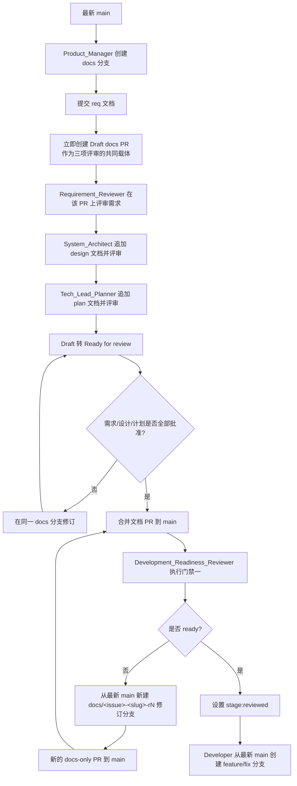

> **返工规则（v2 修正）**：docs PR 一旦合入 `main`，原 docs 分支即视为关闭并删除。门禁一驳回后，**必须**从最新 `main` 新建修订分支 `docs/<issue>-<slug>-r2`（再次驳回则 `-r3`，依此类推），走新的 docs-only PR，**禁止**尝试在已合并分支上继续提交。

### 7.3 分支模型

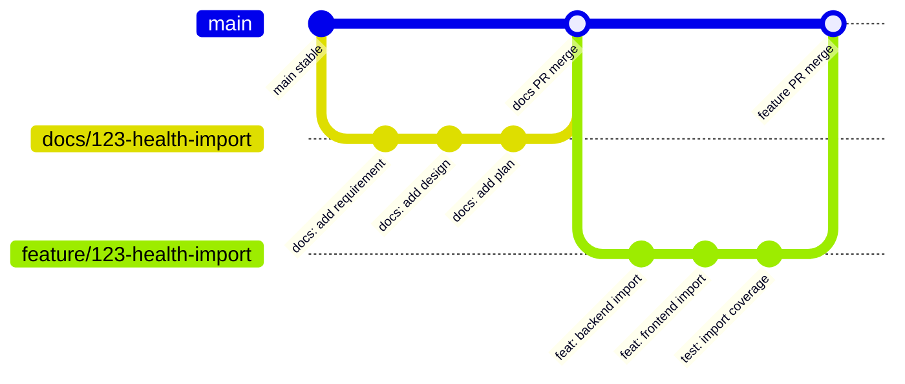

| 分支类型 | 创建时机 | 创建角色 | 合入目标 | 内容 |
|---|---|---|---|---|
| `docs/<issue>-<slug>` | Issue 已判定为 `complexity:complex`，开始形成正式文档时 | `Product_Manager`（`Requirement_Reviewer` 可在其授权下代建） | `main` | requirements/design/plan 文档、评审记录、方案候选 |
| `docs/<issue>-<slug>-r<N>` | 门禁一驳回后的修订 | 原文档负责人 | `main` | 修订后的文档 |
| `feature/<issue>-<slug>` | Issue 已达 `stage:reviewed` | `Developer` | `main` | 代码、测试、必要文档更新 |
| `fix/<issue>-<slug>` | Issue 已达 `stage:reviewed` | `Developer` | `main` | 修复代码、回归测试、必要文档更新 |
| `fix/<slug>` | 无关联 Issue 的小型缺陷修复（见 7.5） | `Developer` | `main` | 修复代码、回归测试 |
| `release/<version>` | 确定发布范围后 | `Release_Manager` | `main` | 版本文件与发布说明 |
| `hotfix/<version>` | **暂不启用**（见第 14 章） | — | — | — |

Issue **必须**先于 docs 分支创建。早期探索内容保存在 Issue 描述和评论中，正式文档保存在 `docs/<issue>-<slug>` 分支并通过 PR 合入 `main`。

### 7.4 各角色的工作基线

| 角色 | 工作基线 | 操作方式 | 交付物 |
|---|---|---|---|
| `Product_Manager` | 简单需求使用 Issue；复杂需求使用最新 `main` 拉出的 `docs/*` | 完善 Issue，复杂需求再编写 `req-*.md` | Issue，或需求文档与 Issue 摘要 |
| `Requirement_Reviewer` | 简单需求读取 Issue；复杂需求读取同一个 `docs/*` | 审核需求本身并给出 blocking/high/medium/low 问题 | 评审结论、澄清问题 |
| `System_Architect` | 复杂需求的同一个 `docs/*` 分支 | 增加 `docs/design/design-*.md` | 设计文档 |
| `Tech_Lead_Planner` | 复杂需求的同一个 `docs/*` 分支 | 增加 `docs/plan/plan-*.md` | 实施计划 |
| `Development_Readiness_Reviewer` | 简单需求读取 Issue；复杂需求读取已合入 docs-only PR 的最新 `main` | 审核适用产物并决定是否 ready | 就绪结论、阻塞项、stage 转换 |
| `Developer` | Issue 已 ready 后的最新 `main` | 创建 `feature/*` 或 `fix/*`，开始编码 | 代码、测试、PR |
| `QA_Engineer` | 与实现同一分支（旅程级用例）或独立 `test/<issue>-<slug>` 分支 | 编写/维护旅程级 Playwright 用例 | E2E 计划、用例、报告 |

### 7.5 创建实现分支的前置条件

**禁止**在需求探索阶段创建 `feature/*` 分支。所有需求**必须**满足：

- Issue 已形成可验收 AC；
- 范围与非范围已明确；
- `Development_Readiness_Reviewer` 已设置 `stage:reviewed`；
- 已指定接手实现的 `Developer`。

`complexity:complex` **还必须**满足：

- requirement、design、plan 三项评审均已在 docs PR 上留下通过结论；
- docs-only PR 已合入 `main`。

**唯一例外**：无关联 Issue 的小型缺陷修复，同时满足①仅文案/样式/明显笔误、②不涉及 API 与数据库、③单个 PR 变更行数 ≤ `[待确认: 建议 20 行]`，**可**直接使用 `fix/<slug>` 分支，跳过门禁一，但**不得**跳过门禁二。不满足任一条件时**必须**先创建 Issue。

### 7.6 复杂需求如何获得最新文档

```cmd
git checkout main
git pull origin main
git checkout -b feature/<issue>-<slug>
```

因为 docs-only PR 已合入 `main`，从最新 `main` 创建 feature 分支即自然带上最新文档。

**禁止**在文档 PR 合并前启动编码；**禁止**从 `docs/*` 分支拉出 `feature/*` 分支。

### 7.7 小团队快速模式（仅 `complexity:simple`）

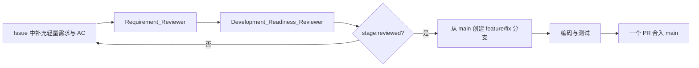

只要涉及多人协作、架构设计、数据库/API 改动、发布风险或验收争议，**必须**按 `complexity:complex` 处理。快速模式**可**省略 docs 分支与设计/计划文档，**禁止**省略需求评审与门禁一。

### 7.8 Issue 与 PR 的关联语义

| PR 类型 | 是否关联 Issue | 关键字 | 是否关闭 Issue |
|---|---|---|---|
| docs PR | 必须 | `Refs #123` | 否 |
| feature PR | 必须 | **一律 `Refs #123`**；完整交付时另加 `AC-COMPLETE: #123` | 否（由 Issue Owner 手工关闭） |
| fix PR | 有 Issue 时必须 | **一律 `Refs #123`**；完整修复时另加 `AC-COMPLETE: #123`；无 Issue 时不使用关联关键字 | 否（由 Issue Owner 手工关闭） |
| release/hotfix PR | 必须 | `Refs #123`（可多个） | 否 |
| follow-up PR | 必须 | `Refs #123` | 否 |

- **全部 PR 一律使用 `Refs`，禁止使用 `Closes` / `Fixes` 等自动关闭关键字**（v2.3 修正）。原因：代码合入 ≠ 业务验收完成，自动关闭会使 Issue 在 Staging 验证与 AC 确认之前被关掉；
- 完成全部 AC 的那个实现 PR，**必须**在描述中另加一行 `AC-COMPLETE: #<issue>`，作为置 `stage:developed` 的唯一依据；
- Issue 由 Issue Owner 在业务验收通过后**手工关闭**（见 7.9）；
- 无 Issue 的小型修复使用 `fix/<slug>`，并在 PR 描述中记录问题、修复范围与验证证据；
- release PR 在描述中以清单列出 `Refs #123`、`Refs #124`。

### 7.9 Issue 关闭与验收责任人

1. Issue **只能由 Issue Owner 手工关闭**；仓库**禁止**使用自动关闭关键字（见 7.8）。代码合入只使 Issue 进入 `stage:developed`，不代表业务验收完成。
2. Issue Owner（默认 `Product_Manager`）**必须**在 Staging 验证通过后，在 Issue 中逐条确认 AC 并留下验收结论，然后关闭 Issue。
3. `QA_Engineer` 给出的 Staging 准出结论是验收的**前置步骤**（先准出、后验收，见 10.4），但不替代 Issue Owner 的业务验收。**禁止**把业务验收结果反过来作为准出条件。

---

## 8. 阶段五：功能开发

`Developer` 按已批准的权威来源编码：简单需求读取 Issue，复杂需求读取 requirement/design/plan。

### 8.1 开发流程

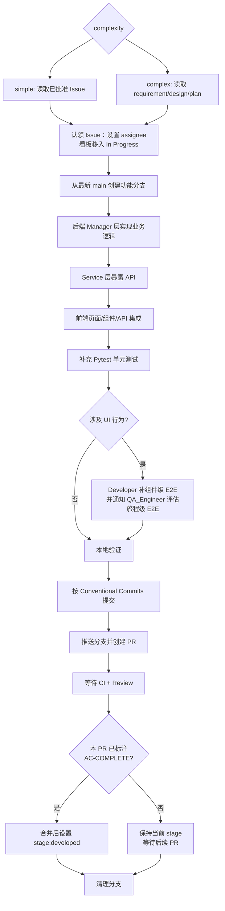

### 8.2 E2E 测试职责分工（v2 明确）

| 测试层次 | 范围 | 编写与维护人 | 何时必须存在 |
|---|---|---|---|
| 单元测试（Pytest） | 函数、Manager 层业务逻辑、边界与异常分支 | `Developer` | 所有后端逻辑变更 |
| 组件级 E2E（Playwright） | 单页面/单组件的交互与校验 | `Developer` | 变更涉及 UI 行为 |
| 旅程级 E2E（Playwright） | 跨页面、跨模块的完整用户旅程 | `QA_Engineer` | 变更影响关键用户旅程，或新增关键旅程 |

1. `Developer` 在 PR 描述中**必须**声明本次变更是否影响关键用户旅程。
2. 声明为"影响"时，`QA_Engineer` **必须**在门禁二之前完成旅程级用例的新增或修复，PR **不得**在此之前合并。
3. 旅程级用例清单维护在 `[待确认: E2E 用例清单文件路径]`，新增关键旅程时**必须**同步更新。
4. **旅程级用例的合入方式**（v2.3 明确）：`QA_Engineer` **应**直接向该实现 PR 的分支提交用例，使其随同一 PR 合入；仅当用例需独立演进时才使用 `test/<issue>-<slug>` 分支，此时该测试 PR **必须**先于实现 PR 合并，并在实现 PR 描述中引用其编号作为证据。**禁止**实现 PR 以"E2E 稍后补"为由合并。

### 8.3 分支创建

```cmd
:: 在 Terminal 3（操作终端）执行
git checkout main
git pull origin main
git checkout -b feature/<issue>-<slug>
git push -u origin feature/<issue>-<slug>
```

**分支命名规范：**

| 分支前缀 | 用途 | 示例 |
|---|---|---|
| `feature/<issue>-<slug>` | 新功能 | `feature/123-health-trend-dashboard` |
| `fix/<issue>-<slug>` | 有 Issue 的 Bug 修复 | `fix/456-bp-validation-limits` |
| `fix/<slug>` | 无 Issue 的小型 Bug 修复（限 7.5 例外条件） | `fix/login-copy-typo` |
| `release/<version>` | 版本发布 | `release/1.2.0` |
| `hotfix/<version>` | **暂不启用**（见第 14 章） | — |

`<issue>` 是不带 `#` 的 GitHub Issue 编号；`<slug>` 使用简短的英文小写 kebab-case。新功能**必须**关联 Issue。

### 8.4 本地验证

| 变更类型 | 必须启动的终端 |
|---|---|
| 纯后端（无 UI 行为变化） | Terminal 1（后端）+ Terminal 3（操作） |
| 纯前端 | Terminal 2（前端）+ Terminal 3（操作）；若依赖真实接口则同时启 Terminal 1 |
| 前后端联调 / 涉及 E2E | Terminal 1 + 2 + 3 全部 |

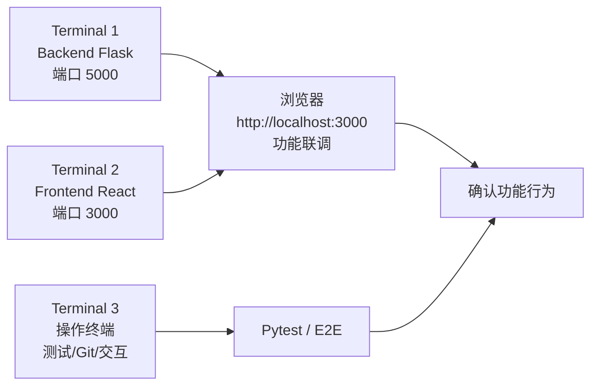

| 终端 | 责任 | 禁止操作 |
|---|---|---|
| Terminal 1 | 后端 Flask 服务 | 禁止执行测试、Git、脚本 |
| Terminal 2 | 前端 React 开发服务 | 禁止执行测试、Git、脚本 |
| Terminal 3 | 测试、Git、人机交互命令 | 禁止启动长驻服务 |

```cmd
:: Terminal 3 执行
python -m pytest tests/ -q

:: 如涉及 E2E
cd tests/e2e
npx playwright test tests/regression-user-journey-cn.spec.js --headed
```

### 8.5 提交规范

```cmd
git add -A
git commit -m "feat(health): add trend dashboard for blood pressure"
```

**提交类型（完整集合，禁止使用表外类型）：**

| type | 说明 | 影响版本号 |
|---|---|---|
| `feat` | 新功能 | MINOR |
| `fix` | Bug 修复 | PATCH |
| `perf` | 性能优化 | PATCH |
| `refactor` | 重构（无外部行为变化） | PATCH |
| `docs` | 文档更新 | PATCH |
| `test` | 测试相关 | PATCH |
| `build` | 构建系统或依赖变更 | PATCH |
| `ci` | CI 配置与脚本 | PATCH |
| `chore` | 其他杂项 | PATCH |
| `revert` | 回滚既有提交 | 按被回滚提交类型 |

- `scope` **应**使用模块名（如 `health`、`auth`、`deploy`），全小写 kebab-case；
- 存在不兼容变更时，**必须**在 type 后加 `!`（如 `feat(api)!:`）**并**在 commit body 中写 `BREAKING CHANGE: <说明>`。该标记是 MAJOR 版本判定的唯一依据。

### 8.6 PR 创建与描述

```cmd
git push origin feature/<issue>-<slug>
```

PR 描述**必须**包含：

| 必填项 | 说明 |
|---|---|
| 需求背景 | 为什么要做这个变更 |
| 主要变更点 | 后端/前端/DB/配置分别改了什么 |
| 数据库迁移 | 有无迁移、执行顺序、是否可逆；无则写"不涉及" |
| 测试覆盖 | Pytest 与 Playwright 涉及哪些用例，附执行结果 |
| 关键旅程影响 | 是否影响关键用户旅程（触发 8.2 第 2 条） |
| 回滚方式 | 本变更如何回滚；纯代码变更可写"随版本回滚" |
| 关联 Issue | 一律 `Refs #123`；若本 PR 完成全部 AC，另起一行写 `AC-COMPLETE: #123` |

### 8.7 合并后清理

```cmd
git checkout main
git pull origin main
git branch -D feature/<issue>-<slug>
git push origin --delete feature/<issue>-<slug>
```

> 因仓库统一采用 **squash merge**（见 9.2），本地分支在 squash 后不会被识别为已合并，故使用 `-D` 而非 `-d`。若已在仓库设置中开启"合并后自动删除分支"，则远端删除命令可省略。

---

## 9. 阶段六：PR 校验与代码审查（门禁二）

所有变更**必须**通过 PR 合入 `main`，**禁止**直接推送 `main`。该阶段发生在 GitHub.com，不新增 Issue stage。

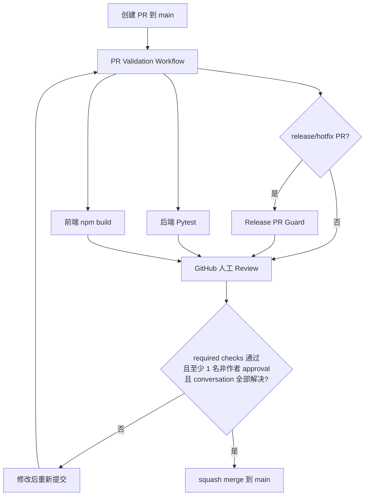

### 9.1 PR Validation 包含的检查

| Job | 作用 | 是否 required |
|---|---|---|
| `backend-tests` | 安装 Python 依赖并运行 Pytest | 第一阶段必须 |
| `frontend-build` | 安装前端依赖并执行生产构建 | 第一阶段必须 |
| `release-pr-guard` | `release/*` 分支额外校验 VERSION、CHANGELOG、Release Notes（`hotfix/*` 暂不启用） | `release/*` PR 必须 |
| `frontend-tests` | 前端单元/组件测试 | **待补齐**（B-20），补齐后必须 |
| `lint` | 后端与前端静态检查 | **待补齐**（B-20），补齐后必须 |
| `migration-check` | 校验迁移脚本可正向执行且声明了可逆性 | **待补齐**（B-20），涉及迁移的 PR 必须 |
| `dependency-scan` | 依赖漏洞扫描（见第 16 章） | **待补齐**（B-05），补齐后必须 |
| E2E | **不进入 PR required checks**（耗时过长），改由 Staging 阶段强制执行（见 10.2） | 不适用 |

required checks 的具体名称由 `DevOps_Engineer` 在 Ruleset 中配置并维护，**必须**与本表保持一致。

### 9.2 合并规则

| 项 | 规定 |
|---|---|
| 合并方式 | **必须**使用 squash merge。squash 后的提交标题**必须**符合 Conventional Commits（作者在合并前修正） |
| 谁执行合并 | 由 **approve 的 reviewer** 执行合并；reviewer 授权时 PR 作者**可**自行合并，但**禁止**在无他人 approval 时合并 |
| approval 要求 | 至少一名非 PR 作者的自然人在 GitHub.com 提交 approval |
| Copilot Code Review | **可**按需请求，仅作为补充建议，**禁止**替代人工 approval |
| 新提交处理 | 新提交**必须**使旧 approval 失效；所有 Review conversation **必须**解决 |
| 绕过 | **禁止** PR 作者或自动化绕过 Ruleset 合并；**禁止**为放行单个 PR 临时关闭 Ruleset |

**参考路径：** `.github/workflows/pr-validation.yml`、`scripts/check_release_pr.py`、`docs/BRANCHING-AND-DEPLOYMENT.md`

---

## 10. 阶段七：Staging 自动部署与回归

PR 合并到 `main` 后，Deploy Staging workflow 自动构建镜像、推送 GHCR，并部署到 Kubernetes staging 环境。

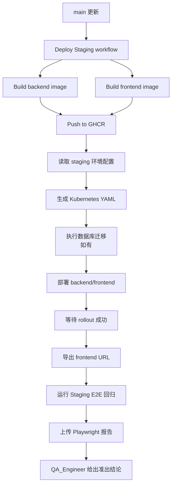

### 10.1 触发范围

Deploy Staging **必须**配置 `paths-ignore`，使**纯文档变更**（`docs/**`、`*.md`，不含 `deploy/**` 与 workflow 文件）不触发镜像构建与部署。具体路径清单由 `DevOps_Engineer` 维护于 `.github/workflows/deploy-staging.yml`。

### 10.1.1 并发与互斥控制

1. Deploy Staging workflow **必须**配置并发控制（GitHub Actions `concurrency` group，取消同一环境的旧运行），避免两次合并同时部署导致环境状态错乱。
2. 涉及数据库迁移的部署**必须**串行执行，**禁止**与其他部署并发。
3. 同一时刻**禁止**对同一环境执行两个部署或"部署 + 回滚"操作；执行回滚期间**必须**暂停自动部署。
4. 上述控制由 `DevOps_Engineer` 在 workflow 中实现（附录 B-21）。

### 10.2 Staging 阶段目标

| 动作 | 目的 |
|---|---|
| 构建镜像 | 验证生产形态的容器可构建 |
| 部署到 staging namespace | 验证 K8s 配置和服务启动 |
| Rollout 检查 | 确认后端和前端都成功发布 |
| E2E 回归 | 验证关键用户旅程没有断裂 |
| 上传报告 | 留存 QA 证据 |

### 10.3 失败处理与责任人

| 失败环节 | 首要责任人 | 处理要求 |
|---|---|---|
| 镜像构建失败 | 引入该次合并的 PR 作者 | `[待确认: 建议 2 小时内]` 修复或回退合并 |
| K8s 部署 / rollout 失败 | `DevOps_Engineer` | 判断是配置问题还是代码问题，并指派修复人 |
| Staging E2E 失败 | `QA_Engineer` 定位，判定为产品缺陷后转 PR 作者 | 用例缺陷由 `QA_Engineer` 修；产品缺陷**必须**在发布前修复 |

**约束**：Staging 未部署成功、或 E2E 存在未关闭的失败用例时，**禁止**进入版本发布准备。

### 10.4 Staging 准出结论（发布准入的必要条件）

> **顺序规则（v3.1 修正）**：Staging 准出与业务验收是**先后两步，不得互为前置**——
> **① `QA_Engineer` 准出（技术可用性）→ ② Issue Owner 业务验收（AC 满足度）→ ③ 发布准备时同时核对两份证据。**
> 此前 10.4 曾把"AC 已由 Issue Owner 确认"列为准出条件，与 7.9"验收在准出之后"互为前置，形成死锁，现已解除。

#### 10.4.1 第一步：QA 准出（只判定技术可用性）

`QA_Engineer` **必须**在业务验收开始前给出书面准出结论。判定标准**仅限**以下四项，**禁止**将业务验收结果纳入：

- Staging 部署成功且 rollout 完成；
- 旅程级 E2E 全部通过，或失败项已确认为用例问题并已修复重跑；
- 无未关闭的 P1/P2 缺陷（严重度判定见 2.1.5）；
- 本次变更涉及的功能在 Staging 环境**可访问、可操作**（冒烟级确认，不逐条对 AC）。

准出**不通过**时：**禁止**开始业务验收，缺陷按 10.3 指派修复，修复合入后重新走 10.1～10.4.1。

#### 10.4.2 第二步：业务验收（判定 AC 满足度）

QA 准出通过后，Issue Owner **必须**逐条确认 AC 并留下验收结论（见 7.9）。

验收**不通过**时，按下表处理——关键是区分**代码是否发生变更**：

| 情形 | 处理 | 是否需要重新准出 |
|---|---|---|
| **代码未变**，仅业务判断变化或验收标准理解澄清 | 在 Issue 中记录澄清结论，重新验收 | **否**——原 QA 准出证据仍有效 |
| **需修改代码**（实现缺陷、遗漏 AC） | 创建修复 Issue 或在原 Issue 下继续；修复走完整流程（分支 → PR → 门禁二 → 合入 `main`） | **是**——修复合入后**必须**重新部署 Staging 并重新执行 10.4.1，旧准出证据作废 |
| **需求理解偏差**（AC 本身要改） | 按第 15 章走需求变更流程；**回退至 `analyzed` 还是 `drafted` 由 `Development_Readiness_Reviewer` 按影响面决定**（15.2，判定原则见 2.1.2 退回表） | **是**——变更实现后同上 |

**强制规则：**

1. **任何修复代码合入 `main` 后，原 Staging 准出证据立即失效**，**必须**重新走 10.1～10.4.1；
2. **禁止**跳过重新准出直接进行第二次业务验收；
3. 原 Issue 在业务验收通过前**禁止**关闭（无论期间创建了多少个修复 Issue）；
4. **禁止**因验收不通过而要求 `QA_Engineer` 对"AC 是否满足"作出判定——准出判定技术可用性，验收判定 AC 满足度，二者不可互换。

#### 10.4.3 第三步：发布准备时的双证据核对

`Release_Manager` 在创建 Release PR 时**必须**同时核对并在 Release Manifest 中记录：

| 证据 | 出具人 | 缺失时 |
|---|---|---|
| Staging 准出结论 | `QA_Engineer` | **禁止**发布 |
| 各 Issue 的业务验收结论 | 各 Issue Owner | 按 **10.4.4** 处理——**禁止**仅从 Manifest 移除条目 |

#### 10.4.4 未验收代码已在冻结提交中的处理（v3.3 新增，硬性）

> **关键事实**：Manifest 是**记录**，不是**制品**。范围冻结点之前合入 `main` 的代码**已经在部署制品中**——把 Issue 从 Manifest 删掉，**不会**把它的代码从镜像里删掉。
>
> 因此**禁止**以「移出发布范围」的方式处理已合入但未验收的代码。这是 v3.2 及更早版本的实质漏洞。

当冻结提交中包含**未通过业务验收**的 Issue 代码时，`Release_Manager` **必须**在下列三种方式中选择其一，**没有第四种**：

| 方式 | 做法 | 适用 | 后续要求 |
|---|---|---|---|
| **A. 推迟整个发布** | 等待该 Issue 完成业务验收后再发布 | 验收即将完成，或代码耦合度高 | 验收通过后**必须**重新核对双证据；若期间 `main` 有新合入，范围冻结点随之更新 |
| **B. revert 该代码** | 新建 PR 将该 Issue 的变更 revert，走完整门禁二合入 `main`，并以 revert 后的提交重建 `release/*` | 代码可独立回退 | 见下方 **B 的验收口径** |
| **C. feature flag 关闭** | 用**已存在且已审批**的开关将该功能在生产关闭 | 代码已带开关，且开关本身经过验证 | 见下方 **C 的验收口径** |

**B 与 C 的验收口径（v3.4 明确）**

> 上一版要求 B、C「重新执行原业务验收」在逻辑上不成立——**revert 后功能已不存在，flag 关闭后功能不可访问**，Issue Owner 无从确认原 AC。故按下表区分：

| 方式 | 需要重新执行的验证 | **不要求**的验证 | 原 Issue 的 stage 与关闭 |
|---|---|---|---|
| **B. revert** | **技术准出（10.4.1）**：验证 revert 后系统功能正常、无回归 | **不要求**原 AC 通过（功能已不在制品中） | 回到 **`stage:reviewed`**（`AC-COMPLETE:` 已失效，代码不在 `main`）；**禁止**关闭。重新实现后按主线重走环节 10～14 |
| **C. flag 关闭** | **关闭态验证**：①关闭后系统行为正常、无副作用；②开关确实生效、功能不可达；③开关本身可控（可在不发版的情况下切换） | **不要求**原 AC 通过（功能不可访问） | 保持 **`stage:developed`**；**禁止**关闭。原 AC 的验收**延至该功能启用的那个版本**执行 |

**配套规则：**

1. **门禁三核对的是「所选处置方式的对应证据」**，而**不是**要求已不存在或不可访问的功能通过原 AC；
2. 方式 C 中，**开启 flag 本身视为一次发布变更**——开启版本**必须**重新执行 10.4.1 准出与 10.4.2 原 AC 验收，通过后方可关闭 Issue；
3. flag 默认关闭状态**必须**经 `[待确认: 安全负责人]` 或 `Release_Manager` 书面确认；Manifest **必须**记录该 flag 名称与状态；
4. 无论 B 还是 C，**原 Issue 在其 AC 真正被验收通过前一律禁止关闭**。

**强制规则：**

1. **禁止**仅从 Manifest 删除条目而不处理代码——这会使发布内容与发布记录不一致，且未验收功能仍会上线；
2. 选择 B 或 C 后，**必须**按上方「B 与 C 的验收口径」重新执行**适用的**验证，旧证据作废；**禁止**要求验证已不存在或不可访问的功能；
3. 选择 C 时，被关闭的功能在**开启的那个版本**完成 10.4.1 准出与原 AC 验收后，方可关闭 Issue；
4. Manifest **必须**如实记录所采用的方式（A/B/C）及其证据链接。

**参考路径：** `.github/workflows/deploy-staging.yml`、`deploy/README.md`

---

## 11. 阶段八：版本发布准备

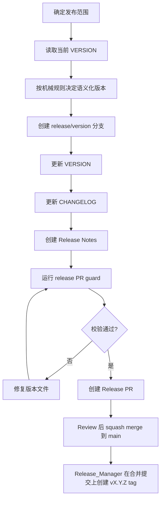

### 11.1 语义化版本的机械判定规则

版本号**必须**依据自上个 tag 以来的提交历史机械判定，不依赖主观评估：

| 条件（自上而下首个匹配者生效） | 版本递增 |
|---|---|
| 存在任一含 `BREAKING CHANGE:` 或 `type!:` 的提交 | MAJOR |
| 存在任一 `feat` 提交 | MINOR |
| 其余情况（`fix`/`perf`/`docs`/`test`/`build`/`ci`/`chore`/`refactor`） | PATCH |

对判定结果有异议时，**必须**先修正提交信息或补充 `BREAKING CHANGE` 说明，**禁止**直接推翻规则结论。

**例外：版本号已分配但被作废时（v3.4 新增，优先于上表）**

当某版本号已创建 tag，但在 tag 校验或门禁三阶段被作废（见 12.0.2）时：

| 规则 | 说明 |
|---|---|
| 递增方式 | 下一次发布**必须**以**该作废版本号**为基准 **PATCH 递增**（如 `1.2.0` 被作废 → 下次用 `1.2.1`），**不再**按上表重新机械判定 |
| 优先级 | **本例外优先于机械判定规则**。即使新增提交中含 `feat` 或 `BREAKING CHANGE`，也不改变递增方式 |
| 原因 | 作废版本号**禁止**复用（12.0.2），且发布内容未变或仅为修正，重新判定会产生版本号跳跃与追溯困难 |
| 配套 | **必须**创建新的 Release PR 并重新走门禁二（12.0.2 第 3 条）；Manifest **必须**注明「本版本因 vX.Y.Z 作废而递增」及作废原因 |

> 若作废后**发布范围发生实质变化**（新增了功能或不兼容变更），则**不适用**本例外——**必须**回到机械判定规则重新定版，并在 Manifest 中说明。

### 11.1.1 发布范围冻结与 Release Manifest

1. `Release_Manager` 创建 `release/*` 分支的时刻即为**范围冻结点**：该时刻 `main` 上已合入的变更构成本次发布范围。
2. 冻结后**禁止**为「搭车」向本次发布追加功能；确需追加时，**必须**由 `Release_Manager` 决定并重新走一次 Staging 准出。
3. **范围 = 冻结提交的实际内容，而非 Manifest 的条目列表。** 冻结点之前合入 `main` 的全部变更均已进入本次制品。若其中包含未通过业务验收的 Issue，**必须**按 **10.4.4** 选择推迟 / revert / feature flag 关闭，**禁止**仅从 Manifest 移除条目。
4. Release PR **必须**包含 **Release Manifest**，至少列出：

| 字段 | 内容 |
|---|---|
| 版本号 | `vX.Y.Z` |
| 范围冻结时间 | 创建 release 分支的时间 |
| 包含的 Issue | `Refs #...` 清单，逐条注明是否已通过业务验收 |
| 数据库迁移 | 有无、是否可逆、执行顺序 |
| 配置/Secrets 变更 | 有无、变更项 |
| 回滚方式 | 引用 13.3 中的具体方式，并注明是否满足 RTO |
| Staging 准出结论 | `QA_Engineer` 的结论链接（10.4.1） |
| 业务验收结论 | 各 Issue Owner 的逐条 AC 确认链接（10.4.2） |
| 未验收代码处置 | 如有：所采用方式（A 推迟 / B revert / C feature flag）、对应验证证据链接、涉及的 flag 名称与状态（10.4.4）；无则写「不涉及」 |
| 12.0 硬阻塞核对 | 逐项确认已关闭且在有效期内，附台账链接（见 12.0 重新阻塞规则） |

### 11.2 发布对象一致性

| 对象 | 示例 |
|---|---|
| release 分支 | `release/1.2.0` |
| VERSION 文件 | `1.2.0` |
| Git tag | `v1.2.0` |
| Release Notes | `RELEASE_NOTES_v1.2.0.md` |

### 11.3 Tag 创建

1. Release PR 合并到 `main` 后，由 `Release_Manager` 在该合并提交上创建 `vMAJOR.MINOR.PATCH` tag 并推送。
2. **禁止**在 Release PR 合并前创建 tag；**禁止**将 tag 指向非 `main` 可达的提交。**当前不设任何例外。**
3. tag 创建人**禁止**同时担任 production Environment 审批人。

> Hotfix 是否需要 tag 例外属待讨论事项（第 14 章）。结论产出前**规则保持单一**，避免双判定逻辑带来冲突。

**参考路径：** `.github/agents/release-manager.agent.md`、`CHANGELOG.md`、`VERSION`

---

## 12. 阶段九：生产部署与上线验证（门禁三）

### 12.0 生产发布持续前置条件（每次生产发布的硬阻塞项）

> 以下项目**全部关闭且仍在有效期内之前，禁止执行生产部署**。它们决定"出事之后能不能收场"，不是可以边跑边补的事项。
>
> **关闭标准**：每项**必须**填写证据链接、验证人、验证日期三项，缺一不可。**禁止**仅以"已完成"字样关闭。
>
> **本表适用于每一次生产发布，不只是首次。** 每次发布前**必须**重新核对（有效期与重新阻塞规则见下）。
>
> **核对载体（缺一不可）：**
>
> | 发布类型 | 核对载体 |
> |---|---|
> | 常规发布 | **Release Manifest** 中的"12.0 硬阻塞核对"条目（见 11.1.1） |
> | **紧急修复发布**（过渡期按常规流程加急，见 14.1） | 与常规发布相同：**Release Manifest**。加急不减少核对项 |
>
> **验证人资格与独立性：** 验证人**必须**具备执行该项验证的实际权限（如集群操作、数据库恢复权限），且**禁止**验证自己配置或变更的对象——例如修改了备份策略的人不得担任第 2 项的验证人。无法满足独立性时，**必须**由 `[待确认: 安全负责人]` 书面认可。

| # | 前置条件 | 责任人 | 证据（链接） | 验证人 | 验证日期 | 有效期 | 状态 |
|---|---|---|---|---|---|---|---|
| 1 | 回滚方式已实操演练成功（至少在 staging 完整演练一次 13.3 方式一） | `DevOps_Engineer` | `[演练记录链接]` | | | 6 个月 | 未关闭 |
| 2 | 数据库备份机制已就绪，且**已验证可成功恢复**（仅有备份不算） | `DevOps_Engineer` | `[恢复验证记录链接]` | | | 6 个月 | 未关闭 |
| 3 | 回滚触发的监控指标与阈值已定义并接入告警（13.1） | `DevOps_Engineer` | `[告警配置链接]` | | | 变更时失效 | 未关闭 |
| 4 | 回滚决策人与**替补决策人**已指定，且联系方式可达 | `Release_Manager` | `[名单链接]` | | | **每次发布前确认** | 未关闭 |
| 5 | 生产 Environment 审批人名单已配置，且与 tag 创建人不同 | `[待确认: 名单维护人]` | `[Environment 配置链接]` | | | 变更时失效 | 未关闭 |
| 6 | 可接受的恢复时间目标（RTO）与数据丢失容忍（RPO）已书面确认 | `[待确认: 业务负责人]` | `[确认记录链接]` | | | 12 个月 | 未关闭 |
| 7 | 生产 Secrets 已配置且完成一次连通性验证 | `DevOps_Engineer` | `[验证记录链接]` | | | Secrets 轮换时失效 | 未关闭 |
| 8 | 生产部署**按 digest 固定镜像**的能力已就绪（见 12.1"镜像固定"） | `DevOps_Engineer` | `[workflow 链接]` | | | 部署方式变更时失效 | 未关闭 |

#### 12.0.1 豁免边界（v2.6 新增，硬性）

> 12.0 是**硬阻塞**。为避免"承担风险"成为万能绕过口，本节把可豁免与不可豁免**穷举**列出，**表外一律不可豁免**。

| 类别 | 项目 | 是否可豁免 |
|---|---|---|
| **底线项（不可豁免）** | 第 1 项 回滚演练、第 2 项 备份与恢复验证、第 3 项 监控阈值与告警、第 7 项 生产 Secrets 验证 | **禁止豁免。** 任何人、任何紧急程度、任何书面风险接受**均不得**绕过。未满足即**禁止**生产部署——包括 Hotfix |
| **有限豁免项** | 第 4 项 替补决策人不可达、第 5 项 审批人名单临时变更、第 6 项 RTO/RPO 尚未复核（仅限已有上一版有效值时） | **可**豁免，须同时满足下方全部条件 |

**有限豁免的成立条件（缺一不可）：**

1. 由 `[待确认: 豁免审批人（附录 E.1-13）]` **书面**批准，且该人**不得**是本次发布的 tag 创建人或 PR 作者；
2. 豁免**必须**写明：豁免项、原因、**代偿措施**（如临时指定其他替补决策人）、**有效期不超过本次发布**；
3. 记入 Hotfix PR 描述或 Release Manifest，并在事后复盘中复查；
4. 同一项目**禁止**连续两次发布豁免——第二次即视为该项失效，回到硬阻塞。

> **判定口径**：当无法确定某项属于底线项还是有限豁免项时，**一律按底线项处理**（禁止发布）。

**重新阻塞规则（v2.4 新增）：** 出现以下任一情况时，对应项**立即回到"未关闭"，并重新阻塞生产发布**，直至重新验证：

| 触发情形 | 失效项 |
|---|---|
| 超过有效期未重新验证 | 该项 |
| K8s 集群、namespace 或部署方式变更 | 第 1 项 |
| 数据库实例、版本或备份策略变更 | 第 2 项 |
| 监控系统或告警通道变更 | 第 3 项 |
| 决策人或替补决策人离职、转岗、休假不可达 | 第 4 项 |
| Environment 配置或审批人名单变更 | 第 5 项 |
| 生产 Secrets 轮换 | 第 7 项 |
| 回滚流程本身（第 13 章）发生实质修改 | 第 1、2 项 |

`Release_Manager` **必须**在每次创建 Release PR 时核对本表，并将核对结论写入 Release Manifest。

**RTO / RPO 约定：** RTO `[待确认: 建议 30 分钟]`，RPO `[待确认: 建议 5 分钟]`。13.2 的决策时限与 13.3 的回滚方式选择**必须**与该目标一致；若某方案无法满足 RTO，**禁止**将其作为首选。

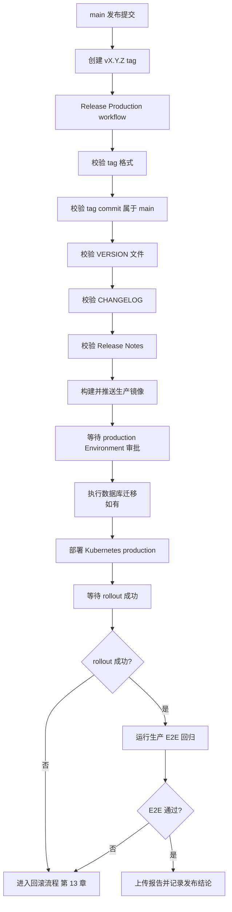

### 12.0.2 tag 校验失败或门禁三被拒绝后的处理（v3.3 新增）

| 情形 | 处理 |
|---|---|
| **tag 格式 / 版本文件 / main 可达性校验失败** | workflow 自动终止，未构建或未部署。删除该 tag，修正版本文件后**必须**新建 Release PR 走门禁二，再创建**新版本号**的 tag |
| **门禁三被拒绝**（审批人不批准） | **立即停止部署**；审批人**必须**书面写明拒绝理由 |
| **12.0 前置条件未满足** | 同上；**禁止**以豁免方式绕过底线项（12.0.1） |

**强制规则：**

1. **禁止移动 tag**——已推送的 tag **禁止**删除后指向新提交再复用同一版本号；
2. **禁止复用版本号**——被拒绝或失败的版本号**必须**作废，重新发布时 PATCH 继续递增（如 `1.2.0` 被拒 → 下次用 `1.2.1`）。该递增方式**优先于** 11.1 的机械判定规则，详见 **11.1 的作废例外**；
3. **Manifest 需修改时必须创建新的 Release PR** 并重新走门禁二，**禁止**直接编辑已合入 `main` 的 Manifest；
4. 重新发布时门禁三**必须**重新审批，**禁止**沿用上一次审批记录；
5. 被拒绝的发布**必须**留痕（理由、决定人、时间、后续动作）。

### 12.1 生产发布的关键保护

| 保护机制 | 说明 |
|---|---|
| Tag 格式校验 | 只接受 `vMAJOR.MINOR.PATCH` |
| main 可达性校验 | tag **必须**指向 `main` 可追溯提交，其他来源一律拒绝（单一判定，见 11.3） |
| 版本文件校验 | VERSION、CHANGELOG、Release Notes 必须匹配 |
| GitHub Environment | production 环境**必须**启用人工审批，审批人名单由 `[待确认: 审批人名单维护人]` 维护 |
| Secrets 隔离 | `DATABASE_URL`、`JWT_SECRET`、`KUBE_CONFIG` 等**必须**存放于 Environment Secrets，**禁止**放入仓库变量或代码 |
| Rollout 检查 | 部署失败自动收集诊断并终止，随即进入第 13 章回滚流程 |
| **镜像固定（digest）** | 生产部署**必须**以 `image@sha256:...` 形式指定镜像，**禁止**以可变 tag（如 `:latest`、`:v1.2.0`）部署——同名 tag 可被重新推送，无法保证与 staging 验证的是同一产物。部署后**必须**校验 Pod `imageID` 包含目标 digest，不一致即判定部署失败并终止 |
| 生产 E2E | 部署成功后跑关键路径回归 |

### 12.2 上线后必须完成的记录

- 生产 rollout 结果与生产 E2E 报告链接**必须**回填到 Release PR 或 Release Notes；
- 本次发布包含的每个 Issue **必须**在评论中标注所发布的版本号。

**参考路径：** `.github/workflows/release-production.yml`、`docs/GITHUB-ENVIRONMENT-SETUP.md`

---
## 13. 回滚流程（v2 新增）

> 本章是生产变更的强制配套。任何一次生产发布，若无可执行的回滚方案，**禁止**进入门禁三。

### 13.1 回滚触发条件（满足任一即触发判定）

| 触发条件 | 判定来源 |
|---|---|
| 生产 rollout 失败或超时 | Release Production workflow |
| 生产 E2E 关键路径失败 | 生产回归报告 |
| 上线后出现 P1 缺陷（判定见 2.1.5） | 线上监控或用户反馈 |
| 关键指标显著劣化 | `[待确认: 指标与阈值，如错误率 > 1%、P95 延迟翻倍]` |

### 13.2 决策与执行

| 环节 | 责任人 |
|---|---|
| 回滚决策（是否回滚） | `Release_Manager`；`[待确认: 建议 10 分钟]` 内无法联系时，由 `[待确认: 替补决策人]` 代行（替补决策人**必须**在每次发布前确认可达，见 12.0 第 4 项） |
| 回滚执行 | `DevOps_Engineer` |
| 对外/对内通知 | `Release_Manager` |
| 事后复盘召集 | Issue Owner |

**时限**：确认触发条件后 `[待确认: 建议 15 分钟]` 内作出回滚或前滚决策；**禁止**在无决策的情况下持续观望。

### 13.3 回滚方式（优先级从高到低）

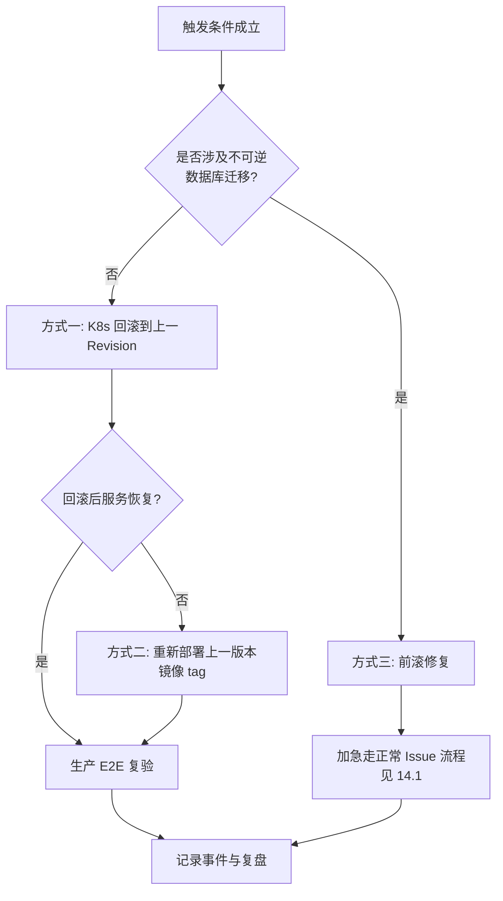

| 方式 | 适用场景 | 操作 |
|---|---|---|
| 方式一：K8s 回滚 | 纯代码变更、无迁移或迁移向后兼容 | `kubectl rollout undo deployment/<name> -n <production-namespace>`（backend 与 frontend 分别执行） |
| 方式二：重部上一版本镜像 | Revision 历史不可用 | 以上一个 `vX.Y.Z` 镜像 tag 重新部署 |
| 方式三：前滚修复 | 存在**不可逆**数据库迁移，或数据已被新逻辑写坏 | **禁止**直接回滚代码。**必须**创建 Issue、标注严重度，按 14.1 过渡约定加急走正常流程 |

> 具体命令与 namespace 以 `deploy/README.md` 为准；`DevOps_Engineer` **应**将上述回滚封装为可一键执行的 workflow（`[待创建: .github/workflows/rollback-production.yml]`），在此之前**必须**在 Release Notes 中写明手工回滚步骤。

### 13.4 数据库迁移的回滚约束

1. 涉及数据库结构变更的发布，Release Notes **必须**注明"可逆"或"不可逆"。
2. "不可逆"发布**必须**在门禁三审批时被显式告知审批人，并**必须**在部署前完成数据备份。备份方式 `[待确认: 备份机制]`，且**必须**已通过恢复验证（见 12.0 第 2 项）——未验证恢复的备份视同没有备份。
3. 破坏性变更（删除列/表、重命名）**必须**拆分为至少两个版本：先兼容写入，后清理。

### 13.5 事故复盘（覆盖回滚、生产事故与 Hotfix）

以下三种情形**必须**进行复盘，**不限于**回滚：

| 情形 | 是否必须复盘 |
|---|---|
| 执行了生产回滚 | 必须 |
| 发生 P1/P2 生产事故（无论是否回滚） | 必须 |
| 执行了 Hotfix 发布 | 必须 |
| 生产 E2E 失败但未升级为事故 | 应 |

复盘**必须**产出：时间线、根因、为何未被 Staging 拦截、改进项与责任人、改进项的跟踪位置。复盘**禁止**以追责为目的。

### 13.5.1 回滚后的必办事项

- 生产 E2E 复验并留存报告；
- 在对应 Issue 与 Release Notes 中记录：触发原因、决策时间、执行方式、影响范围与时长；
- `[待确认: 建议 3 个工作日]` 内完成复盘，并将改进项登记到附录 B。

---

## 14. Hotfix 流程（**暂缓，待专题讨论**）

> **本章当前不提供可执行规则。** 团队已决定优先梳理 **Issue 主线（新需求开发）** 流程；Hotfix 属低频场景，设计尚有未决问题，暂不纳入本规范强制执行。

### 14.1 过渡约定（当前生效）

定稿前，生产紧急问题**必须**按以下方式处理：

| 情形 | 处理方式 |
|---|---|
| 可等待常规发布 | 创建 Issue、标注严重度（2.1.5），按**正常 Issue 流程加急**：`fix/<issue>-<slug>` → PR → `main` → Staging → release → tag → 生产 |
| 不可等待 | 由 `[待确认: 决策人]` **逐案决定**，并**必须**在事后 `[待确认: 建议 2 个工作日]` 内补齐记录（问题、决策、操作、验证证据），纳入复盘（13.5） |

> **「逐案决定」的边界（v3.1 明确）**：决策人**只能**决定**优先级排序**与**是否立即启动常规流程**（如插队排期、加急评审、缩短等待）。**禁止**决定跳过或放宽下列硬约束——它们不在决策人权限范围内。

**过渡期硬约束（不可豁免）：**

1. tag **必须**指向 `main` 可达提交（11.3）——过渡期**不设例外**；
2. 门禁二、门禁三**禁止**豁免；
3. 12.0 底线项（12.0.1）**禁止**豁免；
4. **禁止**跳过 Staging 验证。

> 这意味着过渡期内紧急修复**在流程上与常规发布相同，只是优先级更高**。这是刻意选择——用"流程慢一点"换"规则不打架"。

### 14.2 待讨论事项

完整设计草案（分支策略、tag 例外、Staging Runbook、环境锁、失败恢复、迁移约束）已拆至 **`HOTFIX-DRAFT.md`**，含 6 个待决问题，**先定"是否需要独立紧急通道"**（B-30）。

> **本规范转正式生效不以本章定稿为条件。**

## 15. 需求变更与状态回退

### 15.1 开发中发生需求变更

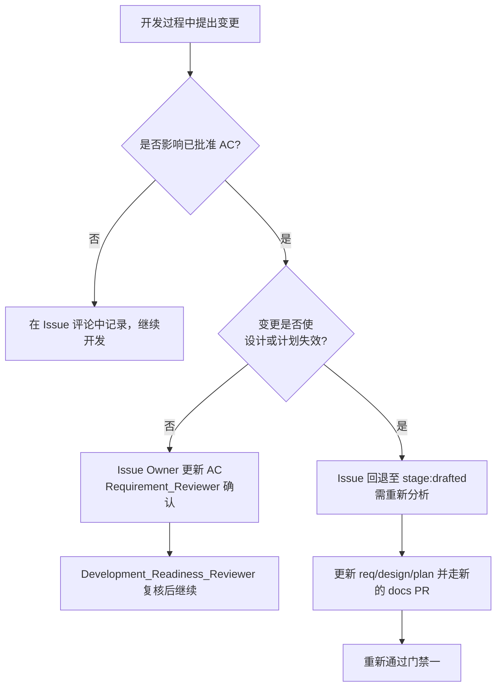

### 15.2 规则

1. 只有 Issue Owner **可**发起 AC 变更；`Developer` 发现需求缺口时**必须**回报 Issue Owner，**禁止**自行扩大或缩小范围。
2. 回退到 `stage:analyzed` 或 `stage:drafted` 的决定，一律由 `Development_Readiness_Reviewer` 按影响面作出——**编码期间（`stage:reviewed`）与业务验收阶段（`stage:developed`）适用同一规则**。判定原则见 2.1.2 退回表：仅措辞澄清或小幅补充 → `analyzed`；需重写需求/设计/计划 → `drafted`。
3. 已写代码的处理：**应**保留在原 feature 分支（不合并），待新的门禁一通过后继续；若变更导致方案作废，**应**关闭原 PR 并在 Issue 中说明。
4. 范围显著变化时，**应**拆分为新 Issue，保持原 Issue 的可追踪性。

---

## 16. 安全与合规要求（v2 新增）

| 要求 | 规则 | 责任人 |
|---|---|---|
| 依赖漏洞扫描 | **应**在 PR Validation 中加入依赖扫描（`[待创建: 扫描 job 名称]`）；出现 Critical/High 漏洞时**必须**在合并前处置或书面豁免 | `DevOps_Engineer` |
| 密钥扫描 | **必须**启用仓库 secret scanning 与 push protection；**禁止**任何密钥进入仓库历史 | `DevOps_Engineer` |
| Secrets 管理 | 生产密钥**必须**存于 production Environment Secrets，轮换周期 `[待确认: 建议 90 天]` | `DevOps_Engineer` |
| 权限与鉴权变更 | 涉及 JWT、角色、数据可见性的变更，PR **必须**额外指定一名安全评审人 | PR 作者 |
| 健康数据处理 | 涉及个人健康数据的需求，需求文档**必须**填写数据与隐私模块（见 3.2） | `Product_Manager` |
| 生产数据使用 | **禁止**将生产数据用于本地或 staging 测试，除非已脱敏并获 `[待确认: 审批人]` 批准 | 全体 |

---

## 17. 端到端泳道图

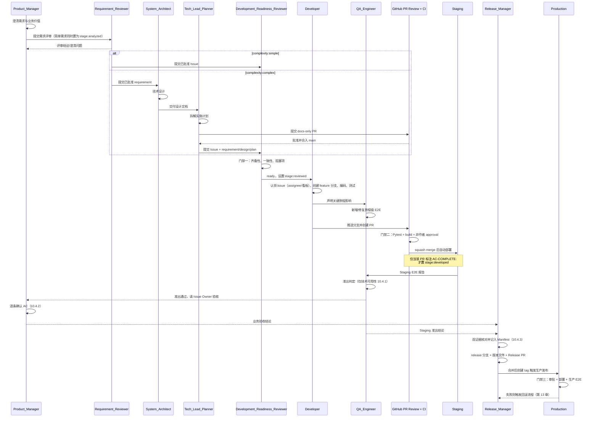

---

## 18. 分支策略与 Git 流

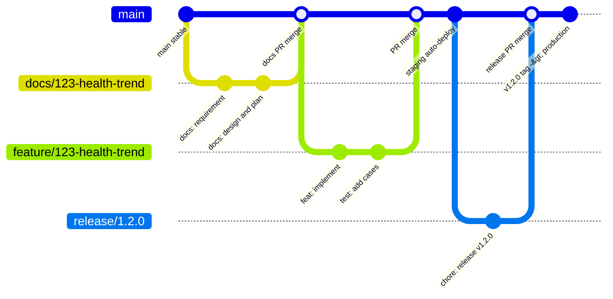

| 分支 | 用途 |
|---|---|
| `main` | 唯一长期分支，始终保持可部署；所有变更经 PR 合入 |
| `docs/<issue>-<slug>` | 复杂需求的需求/设计/计划文档协作（含早期草案） |
| `docs/<issue>-<slug>-r<N>` | 门禁一驳回后的文档修订 |
| `feature/<issue>-<slug>` | 关联 Issue 的新功能开发 |
| `fix/<issue>-<slug>` | 关联 Issue 的 Bug 修复 |
| `fix/<slug>` | 无 Issue 的小型 Bug 修复（限 7.5 例外条件） |
| `release/<version>` | 发布准备 |
| `hotfix/<version>` | **暂不启用**，待专题定稿（见第 14 章） |

> **v2 说明**：本项目采用单一主干模型，**不使用** `develop`、`staging` 等长期环境分支。环境差异通过 GitHub Environment 配置区分，而非分支区分。

---

## 19. 检查清单

### 19.1 需求进入开发前（门禁一）

- [ ] 业务价值明确
- [ ] 范围与非范围明确
- [ ] 验收标准可逐条映射到测试
- [ ] 权限、异常路径、边界值已覆盖
- [ ] 需求已同步 GitHub Issue，且已标注 complexity
- [ ] `Requirement_Reviewer` 已给出通过或有条件通过结论
- [ ] 有条件通过的待关闭项已逐项核对
- [ ] 复杂需求：req/design/plan 三项评审结论均可在 docs PR 上查到，且 docs PR 已合入 `main`
- [ ] 涉及数据库变更：迁移方案、执行顺序、可逆性已写明
- [ ] `Development_Readiness_Reviewer` 已确认无未解决阻塞项
- [ ] Issue 已设置为 `stage:reviewed`

### 19.2 Developer 开始前

- [ ] 已从最新 `main` 创建 feature/fix 分支
- [ ] 简单需求已读取批准后的 Issue；复杂需求已读取 requirement/design/plan
- [ ] 按变更类型启动了所需终端（见 8.4）
- [ ] Issue 已认领：assignee 已设置，看板已移入 In Progress（**注意**：`stage:developed` 在 PR 合并后才设置）

### 19.3 PR 合并前（门禁二）

- [ ] 后端 Pytest 通过
- [ ] 前端 build 通过
- [ ] 涉及 UI 的变更已有组件级 E2E
- [ ] 已声明是否影响关键旅程；影响时旅程级 E2E 已由 `QA_Engineer` 完成
- [ ] 本地验证已确认功能行为
- [ ] 提交信息遵循 Conventional Commits；不兼容变更已标注 `BREAKING CHANGE`
- [ ] PR 描述包含背景、变更点、迁移说明、测试证据、回滚方式
- [ ] PR 已关联源 Issue（`Refs`），完成全部 AC 时已标注 `AC-COMPLETE:`
- [ ] 至少一名非作者已 approval，所有 Review conversation 已解决
- [ ] release/hotfix PR 已通过 release guard
- [ ] 若本 PR 标注了 `AC-COMPLETE:`，合并后已将 Issue 置为 `stage:developed`

### 19.4 上线前（门禁三）

- [ ] Staging 部署成功
- [ ] Staging E2E 回归通过
- [ ] `QA_Engineer` 已出具 Staging 准出结论（10.4.1，仅技术可用性）
- [ ] 各 Issue Owner 已在准出**之后**逐条确认 AC（10.4.2）
- [ ] 两份证据均已记入 Release Manifest（10.4.3）
- [ ] 冻结提交中**不含**未验收且未处置的代码；如有，已按 10.4.4 选择 A/B/C，并完成该方式**对应的**验证（B=技术准出；C=关闭态验证），相关 Issue 均未被关闭
- [ ] VERSION、CHANGELOG、Release Notes 一致，版本号符合机械判定规则
- [ ] 生产 Secrets 和 Variables 已配置
- [ ] production Environment 审批人明确，且与 tag 创建人不同
- [ ] **12.0 硬阻塞项全部已关闭，且均在有效期内**（含证据链接、验证人、验证日期；已在 Release Manifest 中记录核对结论）
- [ ] 替补决策人本次发布前已确认可达（12.0 第 4 项）
- [ ] 回滚方式已写入 Release Notes，且满足 RTO；迁移可逆性已注明
- [ ] 不可逆迁移已完成数据备份

### 19.5 上线后

- [ ] 生产 rollout 成功
- [ ] 生产 E2E 回归通过
- [ ] Playwright 报告已上传
- [ ] 发布结论记录到 Release PR 或 Release Notes
- [ ] 发布范围内每个 Issue 已标注版本号
- [ ] 如发生回滚：事件记录与复盘已完成

---

## 附录 A：设计决策与取舍（rationale，非执行条款）

| 决策 | 理由 | 被否决的替代方案 |
|---|---|---|
| 文档也走分支 + PR | `main` 需保持可部署且 Ruleset 要求全部变更经 PR；文档同样需要评审留痕 | 直接向 `main` 推送文档：绕过评审，且与 Ruleset 冲突 |
| Issue stage 只保留四个 | 每个 stage 对应一个可客观核验的里程碑，与"谁负责推进"一一对应；状态越多越易失真 | 增设 `stage:design`、`stage:plan`：无对应门禁与决策人 |
| stage 统一采用过去式（已完成里程碑） | 消除"这个状态是正在做还是已做完"的歧义；门禁判定的本质就是"里程碑是否达成" | 用活动名（`requirements-review`）：用单一角色的活动命名跨角色区间，且无法区分进行中与已完成 |
| "正在编码"用 assignee + 看板而非 stage 表达 | 保持 stage 的过去式一致性；活动状态本就属于看板语义 | 增设 `stage:developing`：破坏命名一致性，回到活动名与里程碑名混用 |
| 第一阶段只启用 6 个标签（`stage:*` + `complexity:*`） | 标签越多越难维护，且维护不及时的标签会误导判断；`doc:*` 与 docs PR 的审批记录重复，`priority:*` 在小规模在途量下靠标题前缀即可 | 一次性铺开四套标签：执行负担高，实际很快无人维护 |
| 严重度"定义生效、标签缓行" | 门禁三、回滚触发、Hotfix 适用范围都依赖 P1/P2 判定；缺标签可以，缺判定标准会使这三条规则不可判定 | 连定义一起缓行：三条强制规则悬空 |
| 门禁只设三道 | 门禁越多，绕过与走过场的概率越高；三道分别对应"进入编码/合入主干/进入生产" | 每个角色一道门禁：流程停滞、责任分散 |
| 驳回后新建 `-rN` 修订分支 | 原 docs 分支在合并后已关闭，无法继续提交；新建分支保留完整评审历史 | 复用已合并分支：技术上不成立 |
| 统一 squash merge | 保证 `main` 历史与 Conventional Commits 一致，使版本号可机械判定 | merge commit：历史噪声大，版本判定不可靠 |
| 版本号机械判定 | 消除"这算 MINOR 还是 MAJOR"的主观争论，使发布可复核 | 由发布人主观判断：不可复核、易漂移 |
| Hotfix 暂缓、聚焦 Issue 主线 | Hotfix 低频且设计未决，其 tag 例外会给主线引入双判定逻辑；先把高频主线做扎实 | 继续在主规范中细化 Hotfix：冲突面持续放大，主线可读性下降 |
| 单一主干、无 develop 分支 | 与现有 CI/CD（main → staging、tag → production）一致 | 引入 develop/staging 分支：与现有流水线不匹配，增加合并成本 |

---

## 附录 B：待确认项与改进计划

> 本表中的 `[待确认]`、`[待创建]` 项**必须**在 `[待确认: 目标日期]` 前关闭；关闭后从本表移除并在正文落地。

| 编号 | 事项 | 类型 | 责任人 | 目标日期 |
|---|---|---|---|---|
| B-01 | 确定文档 Owner 与复核机制 | 待确认 | | |
| B-02 | 确定各环节评审 SLA（**2.1.6**） | 待确认 | `[待确认]` | `[待确认]` |
| B-03 | 统一文档目录大小写为 `docs/design`（历史目录重命名并更新引用） | 改进 | | |
| B-04 | **[发布阻塞]** 创建 `rollback-production.yml` 一键回滚 workflow，并在 staging 完整演练一次（12.0-1） | 待创建 | | |
| B-05 | 在 PR Validation 中加入依赖漏洞扫描 job（第 16 章） | 待创建 | | |
| B-06 | 为 Deploy Staging 配置 `paths-ignore`（10.1） | 改进 | | |
| B-07 | **[发布阻塞]** 确定线上指标阈值并接入告警（13.1、12.0-3） | 待确认 | | |
| B-08 | **[发布阻塞]** 确定迁移工具与备份机制，并完成一次**恢复验证**（5.2、13.4、12.0-2） | 待确认 | | |
| B-09 | 补充 `.github/agents/*` 全部角色定义文件并纳入索引 | 改进 | | |
| B-10 | 确定本地开发操作系统基线并补充非 Windows 命令（0.5） | 待确认 | | |
| B-11 | 建立旅程级 E2E 用例清单文件（8.2） | 待创建 | | |
| B-12 | 若团队规模无法满足 0.4 的不可降级项，登记并书面接受风险 | 待确认 | | |
| B-13 | 在 GitHub 仓库中建立第一阶段 6 个标签（4 个 `stage:*` + 2 个 `complexity:*`），迁移存量 Issue，删除或归档不再使用的旧标签；同步更新 `.github/agents/*` 与自动化脚本 | 改进 | | |
| B-18 | 评估是否进入标签第二阶段（启用 `doc:*` 与 `priority:*`），触发条件见 2.1.4、2.1.5 | 待确认 | | 第一阶段运行 3 个月后 |
| B-19 | **[活动阻塞][正式生效条件]** 指定 1.2 审批人总表中全部主审批人、替补审批人与升级对象（含安全负责人、替补决策人、严重度复核人）。未指定者，对应活动禁止开始；**本项未关闭则本规范不得转为正式生效** | 待确认 | 文档 Owner | `[待确认]` |
| B-20 | 补齐 required checks：`frontend-tests`、`lint`、`migration-check`（9.1） | 待创建 | | |
| B-21 | 为 Deploy Staging 配置 concurrency group 与迁移串行控制（10.1.1） | 待创建 | | |
| B-22 | **[发布阻塞]** 书面确认 RTO / RPO 目标（12.0） | 待确认 | | |
| B-23 | 建立事故复盘模板与存放位置（13.5） | 待创建 | | |
| B-27 | **[暂缓]** Release Production workflow 的 hotfix tag 支持——待 Hotfix 专题定稿后评估 | 暂缓 | — | — |
| B-28 | **[发布阻塞]** 生产与 staging 部署改为按 digest 固定镜像，并校验 Pod `imageID`（12.1、12.0-8） | 待创建 | `DevOps_Engineer` | `[待确认]` |
| B-29 | 实现 staging 环境锁，并使自动部署 workflow 启动时检查该锁（10.1.1）。**与 Hotfix 无关**，常规并发部署同样需要 | 待创建 | `DevOps_Engineer` | `[待确认]` |
| B-25 | **[暂缓]** 按 tag/digest 部署 staging 的 `workflow_dispatch` 入口——待 Hotfix 专题定稿后评估 | 暂缓 | — | — |
| B-26 | 建立 12.0 硬阻塞项登记台账（证据、验证人、日期、有效期），纳入 Release Manifest 核对 | 待创建 | `[待确认]` | `[待确认]` |
| B-30 | **Hotfix 专题讨论**：按 `HOTFIX-DRAFT.md` 的 6 个待决问题产出结论，**先定「是否需要独立紧急通道」** | 待确认 | `[待确认]` | `[待确认]` |
| B-24 | 关闭全部 [发布阻塞] 项后，由文档 Owner 宣布本规范由试运行转正式生效 | 待确认 | | |
| B-14 | 配置 GitHub Projects 看板列（Backlog / In Progress / In Review / Done），承载"是否已开工"的活动信号（2.1.2） | 待创建 | | |
| B-15 | 将 19.1–19.5 检查清单落地为 GitHub Issue/PR 模板（`.github/ISSUE_TEMPLATE/`、`PULL_REQUEST_TEMPLATE.md`），使清单在创建时自动出现 | 待创建 | | |
| B-16 | 建立需求文档、设计文档、实施计划、Release Notes 四类模板文件，供各角色直接套用 | 进行中：需求模板已完成，其余待创建 | | |
| B-17 | 明确本流程规范自身的变更方式（本文档修改是否也走 docs PR、由谁批准） | 待确认 | | |

---

## 附录 C：相关文档索引

| 文档 | 路径 | 用途 |
|---|---|---|
| 贡献指南 | `CONTRIBUTING.md` | 代码规范、提交规范、版本发布 |
| 开发环境 | `docs/DEVELOPMENT.md` | 环境搭建、启动命令 |
| 分支策略 | `docs/BRANCHING-AND-DEPLOYMENT.md` | 分支、环境与自动部署规则 |
| 部署指南 | `deploy/README.md` | K8s 部署与回滚操作 |
| 环境配置 | `docs/GITHUB-ENVIRONMENT-SETUP.md` | GitHub Secrets/Variables/Environment |
| 架构设计 | `docs/architecture/architecture.md` | 系统架构与分层 |
| 角色定义（Agent） | `.github/agents/`（含 `role-developer.agent.md`、`release-manager.agent.md` 等，清单见 B-09） | 各角色 Agent 定义 |
| 三终端启动 | `.github/prompts/invoke_app_with_different_Terminals.prompt.md` | 本地开发三终端模型 |
| 分支策略 Prompt | `.github/prompts/feature_branch_development_strategy.prompt.md` | Agent 开发时的分支操作指南 |
| PR 校验 | `.github/workflows/pr-validation.yml` | CI 自动检查 |
| Staging 部署 | `.github/workflows/deploy-staging.yml` | 合并后自动部署 |
| 生产发布 | `.github/workflows/release-production.yml` | Tag 驱动发布 |
| 生产回滚 | `[待创建: .github/workflows/rollback-production.yml]` | 一键回滚 |
| E2E 回归 | `.github/workflows/e2e-regression.yml` | 手动触发 E2E |
| Release PR Guard | `scripts/check_release_pr.py` | 发布 PR 校验脚本 |

---

## 附录 D：变更记录

> **阅读提示**：本附录保留历次修订记录，仅用于变更溯源。其中 **v2.3–v2.6 记录中涉及 14.3-x、14.4.x 的条目**，其对应内容已于 **v3.0 拆至 `HOTFIX-DRAFT.md`**，在本规范中**均不再生效**。

| 类别 | 变更 |
|---|---|
| 新增 | 第 13 章回滚流程、第 14 章 Hotfix 流程、第 15 章需求变更与状态回退、第 16 章安全与合规 |
| 新增 | 0.1 措辞等级、0.2 角色术语表、0.3 Agent 与人的问责边界、0.4 角色兼任降级规则、0.5 环境基线 |
| 新增 | 1.1 门禁总表；2.1.3 文档进度标签；2.1.4 评审 SLA；7.9 Issue 关闭与验收责任人；10.3 失败责任人；10.4 Staging 准出结论 |
| 修正 | 门禁一驳回后的返工路径改为新建 `-rN` 修订分支（原流程指向已合并分支，逻辑不成立） |
| 修正 | 明确 E2E 三层职责分工，统一总览图、开发流程图、泳道图中 QA 的位置 |
| 修正 | 澄清 `stage:analyzed` 的边界，评审进度改由 `doc:*` 标签表达 |
| 修正 | "唯一门禁"限定为"进入编码的门禁"；合并 docs 分支重复条目；统一角色术语与 `docs/design` 大小写 |
| 修正 | 明确合并方式为 squash merge、合并执行人、分支清理改用 `git branch -D` |
| 修正 | 补全 Conventional Commits 类型与 `BREAKING CHANGE` 规则；版本号改为机械判定 |
| 修正 | 明确 tag 创建人为 `Release_Manager` 及创建时机；删除与分支表不符的 develop/staging 表述 |
| 修正 | 三终端按变更类型条件化；Issue 创建给出客观触发条件；`fix/<slug>` 例外给出量化边界 |
| 结构 | 全文措辞统一为"必须/应/可"；rationale 移入附录 A；待办项移入附录 B |

### v2.0 → v2.1（Issue stage 命名重构）

| 类别 | 变更 |
|---|---|
| 重命名 | `stage:draft` → `stage:drafted`；`stage:requirements-review` → `stage:analyzed`；`stage:ready-for-development` → `stage:reviewed`；`stage:in-development` → `stage:developed` |
| 约定 | 确立"stage 一律过去式 = 里程碑已完成"，并明确"当前正在做的是下一个里程碑" |
| 语义变更 | `stage:developed` 重新定义为"代码已合入 `main`"（原 `in-development` 为"开始编码"）；"正在编码"改由 assignee + Projects 看板表达 |
| 语义澄清 | 复杂需求在设计/计划期间处于 `stage:drafted`（分析未完成），plan 成文后由 `Tech_Lead_Planner` 置为 `stage:analyzed` |
| 新增 | 2.1.2 每个 stage 的客观达成标准、期间正在发生的活动、状态流转图与退回规则 |
| 新增 | 目录、按角色快速导航、常用缩写表 |
| 修正 | `Tech_Lead_Planner` 职责与"禁止修改 stage"的冲突（现明确其仅可设置 `stage:analyzed`） |
| 修正 | 第 4 章评审结论与流程图：`doc:*` 标签仅适用于 `complexity:complex`；补充简单/复杂需求各自的退回目标状态 |

### v2.1 → v2.2（标签精简与分期落地）

| 类别 | 变更 |
|---|---|
| 精简 | 第一阶段只启用 **6 个标签**（4 个 `stage:*` + 2 个 `complexity:*`）；`doc:*` 与 `priority:*` 定义在案但暂不启用 |
| 新增 | 2.1.3 标签总表与分期落地，含"GitHub 已原生记录的信息禁止用标签重复记账"原则 |
| 变更 | 复杂需求的三项评审证据由 `doc:*` 标签改为 **docs PR 上的 approval 与评论**（单一事实来源），门禁一、7.5、19.1 同步调整 |
| 新增 | 2.1.5 P1/P2/P3 严重度定义**立即生效**（标签缓行不影响判定），第一阶段以 Issue 标题前缀记录 |
| 联动 | 10.4 Staging 准出、13.1 回滚触发、14.1 Hotfix 适用范围统一引用 2.1.5，不再依赖 `priority:*` 标签 |
| 新增 | 附录 B-18：第一阶段运行 3 个月后评估是否进入标签第二阶段 |

### v2.2 → v2.3（外部评审 Request changes 修订）

| 编号 | 类别 | 变更 |
|---|---|---|
| P0-1 | **修正** | docs PR **必须在 req 提交后立即以 Draft 创建**，作为三项评审的共同载体（v2.2 移除 `doc:*` 标签后遗留的时序循环：评审需要 PR，PR 却要等三份文档写完） |
| P0-2 | **修正** | 新增 `stage:developed` 触发规则：仅 `feature/*`、`fix/*` PR 可触发，`Refs` 不触发，需显式 `AC-COMPLETE:` 标记；全仓库**禁用** `Closes`/`Fixes` 自动关闭关键字，Issue 改由 Issue Owner 手工关闭 |
| P0-3 | **修正** | Hotfix 改为"**先发布、后回合**"：tag 打在 hotfix 分支并以该 tag 部署生产，验证通过后再合并回 `main`；12.1 的 main 可达性校验同步开放该例外 |
| P0-4 | **新增** | 12.0 生产发布前置条件（7 项硬阻塞，含回滚演练、备份恢复验证、监控阈值、替补决策人、RTO/RPO） |
| P0-5 | **新增** | 文档状态改为**试运行**，并区分"立即强制生效"与"配套完成后升级为必须"的条款 |
| P1 | 新增 | 1.2 审批人总表（含审批独立性与升级路径） |
| P1 | 新增 | 9.1 required checks 分期补齐；明确 E2E 不进 PR 门禁 |
| P1 | 新增 | 10.1.1 Staging 并发控制与迁移互斥 |
| P1 | 新增 | 11.1.1 发布范围冻结与 Release Manifest |
| P1 | 扩展 | 13.5 复盘覆盖回滚、P1/P2 生产事故与 Hotfix |
| P1 | 明确 | 8.2 旅程级 E2E 的合入方式与证据地位 |
| P1 | 新增 | 附录 B-19～B-24，并为发布阻塞项加 **[发布阻塞]** 标记 |

**本轮未采纳的评审建议：**

| 建议 | 处理 | 理由 |
|---|---|---|
| 新增完整 RACI 矩阵 | 以 1.2 审批人总表替代 | 9 角色 × 20 活动的 RACI 与现有角色表、门禁总表、stage 决策人表大量重复；真正缺的是"谁拍板"，已补齐 |
| E2E 纳入 PR required checks | 不采纳 | PR 阶段跑全量 E2E 会显著拖慢反馈；已在 Staging 阶段强制执行并作为准出条件 |
| "回滚机制不可执行" | 部分采纳 | 13.3 已有可执行的 runbook 与命令；真正缺的是阈值、备份恢复验证与演练，已列为 12.0 硬阻塞 |

### v2.3 → v2.4（复审 Request changes 修订）

| 编号 | 类别 | 变更 |
|---|---|---|
| P0 | **修正** | **解决 Hotfix tag 的强制条款冲突**：11.3 重写为"常规发布 / 紧急修复"两情形表，明确 hotfix 为唯一例外并给出合法性判定；12.1 校验规则同步为二选一判定 |
| 1 | 修正 | Hotfix 图中 `vX.Y.Z+1` 改为合法示例 `v1.1.1 → v1.1.2` |
| 2 | 新增 | 14.3-9 定义 hotfix tag 镜像的 staging 验证方式（按 digest 比对同一镜像）与失败处理（删除 tag、版本号继续递增、禁止复用）。*注：其中「不可验证时书面批准」一项已在 v2.6 按 12.0.1 收紧* |
| 3 | 修正 | 14.3-4 澄清 hotfix 的门禁二"**推迟的只是合并动作，检查条件一项不减**" |
| 4 | 修正 | 8.1 流程图补 `AC-COMPLETE:` 判定分支，与 2.1.2 触发规则一致 |
| 5 | 强化 | 12.0 硬阻塞表增加证据链接、验证人、验证日期、有效期四列，并新增**重新阻塞规则**（8 类触发情形）；由"首次发布阻塞"升级为"每次发布前核对" |
| 6 | 新增 | 19.4 上线前清单增加"12.0 硬阻塞全部关闭且仍有效"与"替补决策人已确认可达" |
| 保留意见 1 | 强化 | 1.2 审批人表增加**替补审批人**列；新增配置规则：未配置审批人则**对应活动禁止开始**（[活动阻塞]）、禁止审批自己产出、**文档 Owner 不作为默认升级对象** |
| — | 新增 | 附录 B-25（hotfix staging 验证入口）、B-26（硬阻塞台账） |

### v2.4 → v2.5（终审 P1 修订）

| 编号 | 类别 | 变更 |
|---|---|---|
| P1-1 | 新增 | **附录 E 待指定人员登记表**——将全文所有 `[待确认: 人员/阈值]` 汇总为一张可回填表（E.1 审批人 12 项 + E.2 角色与阈值 18 项）；B-19 升级为 **[正式生效条件]**；文档头明确 B-19 未关闭前**哪些活动可正常开展、哪些受阻**。**注**：审批人姓名属组织决策，须由团队填写，文档层面无法关闭 |
| P1-2 | 新增 | **14.4 Hotfix Staging 验证 Runbook**——B-25 落地前的可执行手工路径，含 7 步表、kubectl 命令、digest 一致性校验、授权与失败处理；B-25 标记为"有替代路径的活动阻塞" |
| P1-3 | 修正 | 泳道图补 `AC-COMPLETE:` 条件注记，与 2.1.2、8.1 一致；新增 2.1.2-5 **标签落地前的替代证据**（PR 的 `AC-COMPLETE:` 行 + Issue 评论），并要求标签建好后回填 |
| P1-4 | 强化 | 门禁三总表明确包含"12.0 全部关闭且在有效期内"；12.0 新增**核对载体表**（*Hotfix 相关部分已于 v3.0 拆出，v3.1 改指 Release Manifest*） |
| P1-5 | 新增 | 1.2 增加 **P1/P2 严重度判定复核**行（主/替补/升级对象）；2.1.5 明确争议期间**先按就高执行**，禁止因争议未决而暂停回滚或 Hotfix 响应 |
| 次要 | 修正 | 12.0 标题改为"**生产发布持续前置条件**"（每次发布适用，非仅首次）；新增**验证人资格与独立性**规则；修正 B-02 的 SLA 章节引用（2.1.4→2.1.6）；附录 B 补责任人/日期列 |
| 次要 | 新增 | E.2 阈值类项目设**默认值兜底**：未在决议日期前决定则自动采用建议值，避免流程停摆（审批人不适用） |

---

### v2.5 → v2.6（复审 P1 修订：Runbook 与默认值机制的风险收口）


| 编号 | 类别 | 变更 |
|---|---|---|
| P1-1 | 修正 | 试运行范围由"简单需求全流程"改为**按 E.1 逐项对照的活动状态表**；明确 B-19 未关闭时"代码可写、PR 可合，但需求无法通过评审、无法进入门禁、无法发布" |
| P1-2 | **修正** | 新增 **12.0.1 豁免边界**：回滚演练、备份与恢复验证、监控告警、Secrets 验证为**底线项，一律不可豁免**（含 Hotfix）；其余为有限豁免项，须预先指定审批人、写明代偿措施、有效期限本次发布、禁止连续两次豁免；无法判定时按底线项处理。14.3-8 的"承担风险后继续"已删除 |
| P1-3 | **修正** | 新增 **14.4.0 Runbook 前置条件**：workflow 支持 hotfix tag（B-27）是启动 Runbook 的前提；未完成时走新增的 **14.4.4 受控备用构建路径**，禁止为绕过校验而改 tag 指向 |
| P1-4 | **修正** | 生产部署**必须**按 `image@sha256:` 固定镜像，禁止用可变 tag；部署后校验 Pod `imageID`；12.1 新增"镜像固定"保护项，12.0 新增第 8 项前置条件，落地为 B-28 |
| P1-5 | **新增** | Runbook 补齐可执行的互斥与恢复：**14.4.3 环境锁**（ConfigMap 实现、超时强制释放、workflow 启动检查）、**14.4.5 失败恢复**（旧镜像快照 → 恢复 → 验证 → 释放锁，含恢复失败的升级路径）；14.4.1 增加 kube context、权限、锁状态检查；`rollout status` 增加 `--timeout` |
| P1-6 | **修正** | 新增 **E.2.1 默认值适用边界**：仅流程时限类 8 项可默认；备份恢复、监控阈值、RTO/RPO、Secrets 周期**禁止默认**，须书面批准，未批准则持续阻塞生产发布 |
| 次要 | 修正 | 交叉引用编号（14.3-8 / 14.3-9）；Runbook 补 frontend digest 与 Pod `imageID` 校验 |
| 次要 | 新增 | **14.4.6 带数据库迁移的 Hotfix**：可逆且向后兼容才可执行；不可逆或破坏性变更**禁止**以 Hotfix 发布；无法判断时按不可逆处理 |
| 次要 | 新增 | 附录 E.1 补 13～15 项（有限豁免审批人、台账维护人、独立性例外批准人）；附录 B 新增 B-27、B-28、B-29 |

### v2.6 → v3.0（聚焦 Issue 主线，Hotfix 暂缓）

| 类别 | 变更 |
|---|---|
| **聚焦** | 明确本版聚焦 **Issue 主线（新需求开发）**；Hotfix 属低频场景且设计未决，暂缓纳入强制流程 |
| **新增** | **2.2 Issue 全生命周期总表**——18 个环节的主线速查表（触发、负责人、输入、动作、产出、完成判定、stage 变化、详见）；2.2.2 简繁对照；2.2.3 两条完整时间线示例；2.2.4 主线三个常见错误 |
| **拆出** | 第 14 章完整内容（含 Staging Runbook、环境锁、失败恢复、迁移约束）拆至独立文件 **`HOTFIX-DRAFT.md`**，标注"草案 / 不生效"，并列出 6 个待决问题 |
| **简化** | 第 14 章改为过渡约定：紧急问题按**正常 Issue 流程加急**处理，过渡期硬约束（tag 单一规则、门禁二三不豁免、12.0 底线项不豁免、不跳过 Staging）不可豁免 |
| **简化** | **11.3 恢复为单一 tag 规则**（tag 必须 `main` 可达，不设例外）；12.1 校验恢复单一判定——消除 v2.4 起因 Hotfix 例外引入的双判定复杂度 |
| **简化** | `hotfix/*` 分支在三处分支表中统一标注"暂不启用"；13.3 方式三改为走正常流程加急 |
| 调整 | 附录 B：B-25、B-27 标记 **[暂缓]**；B-29（环境锁）保留——常规并发部署同样需要，与 Hotfix 无关；新增 B-30 Hotfix 专题讨论 |
| 修正 | 修复 v2.6 中第 15 章标题的重复残留 |

> **本次是减法**：正文由 1838 行降至约 1690 行，且删除了两处双判定逻辑。Hotfix 结论产出后以单独修订版并入。

### v3.0 → v3.1（审核修订：解除循环依赖、统一转换时点）

| # | 类别 | 变更 |
|---|---|---|
| P0 | **修正** | **解除 QA 准出与业务验收的循环依赖**（自 v2.0 起存在）：10.4 拆为三步——**10.4.1 QA 准出仅判定技术可用性**（部署、E2E、P1/P2、冒烟可用，**禁止**纳入 AC 判定）；**10.4.2 业务验收在准出之后**（验收不通过按 15 章处理，**禁止**退回要求重新准出）；**10.4.3 发布准备时双证据核对**。门禁三判定依据、Release Manifest、19.4 清单、7.9 同步 |
| 1 | **修正** | **统一 `analyzed` 转换时点**：一律由「**提交评审**」动作触发，与评审结果无关——简单需求 PM 提交需求评审时，复杂需求 `Tech_Lead_Planner` 提交计划评审时。评审通过不再设置 stage；退回则回 `drafted`，重新提交即再次置 `analyzed`。2.1.2、2.2 总表、2.2.2、4.1、7.1、时间线全部对齐 |
| 2 | 修正 | 环节 12/13 的 stage 由「保持 `developed`」改为「**保持当前 stage**」——部分交付（无 `AC-COMPLETE:`）的 Issue 此时仍为 `reviewed` |
| 3 | **修正** | 2.2 定位改为「**只读本节即可理解完整主线；执行具体环节必须遵循「详见」列规则与检查清单**」，并列出必须跳转查阅的 7 类内容。删除「只读这一节即可完整执行」的过强表述 |
| 4 | 修正 | 明确环节口径：**19 个主环节 + 2 个条件子环节（2b、9b）**，子环节不计入编号；简单需求 16 个主环节，复杂需求 19 个主环节 + 2 个子环节 |
| 5 | 修正 | 两条时间线**统一结束于 Issue 关闭**；新增 **2.2.3.3 发布尾段**（所有需求共用，支持批量发布）；声明 **Day 编号仅表示先后顺序，不是 SLA 或交付承诺** |
| 6 | 修正 | 2.2 总表环节 4、5 的「完成判定」明确为「**由 1.2 指定的独立审批人批准（作者不得自批）**」，避免误读为作者自批 |
| 7 | 新增 | 2.2 总表新增环节 16「发布前双证据核对」，后续环节顺延为 17～19 |
| 8 | 修正 | 清理 Hotfix 拆分后的失效引用（12.0 核对载体表改指 Release Manifest）；附录 D 历史条目加注「已拆出、不再生效」；明确 14.1「逐案决定」**仅限优先级与是否启动常规流程，不得突破四项硬约束** |

### v3.1 → v3.2（评审修订：闭合验收回路、理顺发布时序）

| # | 类别 | 变更 |
|---|---|---|
| P1-1 | **修正** | **闭合业务验收失败回路**：10.4.2 新增三情形表——代码未变（仅澄清）**不需**重新准出；**需改代码或改 AC 则必须重新部署 Staging 并重新执行 10.4.1，旧准出证据作废**；禁止跳过重新准出直接二次验收；原 Issue 验收通过前禁止关闭 |
| P1-2 | **修正** | **重排发布环节 16–19**：16 确定范围并**预核对**双证据（建 `release/*` 即冻结点，未齐备者移出范围）→ 17 **创建 Manifest 与 Release PR 并经门禁二合入 `main`** → 18 **创建 tag 并通过门禁三** → 19 生产部署与验证。原 16 要求写入尚未创建的 Manifest、且门禁二与 tag 创建无承载环节的问题已解决；2.2.3.3 发布尾段同步重写并与环节号对应 |
| P1-3 | **修正** | 4.1 重新提交后的 stage **按复杂度区分**：简单需求重提需求评审 → `analyzed`；复杂需求重提需求评审 **保持 `drafted`**，直到重提计划评审才 → `analyzed`。与 2.1.2「该复杂度对应的最后一项评审被提交」的规则一致 |
| P1-4 | **修正** | 试运行可编码范围**收窄为两类**：已达 `stage:reviewed` 的存量 Issue、符合 7.5 例外的无 Issue 小型修复。明确"新需求禁止开始编码" |
| P1-5 | **修正** | **总览图与泳道图同步三步验收链**：总览图新增 Issue Owner 业务验收节点（`S → V → I`）；泳道图补 QA 准出判定、Owner 逐条验收、RM 双证据核对三步 |
| 次要 | 修正 | 状态图：拆分「就绪审核驳回」与「AC 变更」的起始状态（`analyzed → drafted`、`reviewed → drafted`），并补 `developed → drafted`；转换标注与 2.1.2 对齐 |
| 次要 | 修正 | 目录环节口径改为「19 个主环节 + 2 个条件子环节」；9b 触发条件明确为「与复杂度无关，简单需求同样可能触发」；环节 13 完成标准补「功能可访问可操作」；复杂需求分析完成标准引用 **3.2 全部必填模块** |
| 次要 | 修正 | 清理 Hotfix 拆分后的失效引用（E.2-13 报告位置改指 10.2；附录 D 历史条目加注） |

### v3.2 → v3.3（评审修订：制品范围与异常路径收口）

| # | 类别 | 变更 |
|---|---|---|
| P1-1 | **修正** | **新增 10.4.4：未验收代码已在冻结提交中的处理**。明确「Manifest 是记录、不是制品」——从 Manifest 删除条目**不会**移除已合入的代码。**禁止**以「移出发布范围」处置未验收代码，**必须**三选一：**A 推迟整个发布 / B revert 后重建 `release/*` / C 已审批的 feature flag 关闭**；B、C 均**必须**重新执行 10.4.1 准出与 10.4.2 验收，旧证据作废。10.4.3、11.1.1、2.2 环节 16、Manifest 字段、19.4 清单同步 |
| P1-2a | **修正** | **门禁一驳回统一为「保持 `analyzed`」**（状态图原写回 `drafted`，与 7.1 正文冲突）。2.1.2 新增**各类退回目标状态总表**（4 类触发 × 目标 stage × 决定人 × 依据），作为唯一口径 |
| P1-2b | **修正** | **验收阶段 AC 变更统一由 DRR 按影响面决定**回退至 `analyzed` 或 `drafted`（原 10.4.2 固定写 `drafted`，与 15.2 冲突）；15.2 明确编码期与验收期适用同一规则，并给出判定原则 |
| P1-2c | **新增** | **12.0.2 tag 校验失败或门禁三被拒绝后的处理**：停止部署；**禁止移动 tag、禁止复用版本号**（作废后 PATCH 继续递增）；Manifest 需修改**必须**新建 Release PR 走门禁二；重新发布**必须**重新审批；被拒发布必须留痕 |
| 次要 | 修正 | 需求评审流程图拆为三条路径（blocking 退回 / 有条件通过 / 通过）；2b 标注「仅复杂需求，必经」以与条件触发的 9b 区分 |
| 次要 | 修正 | 设计图与计划图补「由 1.2 指定的独立审批人评审，作者不得自批」节点；计划图补「提交计划评审 → `stage:analyzed`」 |
| 次要 | 修正 | 文档头改为「**Hotfix 过渡约定（14.1）**立即强制生效」，并注明完整流程未定稿；附录 E.2-15 的失效引用改指 14.1 |

### v3.3 → v3.4（评审修订：发布异常路径收口）

| # | 类别 | 变更 |
|---|---|---|
| P1-1 | **修正** | 清除主线中残留的「移出本次范围」表述（2.2.3.3 发布尾段与其下说明），统一改为「双证据不齐备**必须**按 10.4.4 三选一，**禁止**仅从 Manifest 移除条目」 |
| P1-2 | **修正** | **明确 revert / flag 关闭后的验收口径**——上一版要求二者「重新执行原业务验收」在逻辑上不成立（revert 后功能不存在、flag 关闭后不可访问）。现区分为：**B revert** → 只需**技术准出**验证无回归，**不要求**原 AC 通过，原 Issue 回 `stage:reviewed` 且**禁止关闭**；**C flag 关闭** → 只需**关闭态验证**（行为正常、开关生效、开关可控），**不要求**原 AC 通过，Issue 保持 `developed` 且**禁止关闭**，原 AC 延至**功能启用版本**验收。门禁三核对的是所选处置方式的对应证据 |
| P1-3 | **修正** | **11.1 新增「作废版本例外」并声明优先级**：版本号已分配但在 tag 校验或门禁三阶段作废时，下一版本以**该作废版本为基准 PATCH 递增**，**优先于**机械判定规则；须新建 Release PR 并在 Manifest 注明作废原因。若作废后发布范围发生实质变化，则回到机械判定。12.0.2 增加交叉引用 |
| 次要 | 修正 | 2.2 环节口径与 2.2.2 对照表明确：**2b 为复杂需求必经**；**9b 由关键旅程影响触发，与复杂度无关，简单需求同样可能适用** |
| 次要 | 修正 | 状态图补 `developed → analyzed` 与 `reviewed → analyzed`（AC 轻微变更），与各自的 `→ drafted` 并列，均由 DRR 按影响面判定，与 15.2 一致 |
| 次要 | 修正 | 删除试运行状态表中门禁二对 E.1-4 的错误引用（门禁二只需任一非作者 reviewer，不依赖预先指定审批人） |
| 次要 | 修正 | 11.1.1 条目重复编号（两个「3.」）已修正为 3./4. |

### v3.4 → v3.5（**自审**修订：新规则的跨章节回填）

> 本轮无外部评审意见，为对 v3.4 的独立自审。发现的问题均源于「新增 10.4.4 后未回填到其他章节」。

| # | 类别 | 变更 |
|---|---|---|
| 1 | **修正** | **补 `developed → reviewed` 状态转换**：10.4.4 方式 B 规定 revert 后 Issue 回到 `stage:reviewed`，但状态图与 2.1.2 退回表均无此转换。现已在两处补齐（决定人：`Release_Manager` 决定 revert，`Developer` 改 stage） |
| 2 | **修正** | **角色表回填**：`QA_Engineer` 职责明确为「Staging **技术**准出（10.4.1）」，责任边界新增「**禁止在准出中判定 AC 满足度**」；`Release_Manager` 职责补「冻结发布范围、双证据核对、未验收代码处置方式选择、Release Manifest」，边界补「**禁止仅从 Manifest 移除条目以规避未验收代码**」「禁止复用已作废版本号」 |
| 3 | **修正** | **1.2 审批人总表补两行**：「未验收代码处置方式选择（10.4.4 A/B/C）」「feature flag 默认关闭状态确认（10.4.4-C）」；附录 E.1 相应新增第 16 项，使 10.4.4 的审批人有登记入口 |
| 4 | 修正 | 附录 D 的「Hotfix 条目已失效」说明**移至附录开头**（原位置在中部，读者会先读到失效引用）；附录标题由「v1 → v2 变更记录」改为「变更记录」 |

---

## 附录 E：待指定人员登记表（关闭 B-19 用）

> 本表是全文所有 `[待确认: 人员]` 的**唯一汇总入口**。填完本表即可关闭 B-19，正文各处引用本表结论，无需逐处修改。
> 填写人：文档 Owner；确认人：`[待确认: 上一级管理者]`。

### E.1 审批人（对应 1.2 审批人总表）

| # | 审批事项 | 主审批人 | 替补审批人 | 升级对象 | 未指定时被阻塞的活动 |
|---|---|---|---|---|---|
| 1 | 需求评审结论 | | | | 全部需求评审 |
| 2 | 设计文档审批 | | | | **复杂需求的设计评审** |
| 3 | 实施计划审批 | | | | **复杂需求的计划评审** |
| 4 | 开发前就绪（门禁一） | | | | 全部需求进入开发 |
| 5 | Staging 准出 | | | | 全部发布 |
| 6 | 业务验收 / Issue 关闭 | | | | Issue 关闭 |
| 7 | 版本号与发布范围 | | | | 全部发布 |
| 8 | 生产部署（门禁三） | | | | 全部生产发布 |
| 9 | 回滚决定 | | | | **生产发布**（12.0-4） |
| 10 | P1/P2 严重度判定复核 | | | | 准出判定、回滚判定、Hotfix 受理 |
| 11 | 安全豁免 | | | | **安全豁免受理** |
| 12 | 生产数据脱敏使用 | | | | **生产数据用于测试** |
| 13 | **12.0 有限豁免审批**（12.0.1） | | | | 有限豁免申请（底线项不可豁免） |
| 14 | **12.0 名单与台账维护人**（12.0、B-26） | | | | 硬阻塞台账登记与核对 |
| 15 | **验证人独立性例外批准**（12.0 验证人资格） | | | | 无法满足独立性时的验证 |
| 16 | **feature flag 默认关闭状态确认**（10.4.4 方式 C） | | | | 以 flag 关闭方式处置未验收代码 |

> **约束提醒**：第 8 项**禁止**与创建 tag 的人相同；任何人**禁止**审批自己产出的内容，也不得作为自己产出内容的升级对象；文档 Owner 仅在与该事项完全无关时才可作为兜底升级对象。

### E.2 其他待指定角色与阈值

| # | 事项 | 引用位置 | 待填内容 | 填写 |
|---|---|---|---|---|
| 1 | 文档 Owner | 文档头 | 姓名/角色 | |
| 2 | 各环节评审 SLA | 2.1.6 | 需求评审 / 就绪审核 / PR Review / 生产审批 的响应时限 | |
| 3 | SLA 超时升级对象 | 2.1.6 | 姓名/角色 | |
| 4 | Issue 创建的工作量下限 | 3.1 | 建议 0.5 人日 | |
| 5 | 数据库迁移工具 | 5.2 | 建议 Alembic | |
| 6 | 数据备份与恢复机制 | 12.0-2、13.4 | 机制 + 恢复验证方式 | |
| 7 | 回滚触发的监控指标与阈值 | 13.1 | 如错误率 / P95 延迟 | |
| 8 | RTO / RPO | 12.0 | 建议 30 分钟 / 5 分钟 | |
| 9 | 回滚决策时限 | 13.2 | 建议 15 分钟 | |
| 10 | 主审批人不可达判定时限 | 1.2 | 建议 1 个工作日 | |
| 11 | 本地开发操作系统基线 | 0.5 | Windows / macOS / Linux | |
| 12 | E2E 用例清单文件路径 | 8.2 | 路径 | |
| 13 | 测试报告存放位置 | 10.2 | 路径或制品位置 | |
| 14 | Secrets 轮换周期 | 第 16 章 | 建议 90 天 | |
| 15 | 紧急问题事后补齐记录时限 | 14.1 | 建议 2 个工作日 | |
| 16 | 复盘完成时限 | 13.5 | 建议 3 个工作日 | |
| 17 | 复杂需求在途量阈值（标签第二阶段触发） | 2.1.4 | 建议 5 个 | |
| 18 | `fix/<slug>` 例外的变更行数上限 | 7.5 | 建议 20 行 | |

#### E.2.1 默认值适用边界（v2.6 新增，硬性）

> "到期自动采用建议值"**仅适用于下表白名单内的流程时限类参数**。白名单之外的一切参数**禁止**默认生效——沉默不等于批准。

| 类别 | 适用项（E.2 编号） | 到期未决时 |
|---|---|---|
| **✅ 可默认（流程时限与粒度）** | 2 评审 SLA、4 Issue 工作量下限、9 回滚决策时限、10 不可达判定时限、15 Hotfix 补记时限、16 复盘时限、17 在途量阈值、18 变更行数上限 | 自动采用建议值，记入附录 D |
| **⛔ 禁止默认（安全、恢复、生产参数）** | 6 备份与恢复机制、7 监控指标与阈值、8 RTO/RPO、14 Secrets 轮换周期 | **必须**由对应责任人**书面批准**；未批准则**保持未决，并持续阻塞生产发布**（12.0 相应项不得关闭） |
| **⛔ 禁止默认（其他）** | 1 文档 Owner、3 升级对象、5 迁移工具、11 OS 基线、12/13 路径类 | **必须**指定；未指定则相关活动按 1.2 规则阻塞 |

**禁止默认项的书面批准人：**

| 项 | 批准人 |
|---|---|
| 备份与恢复机制、监控阈值 | `DevOps_Engineer` + `[待确认: 安全负责人]` |
| RTO / RPO | `[待确认: 业务负责人]` |
| Secrets 轮换周期 | `[待确认: 安全负责人]` |

> **E.1 的审批人一律不适用默认值**——必须由真人指定。

---

*Health Platform 工作流程规范 v3.5 · 试运行起始 2026-08-14*
