# Health Platform 项目工作流程与角色分工

> 本文档描述 Health Platform 从需求提出、开发实现、测试验证、发布上线到生产回归的端到端协作流程。
> 流程以 Product_Manager 为起点，结合当前仓库中的角色 Agent、文档规范、分支策略、CI/CD workflow 和 Kubernetes 部署实践整理。

---

## 1. 流程总览

Health Platform 当前采用"需求可追踪 + 轻量主干开发 + PR 校验 + Staging 自动部署 + Tag 驱动生产发布"的工作方式。

整体链路如下：

```mermaid
flowchart LR
    A[Product_Manager<br/>需求澄清与价值定义]
    B[Requirement_Reviewer<br/>需求本身评审]
    Q{complexity}
    C[System_Architect<br/>技术设计]
    D[Tech_Lead_Planner<br/>实施计划拆解]
    M[Development_Readiness_Reviewer<br/>开发前就绪审核]
    E[Developer<br/>编码与单元测试]
    F[QA / Playwright<br/>E2E 测试设计与自动化]
    G[Reviewer<br/>代码审查与 PR 合并]
    H[Deploy Staging<br/>自动构建并部署测试环境]
    I[Release_Manager<br/>版本发布准备]
    J[Production Approval<br/>生产审批]
    K[Release Production<br/>Tag 触发生产部署]
    L[Post Deploy E2E<br/>生产回归与报告]

    A --> B --> Q
    Q -- simple --> M
    Q -- complex --> C --> D --> M
    M --> E --> F --> G --> H --> I --> J --> K --> L
```

---

## 2. 核心角色与职责

| 角色 | 主要职责 | 关键产出 | 责任边界 |
|---|---|---|---|
| **Product_Manager** | 澄清业务问题、定义用户价值、确定范围与验收标准，并关联 GitHub Issue | 简单需求的 Issue，或复杂需求的 `req-*.md` | 只定义 What 和 Why，不讨论数据库表、API 实现等技术细节 |
| **Requirement_Reviewer** | 审核需求本身的清晰度、范围、风险和验收标准 | 需求审批结论、澄清问题、风险清单 | 不审核 design/plan 的开发就绪性，不修改为 `stage:ready-for-development` |
| **System_Architect** | 根据需求进行系统设计，识别数据库、API、后端、前端、测试影响面 | 技术设计文档 (`design-*.md`) | 关注结构、接口、边界和可行性，不直接写实现代码 |
| **Tech_Lead_Planner** | 把设计拆成可执行、可测试、按依赖排序的开发任务 | 实施计划 (`plan-*.md`)、阶段验收步骤 | 保证任务足够细，能交给 Developer 执行 |
| **Development_Readiness_Reviewer** | 在开发前审核 Issue 及适用的 requirement/design/plan | 就绪结论、阻塞项、stage 转换 | 是进入开发的唯一门禁，不替代需求、设计、计划或代码评审 |
| **Developer** | 按计划实现后端、前端、测试，保持代码符合项目架构与规范 | 源码变更、测试用例、验证结果 | Service 层处理 HTTP，Manager 层处理业务和数据库，不越层 |
| **QA / Playwright 测试角色** | 设计用户旅程测试、生成或修复 Playwright E2E 自动化用例 | E2E 测试计划、Playwright 用例、测试报告 | 覆盖 happy path、边界条件、错误处理和关键用户路径 |
| **Reviewer** | 审查 PR 的正确性、风险、测试证据和可维护性 | Review 结论、合并建议 | 重点看行为回归、缺失测试、发布风险 |
| **Release_Manager** | 决定语义化版本，创建 release/hotfix 分支，更新版本文件和发布说明 | VERSION、CHANGELOG、Release Notes、Release PR | 不直接推 main，不提前打 tag，release PR guard 必须通过 |
| **DevOps / CI/CD** | 维护 GitHub Actions、环境变量、镜像构建、Kubernetes 部署与回归流水线 | Staging/Production 部署、运行日志、制品报告 | 保障环境隔离、密钥安全、生产审批和回滚可追踪 |

---

## 2.1 需求复杂度与状态模型

需求复杂度和流程阶段是两个不同维度：

- `complexity:simple`: 需求可以直接用 GitHub Issue 描述，验收标准清晰，不需要正式 req/design/plan 文档。
- `complexity:complex`: 需求需要独立的 requirement/design/plan 文档，并在 docs 分支中协作评审。
- `stage:draft`: 需求刚被提出或仍在澄清中。
- `stage:requirements-review`: 需求和复杂需求文档处于开发前准备或评审过程。
- `stage:ready-for-development`: 需求已通过开发前门禁，允许进入实现。
- `stage:in-development`: 已正式开始编码。

责任边界指“谁有权决定并触发 stage 转换”，而不是某角色负责该 stage 期间的全部工作：

| Stage 转换 | 决策角色 |
|---|---|
| `stage:draft` → `stage:requirements-review` | Product_Manager |
| `stage:requirements-review` → `stage:ready-for-development` | Development_Readiness_Reviewer |
| `stage:ready-for-development` → `stage:in-development` | Developer |

Requirement_Reviewer 负责需求本身的审批结论，但不负责设置 `stage:ready-for-development`。System_Architect 和 Tech_Lead_Planner 形成复杂需求的设计与计划，也不修改 stage。具体 label 操作可以由确定性脚本或客户端命令执行，但必须依据对应角色作出的转换决定。

建议只保留这四个 issue stage，避免出现 `design`、`plan`、`implementation-ready` 等不对应明确职责的状态。设计/计划是文档活动，不应当作为 issue stage 过度扩张；状态必须和谁负责更新保持一致。

> 关键约束：在进入 `stage:in-development` 之前，Issue 必须已经达到 `stage:ready-for-development`。只有 Development_Readiness_Reviewer 可以作出该就绪决定。对于复杂需求，它必须确认 requirement/design/plan 文档已存在、已按流程批准、内容和 Issue 一致且互不矛盾。

---

## 3. 阶段一：需求提出与产品澄清

Product_Manager 是流程入口，负责把一个想法转成可执行、可验收、可追踪的需求。

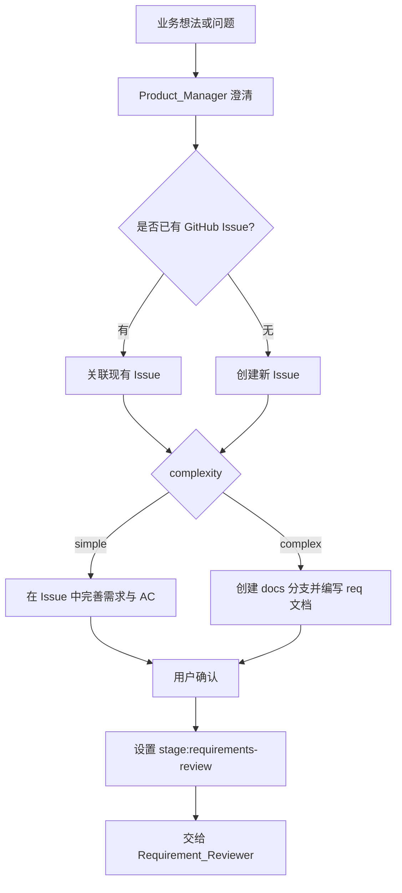

**需求文档建议包含：**

| 模块 | 内容 |
|---|---|
| 背景与价值 | 用户故事、业务价值、目标用户 |
| 范围与边界 | In-Scope、Out-of-Scope |
| 验收标准 | 可测试的 AC 条目 |
| 非功能要求 | 性能、安全、国际化、审计、可用性等 |

**参考路径：** `docs/requirements/`

---

## 4. 阶段二：需求审批

需求审批角色用于在需求定稿前做严谨复核，避免把模糊需求直接带入开发。

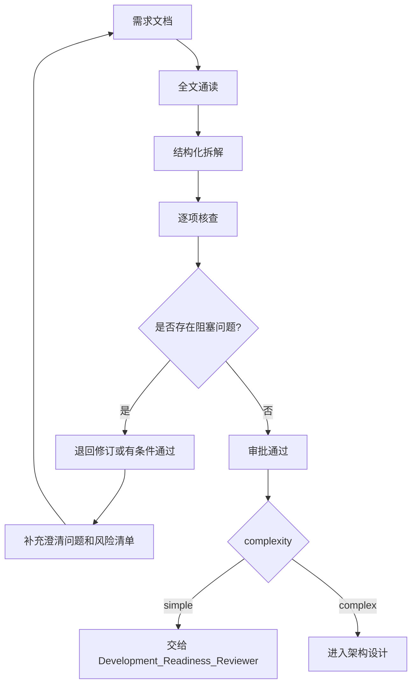

**审批重点包括：**

| 检查项 | 目标 |
|---|---|
| 业务目标 | 是否明确、可量化 |
| 范围边界 | 是否存在范围蔓延 |
| 用户角色与权限 | 是否覆盖正常路径和异常路径 |
| 数据定义 | 字段、来源、生命周期、隐私分级是否清楚 |
| 验收标准 | 是否能映射到测试 |
| 发布与回滚 | 是否具备可操作性 |

---

## 5. 阶段三：架构设计

System_Architect 负责把需求转为技术方案，输出系统边界、接口、数据模型和影响范围。

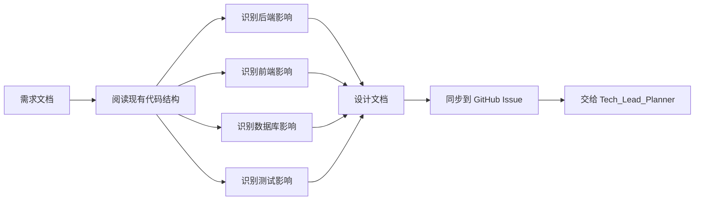

**项目当前技术边界：**

| 层级 | 技术与约束 |
|---|---|
| 后端 | Python、Flask、SQLAlchemy、JWT |
| 前端 | React 18、Ant Design 5、ECharts、i18next |
| 测试 | Pytest、Playwright |
| 部署 | Docker、Kubernetes、GitHub Actions |
| 架构分层 | Client → Service → Manager → Models |

> **重要规则**：Service 层只处理 HTTP 请求、参数校验和响应；数据库查询与业务逻辑应放在 Manager 层。

**参考路径：** `docs/architecture/architecture.md`、`docs/DEVELOPMENT.md`

---

## 6. 阶段四：计划拆解

Tech_Lead_Planner 把架构设计拆成可以执行的任务，通常按依赖顺序组织为后端、前端、测试、验证几个阶段。

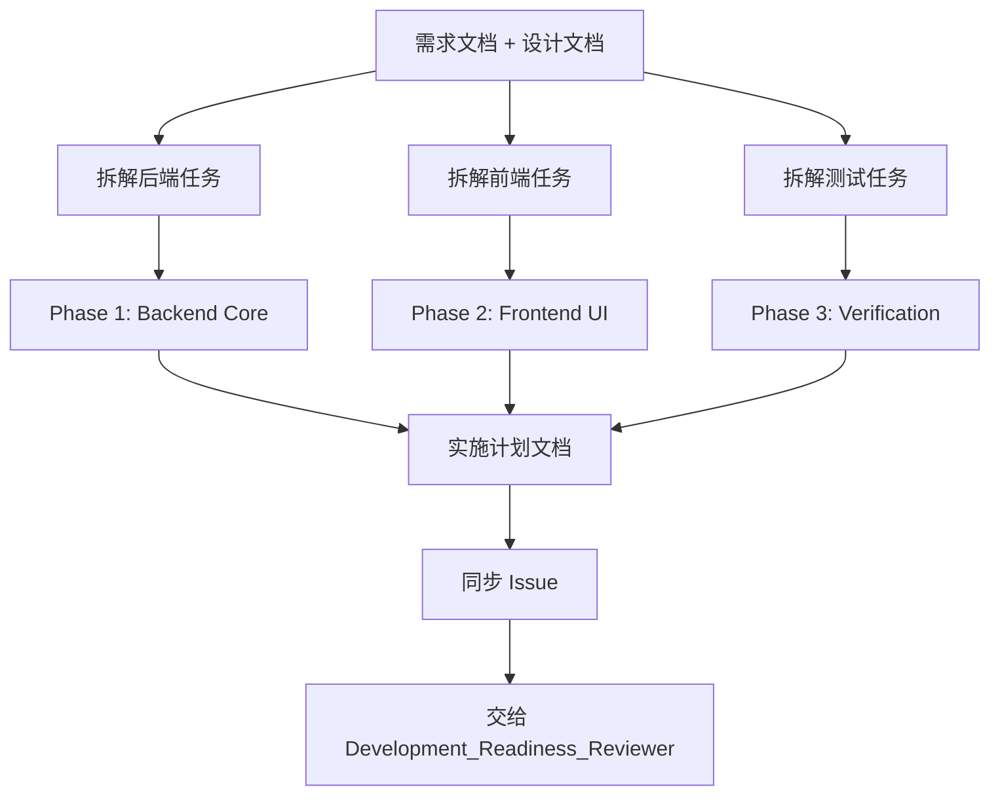

**计划拆解原则：**

| 原则 | 说明 |
|---|---|
| 可执行 | 每个任务开发者拿到后能直接开始 |
| 有顺序 | DB/模型优先，API 其次，UI 最后集成 |
| 可测试 | 每个阶段都有验证方式 |
| 不遗漏 | 后端、前端、测试、配置、文档都要覆盖 |

**参考路径：** `docs/plan/`

---

## 6.5 跨角色文档协作与 Feature 分支创建时机

这里需要区分两个阶段：

| 阶段 | 目标 | 推荐分支 | 是否进入编码 |
|---|---|---|---|
| 需求/设计/计划阶段 | 澄清 What、Why、How、任务拆分 | `docs/<issue>-<slug>` | 否 |
| 开发实现阶段 | 按已批准文档实现代码和测试 | `feature/<scope>-<desc>` 或 `fix/<scope>-<desc>` | 是 |

### 6.5.1 需求评审与开发前就绪审核

Issue 只保留最小状态模型：

| issue stage | 含义 | 转换决策人 |
|---|---|---|
| `stage:draft` | 新需求还在收集和澄清 | Product_Manager 创建或保持 |
| `stage:requirements-review` | 需求和复杂需求文档处于开发前准备或评审过程 | Product_Manager 提交评审时进入 |
| `stage:ready-for-development` | 开发前门禁通过，允许开始实现 | Development_Readiness_Reviewer |
| `stage:in-development` | 代码已开始开发 | Developer |

审核拆为两个明确职责：

1. Requirement_Reviewer 只审核需求本身。简单需求通过后交给开发前就绪审核；复杂需求通过后进入设计和计划，但仍保持 `stage:requirements-review`。
2. Development_Readiness_Reviewer 是进入开发的唯一门禁：

   - 对于 `complexity:simple`，确认需求评审已通过、无阻塞项，Issue 稳定、可验收且可测试；
   - 对于 `complexity:complex`，确认 requirement/design/plan 已齐备并批准，且与 Issue 互相一致、没有矛盾；
   - 审核不通过时保持 `stage:requirements-review`，明确列出阻塞项、证据、责任人和下一步；
   - 审核通过后才设置 `stage:ready-for-development`。

### 6.5.2 为什么不直接在 main 上写需求文档

`main` 始终保持可部署状态，而且仓库规则要求所有变更通过 PR 合入。因此，即使只是 `docs/requirements`、`docs/Design`、`docs/plan` 下的文档，也不应由 Product_Manager、System_Architect 或 Tech_Lead_Planner 直接提交到 `main`。

推荐做法是：**文档也走分支 + PR**。

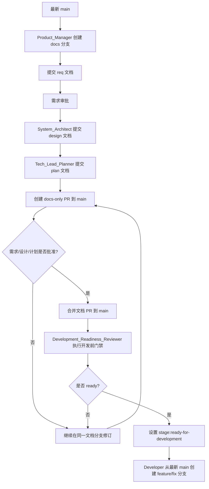

### 6.5.3 推荐分支模型

**首选：两段式分支模型。**

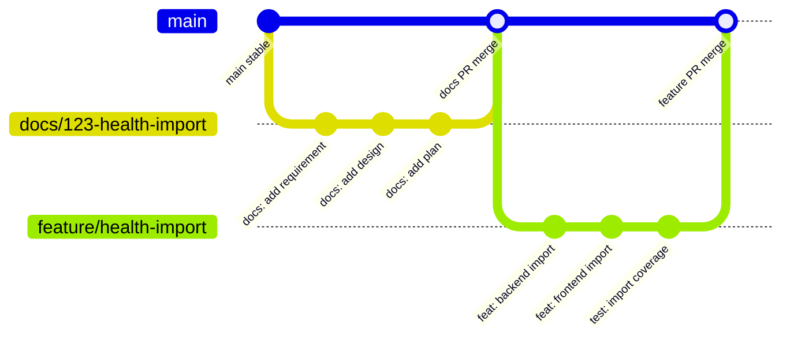

| 分支类型 | 创建时机 | 创建角色 | 合入目标 | 内容 |
|---|---|---|---|---|
| `docs/<issue>-<slug>` | PM 开始形成可落库需求文档时 | Product_Manager | `main` | requirements/design/plan 文档 |
| `docs/<issue>-<slug>` | 需求还不稳定但需要多人协作时 | Product_Manager 或需求审批负责人 | `main` | 草案、评审记录、方案候选 |
| `feature/<scope>-<desc>` | Issue 已达到 `stage:ready-for-development` | Developer | `main` | 代码、测试、必要文档更新 |
| `fix/<scope>-<desc>` | Issue 已达到 `stage:ready-for-development` | Developer | `main` | 修复代码、回归测试、必要文档更新 |


Issue 在问题达到“值得持续跟踪”的最小信息量后创建；docs 分支在需要形成正式、可评审的需求文档时创建。Issue 先于 docs 分支，早期探索内容保存在 Issue 描述和评论中，正式文档保存在 docs/<issue-id>-<slug> 分支并通过 PR 合入 main。

### 6.5.4 各角色基于哪个分支工作

| 角色 | 工作基线 | 操作方式 | 交付物 |
|---|---|---|---|
| Product_Manager | 简单需求使用 Issue；复杂需求使用最新 `main` 拉出的 `docs/*` | 完善 Issue，复杂需求再编写 `req-*.md` | Issue，或需求文档与 Issue 摘要 |
| Requirement_Reviewer | 简单需求读取 Issue；复杂需求读取同一个 `docs/*` | 审核需求本身并提出 blocking/high/medium/low 问题 | 需求审批结论、澄清问题 |
| System_Architect | 复杂需求的同一个文档分支 | 增加 `docs/Design/design-*.md` 或架构补充 | 设计文档 |
| Tech_Lead_Planner | 复杂需求的同一个文档分支 | 增加 `docs/plan/plan-*.md` | 实施计划 |
| Development_Readiness_Reviewer | 简单需求读取 Issue；复杂需求读取已合入 docs-only PR 的最新 `main` | 审核适用产物并决定是否 ready | 就绪结论、阻塞项、stage 转换 |
| Developer | Issue 已 ready 后的最新 `main` | 创建 `feature/*` 或 `fix/*`，开始编码 | 代码、测试、PR |

### 6.5.5 什么时候创建 Feature 分支

**建议不要在 Product_Manager 刚开始探索时就创建 `feature/*`。**

所有需求都必须满足：

- Issue 已形成可验收 AC；
- 关键范围和非范围已经明确；
- Development_Readiness_Reviewer 已将 Issue 设置为 `stage:ready-for-development`；
- 有明确 Developer 接手实现。

`complexity:complex` 还必须满足：

- requirement/design/plan 已批准；
- System_Architect 已确认技术方向可行；
- Tech_Lead_Planner 已拆出最小可执行任务；
- docs-only PR 已合入 `main`。

满足以上条件后，由 **Developer** 从最新 `main` 创建 `feature/*` 或 `fix/*` 分支。创建分支和安排开发不能替代开发前就绪审核。

### 6.5.6 复杂需求的 Feature 分支如何拿到最新 requirements/design/plan

首选路径是：

```cmd
git checkout main
git pull origin main
git checkout -b feature/<scope>-<desc>
```

因为 docs-only PR 已经合入 `main`，Developer 从最新 `main` 创建 feature 分支时，会自然带上最新的 `docs/requirements`、`docs/Design` 和 `docs/plan` 内容。

复杂需求不允许在文档 PR 合并前启动开发，也不允许从 docs 分支拉出 feature 分支。必须先合并已批准文档、通过 Development_Readiness_Reviewer，再由 Developer 从最新 `main` 创建开发分支。

### 6.5.7 小团队快速模式

如果需求很小，例如一个明确 bug 或极小 UI 文案调整，可以省略 docs 分支和正式设计/计划文档，但不能跳过需求评审和开发前门禁：

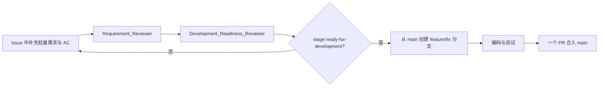

但只要涉及多人协作、架构设计、数据库/API 改动、发布风险或验收争议，仍应使用两段式分支模型。

### 6.5.8 Issue 作为跨角色协作主线

Product_Manager、System_Architect、Tech_Lead_Planner 会通过 GitHub MCP 创建或更新同一个 GitHub Issue。因此，Issue 应作为跨角色协作的主线，分支和 PR 则是把某一阶段产物合入仓库的变更载体。

**建议所有相关 PR 都关联同一个源 Issue，但关闭语义要区分：**

| PR 类型 | 是否关联 Issue | 推荐关键字 | 是否关闭 Issue | 说明 |
|---|---|---|---|---|
| docs PR | 是 | `Refs #123` | 否 | 只沉淀需求、设计、计划，不代表功能已交付 |
| feature/fix PR | 是 | `Closes #123` / `Fixes #123` 或 `Refs #123` | 视情况 | 当该 PR 完整满足验收标准时使用 `Closes/Fixes`；如果只是部分实现，使用 `Refs` |
| release/hotfix PR | 是 | `Refs #123`，必要时列出多个 Issue | 否 | 发布 PR 是版本包装和发布记录，通常不关闭需求 Issue |
| follow-up PR | 是 | `Refs #123` | 否 | 用于补充测试、文档、体验微调或后续修正 |

推荐关系如下：

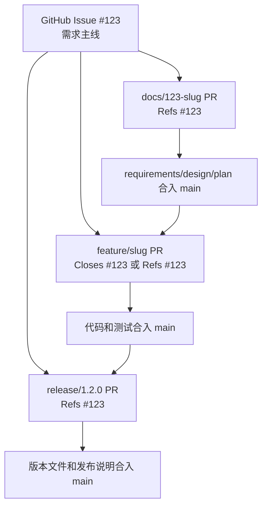

**默认策略：**

- docs-only PR 永远使用 `Refs #<issue>`，避免需求在文档合并时被提前关闭；
- feature/fix PR 如果完整交付该 Issue 的验收标准，使用 `Closes #<issue>` 或 `Fixes #<issue>`；
- 如果一个 Issue 被拆成多个 feature PR，每个 PR 使用 `Refs #<issue>`，最后一个完成全部 AC 的 PR 再使用 `Closes #<issue>`；
- release PR 使用 `Refs #<issue>` 列出本次发布包含的 Issue，并在 release notes 中保留追踪；
- 如果一个 release 包含多个 Issue，PR 描述中使用清单列出 `Refs #123`, `Refs #124`, `Refs #125`。

---

## 7. 阶段五：功能开发（Developer 完整流程）

Developer 按实施计划进行编码、测试和自查。

### 7.1 完整开发流程图

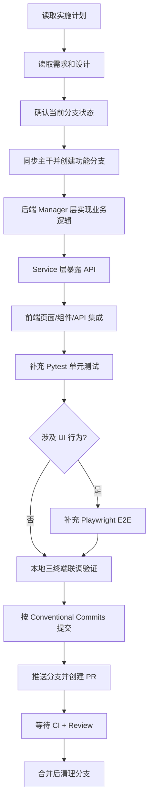

### 7.2 分支创建

`role-developer.agent.md` 和 `feature_branch_development_strategy.prompt.md` 均要求先通过开发前门禁，再从最新 `main` 创建实现分支。

**正确做法（应在编码前执行）：**

```cmd
:: 在 Terminal 3（操作终端）执行
git checkout main
git pull origin main
git checkout -b feature/<short-feature-name>
git push -u origin feature/<short-feature-name>
```

**分支命名规范：**

| 分支前缀 | 用途 | 示例 |
|---|---|---|
| `feature/<scope>-<desc>` | 新功能 | `feature/health-trend-dashboard` |
| `fix/<scope>-<desc>` | Bug 修复 | `fix/bp-validation-limits` |
| `release/<version>` | 版本发布 | `release/1.2.0` |
| `hotfix/<version>` | 紧急修复 | `hotfix/1.1.2` |

### 7.3 本地验证

Developer Agent 使用三终端模型完成本地集成验证。

**正确做法（三终端模型）：**

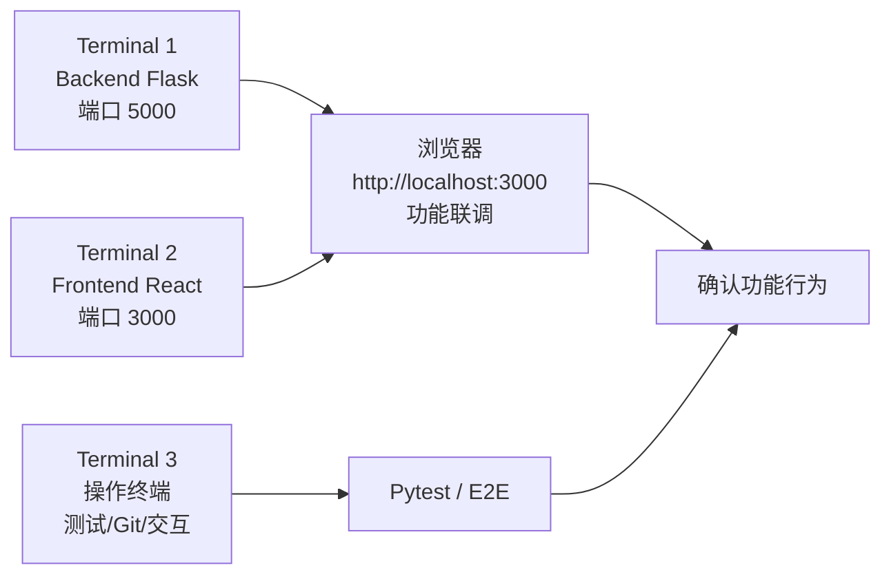

| 终端 | 责任 | 禁止操作 |
|---|---|---|
| Terminal 1 | 后端 Flask 服务 | 不执行测试、Git、脚本 |
| Terminal 2 | 前端 React 开发服务 | 不执行测试、Git、脚本 |
| Terminal 3 | 测试、Git、人机交互命令 | 不启动长驻服务 |

**验证步骤：**

```cmd
:: Terminal 3 执行
python -m pytest tests/ -q

:: 如涉及 E2E
cd tests/e2e
npx playwright test tests/regression-user-journey-cn.spec.js --headed
```

### 7.4 提交规范与 PR 创建

Developer Agent 负责按 Conventional Commits 提交、推送实现分支并创建 PR。

**正确做法：**

**1) 提交（Conventional Commits）：**

```cmd
git add -A
git commit -m "feat(health): add trend dashboard for blood pressure"
```

**提交类型：**

| type | 说明 |
|---|---|
| `feat` | 新功能 |
| `fix` | Bug 修复 |
| `docs` | 文档更新 |
| `refactor` | 重构 |
| `test` | 测试相关 |
| `chore` | 构建/工具 |

**2) 推送并创建 PR：**

```cmd
git push origin feature/<short-feature-name>
```

然后在 GitHub 创建 PR，PR 描述需包含：

| 必填项 | 说明 |
|---|---|
| 需求背景 | 为什么要做这个变更 |
| 主要变更点 | 后端/前端/DB/配置分别改了什么 |
| 测试覆盖 | Pytest 和 Playwright 涉及哪些用例 |
| 关联 Issue | 完整交付用 `Closes #123` / `Fixes #123`；部分交付或文档/发布 PR 用 `Refs #123` |

**3) 合并后清理：**

```cmd
git checkout main
git pull origin main
git branch -d feature/<short-feature-name>
git push origin --delete feature/<short-feature-name>
```

---

## 8. 阶段六：PR 校验与代码审查

所有功能和修复都通过 PR 合入 main，禁止直接推送 main。

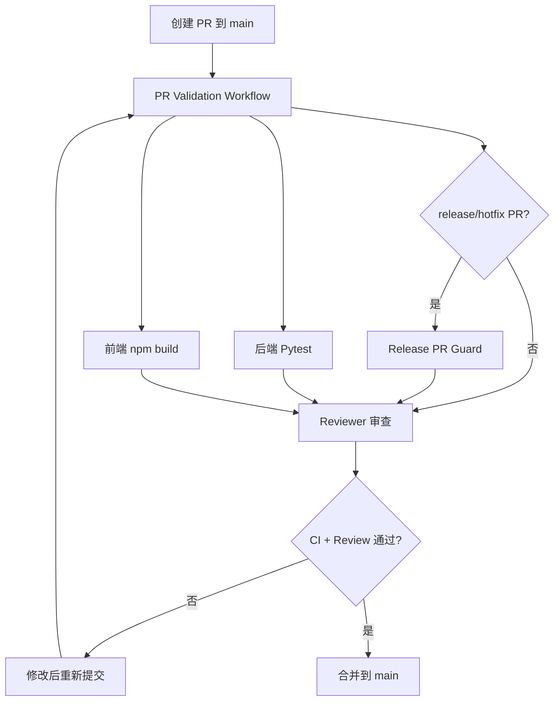

**PR Validation 当前包含：**

| Job | 作用 |
|---|---|
| `backend-tests` | 安装 Python 依赖并运行 Pytest |
| `frontend-build` | 安装前端依赖并执行生产构建 |
| `release-pr-guard` | release/hotfix 分支额外校验 VERSION、CHANGELOG、Release Notes |

**参考路径：** `.github/workflows/pr-validation.yml`、`scripts/check_release_pr.py`

---

## 9. 阶段七：Staging 自动部署与回归

PR 合并到 main 后，Deploy Staging workflow 自动构建镜像、推送 GHCR，并部署到 Kubernetes staging 环境。

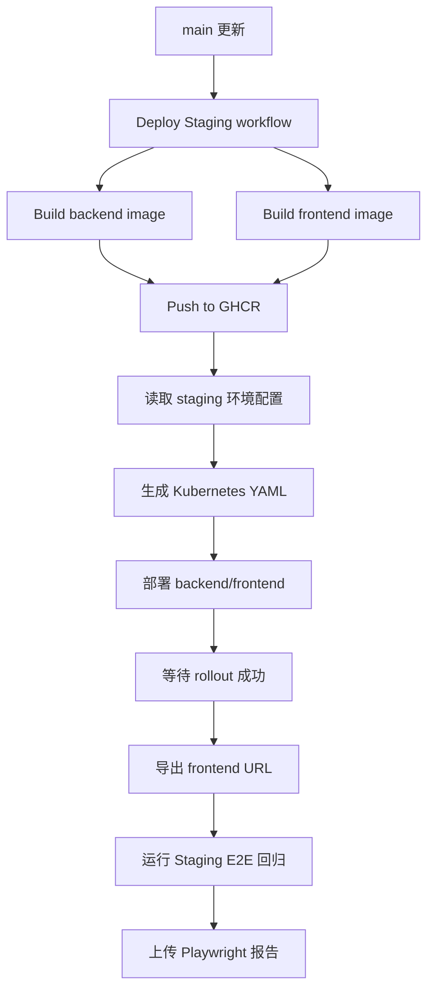

**Staging 阶段的目标：**

| 动作 | 目的 |
|---|---|
| 构建镜像 | 验证生产形态的容器可构建 |
| 部署到 staging namespace | 验证 K8s 配置和服务启动 |
| Rollout 检查 | 确认后端和前端都成功发布 |
| E2E 回归 | 验证关键用户旅程没有断裂 |
| 上传报告 | 留存 QA 证据 |

**参考路径：** `.github/workflows/deploy-staging.yml`、`deploy/README.md`

---

## 10. 阶段八：版本发布准备

当 main 上的功能需要正式上线时，由 Release_Manager 负责发版准备。

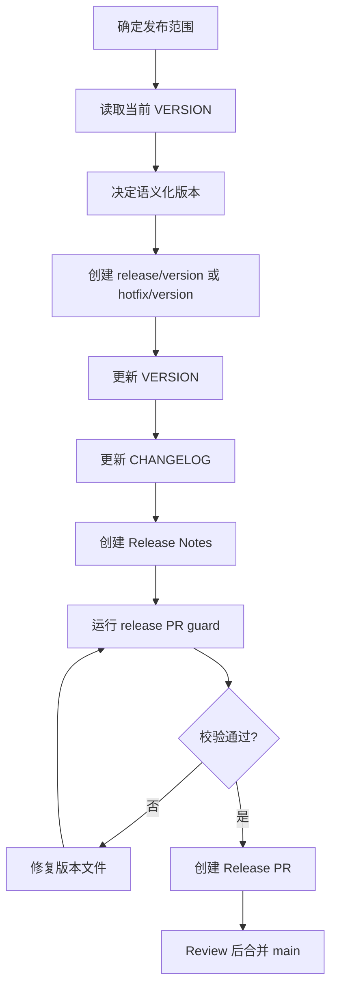

**语义化版本规则：**

| 类型 | 使用场景 |
|---|---|
| MAJOR | 不兼容 API 或数据模型变更 |
| MINOR | 向下兼容的新功能 |
| PATCH | Bug 修复、文档、工具或 CI 调整 |

**Release 必须保持一致：**

| 对象 | 示例 |
|---|---|
| release 分支 | `release/1.2.0` |
| VERSION 文件 | `1.2.0` |
| Git tag | `v1.2.0` |
| Release Notes | `RELEASE_NOTES_v1.2.0.md` |

**参考路径：** `.github/agents/release-manager.agent.md`、`CHANGELOG.md`、`VERSION`

---

## 11. 阶段九：生产部署与上线验证

Release PR 合并到 main 后，在 main 的发布提交上创建 `vMAJOR.MINOR.PATCH` tag，触发生产发布。

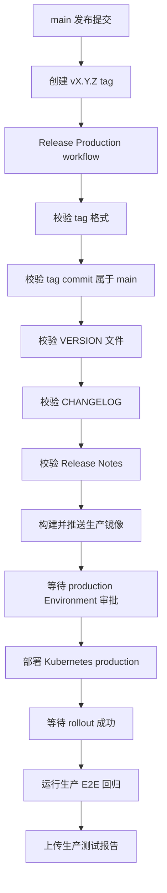

**生产发布的关键保护：**

| 保护机制 | 说明 |
|---|---|
| Tag 格式校验 | 只接受 `vMAJOR.MINOR.PATCH` |
| main 可达性校验 | tag 必须指向 main 可追溯提交 |
| 版本文件校验 | VERSION、CHANGELOG、Release Notes 必须匹配 |
| GitHub Environment | production 环境可配置人工审批 |
| Secrets 隔离 | DATABASE_URL、JWT_SECRET、KUBE_CONFIG 等在 Environment Secrets |
| Rollout 检查 | 部署失败会自动收集诊断并终止 |
| 生产 E2E | 部署成功后跑关键路径回归 |

**参考路径：** `.github/workflows/release-production.yml`、`docs/GITHUB-ENVIRONMENT-SETUP.md`

---

## 12. 端到端泳道图

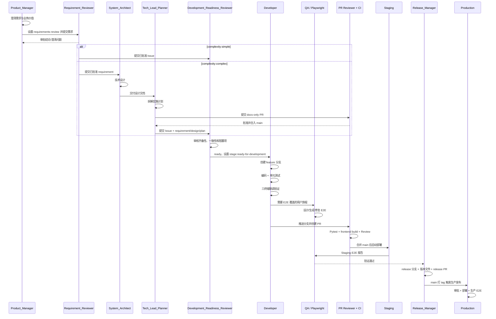

---

## 13. 分支策略与 Git 流

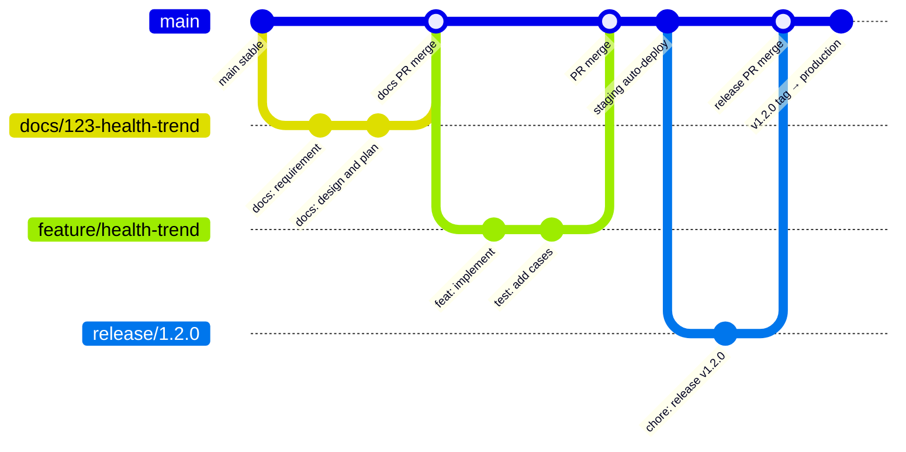

**默认规则：**

| 分支 | 用途 |
|---|---|
| `main` | 始终保持可部署 |
| `docs/<issue>-<slug>` | 已进入正式文档沉淀的需求/设计/计划协作 |
| `docs/<issue>-<slug>` | 更早期、不稳定需求的跨角色草案协作 |
| `feature/<scope>-<desc>` | 新功能开发 |
| `fix/<scope>-<desc>` | Bug 修复 |
| `release/<version>` | 发布准备 |
| `hotfix/<version>` | 生产紧急修复 |

---

## 14. 推荐检查清单

### 需求进入开发前

- [ ] 业务价值明确
- [ ] 范围与非范围明确
- [ ] 验收标准可测试
- [ ] 权限、异常路径、边界值已覆盖
- [ ] 需求已同步 GitHub Issue
- [ ] Requirement_Reviewer 已通过需求本身
- [ ] Development_Readiness_Reviewer 已确认无未解决阻塞项
- [ ] Issue 已设置为 `stage:ready-for-development`

### Developer 开始前

- [ ] 已从最新 main 创建 feature/fix 分支
- [ ] 已读取实施计划并理解任务拆分
- [ ] Terminal 1/2/3 已准备就绪

### PR 合并前

- [ ] 后端 Pytest 通过
- [ ] 前端 build 通过
- [ ] 涉及 UI 的变更已有 E2E 覆盖
- [ ] 本地三终端联调已验证功能行为
- [ ] 提交信息遵循 Conventional Commits
- [ ] PR 描述包含背景、变更点、测试证据
- [ ] PR 已关联源 Issue，且 `Refs` / `Closes` / `Fixes` 语义正确
- [ ] Reviewer 已确认无阻塞问题
- [ ] release/hotfix PR 已通过 release guard

### 上线前

- [ ] Staging 部署成功
- [ ] Staging E2E 回归通过
- [ ] VERSION、CHANGELOG、Release Notes 一致
- [ ] 生产 Secrets 和 Variables 已配置
- [ ] production Environment 审批人明确
- [ ] 回滚方式明确

### 上线后

- [ ] 生产 rollout 成功
- [ ] 生产 E2E 回归通过
- [ ] Playwright 报告已上传
- [ ] 发布结论记录到 PR 或 release notes

---

## 15. 流程优点与注意点

### 优点

| 优点 | 说明 |
|---|---|
| 可追踪 | 需求、设计、计划、PR、Release Notes 都能回链 |
| 风险前移 | 需求审批和架构设计先于开发 |
| 主干稳定 | main 始终保持可部署，所有变更通过 PR |
| 自动验证 | PR、staging、production 都有自动测试保护 |
| 发布可审计 | 版本号、tag、变更日志、发布说明必须一致 |
| 环境隔离 | staging 与 production 使用不同 Environment 配置 |

### 注意点

| 注意点 | 建议 |
|---|---|
| 文档目录大小写不统一 | `docs/Design` vs `docs/design`，建议统一 |
| 默认 trunk 流与可选环境分支并存 | 日常按 feature/fix → main；按需启用 develop/staging |
| 生产依赖环境配置 | DATABASE_URL、JWT_SECRET 等必须提前配置 |
| E2E 覆盖范围需持续维护 | 新增关键用户旅程时同步更新 Playwright 计划 |

---

## 16. 相关文档索引

| 文档 | 路径 | 用途 |
|---|---|---|
| 贡献指南 | `CONTRIBUTING.md` | 代码规范、提交规范、版本发布 |
| 开发环境 | `docs/DEVELOPMENT.md` | 环境搭建、启动命令 |
| 分支策略 | `docs/BRANCHING-AND-DEPLOYMENT.md` | 当前分支、环境与自动部署规则 |
| 部署指南 | `deploy/README.md` | K8s 部署操作 |
| 环境配置 | `docs/GITHUB-ENVIRONMENT-SETUP.md` | GitHub Secrets/Variables |
| 架构设计 | `docs/architecture/architecture.md` | 系统架构与分层 |
| 三终端启动 | `.github/prompts/invoke_app_with_different_Terminals.prompt.md` | 本地开发三终端模型 |
| 分支策略 Prompt | `.github/prompts/feature_branch_development_strategy.prompt.md` | Agent 开发时的分支操作指南 |
| PR 校验 | `.github/workflows/pr-validation.yml` | CI 自动检查 |
| Staging 部署 | `.github/workflows/deploy-staging.yml` | 合并后自动部署 |
| 生产发布 | `.github/workflows/release-production.yml` | Tag 驱动发布 |
| E2E 回归 | `.github/workflows/e2e-regression.yml` | 手动触发 E2E |
| Release PR Guard | `scripts/check_release_pr.py` | 发布 PR 校验脚本 |

---

*Generated by Copilot · Last updated: 2026-06-16*
