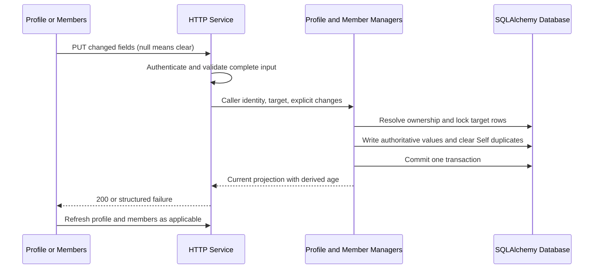

# Design: Optional User and Household Demographics

Status: Draft; independent design review pending. This document does not authorize implementation.

## 1. Traceability and Scope

- Tracking issue: https://github.com/JumpStarGroup/health_platform/issues/12 (Refs #12).
- Draft docs PR: https://github.com/JumpStarGroup/health_platform/pull/13.
- Approved requirement: `docs/requirements/req-optional-user-demographics.md` at `6feaf1fde417f2ff387ecfb71a8b20270c640048`.
- Human conditional approval: https://github.com/JumpStarGroup/health_platform/pull/13#issuecomment-5793333195.
- Approval independence clarification: https://github.com/JumpStarGroup/health_platform/pull/13#issuecomment-5793502137.
- Continue on `docs/12-optional-user-demographics`; keep Issue `stage:drafted` and PR Draft.
- Requirement condition remains open: the requirement owner must define verifiable performance acceptance before development; Gate 1 verifies closure. This design does not invent or waive that criterion.

## 2. Verified Baseline and Design Invariants

`src/models.py` stores nullable `age` and `gender` on both User and Member, without birth month. `UserManager.update_user` ignores null values. `member_service.list_members` merges Self demographics from User with fallback to Member; that fallback can resurrect cleared values. The member PUT route currently refuses all Self edits, and member creation/update accepts stored manual age.

The design must preserve `Client -> Service -> Manager -> Models`. Services parse HTTP and validate fields; Managers own authorization-scoped database access, demographic projection and transactions. No new Service-layer database access is permitted.

Core invariants:

1. Add nullable birth month; derive age at read time and never persist derived age into legacy age columns.
2. Distinguish omitted fields (unchanged) from explicit null (clear) on updates.
3. User is authoritative for Self birth month and gender. No fallback to legacy Member demographics after clearing.
4. Ordinary members retain independent demographics, scoped to their owner's household.
5. Self name, identity and member record remain protected; this requirement authorizes demographic edits only.
6. Validate the complete requested change before mutation; invalid input cannot replace valid values or cause partial clearing.
7. Never backfill birth month from manual age, delete historical age, modify health records, or restore cleared information during rollback.

## 3. Components and Trust Boundaries

| Component | Responsibility and proposed change |
|---|---|
| React Register, Profile, Members | Optional month picker and clearable gender; no editable age; render server-derived age; submit explicit null for a cleared field. |
| `frontend/src/services/api.js` | Retain existing routes and JWT transport; demographic payloads contain only explicitly edited fields. |
| Auth/User/Member Services | Parse an object body, validate types and the entire payload, distinguish missing/null, map domain failures to existing error envelopes. |
| UserManager | Own account demographic creation/update and authoritative Self projection; expose transaction-safe profile operations rather than broad null-ignoring assignment. |
| MemberManager | Resolve members inside the caller's household, enforce Self protections, update ordinary members; delegate Self demographic operations to the same Manager-owned profile transaction. |
| Shared demographic helper | Pure month validation, age derivation and gender alias conversion shared by Services/Managers. No database or HTTP dependency; no new framework. |
| Models | Nullable birth-month columns; existing age columns retained as inaccessible legacy storage. |

Browser input is untrusted. JWT identifies the account; request identifiers never confer ownership. Managers return a demographic projection, and Services only serialize it. Move the existing Self demographic merge out of the Service; preserve existing height/weight behavior unless that field is explicitly updated through its existing path.



## 4. Data Model, Lifecycle and Privacy

| Data | Storage | Active source and lifecycle | Classification |
|---|---|---|---|
| Account birth month | New `users.birth_month VARCHAR(7) NULL`, no default/index | Account and Self authoritative source; explicit clear writes SQL NULL. | Personal information |
| Ordinary member birth month | New `members.birth_month VARCHAR(7) NULL`, no default/index | Member-owned value; explicit clear writes SQL NULL. | Personal information |
| Self birth month | No independent active Member value | Read User only; any duplicate Member value is cleared in the same explicit birth-month update transaction. | Personal information |
| Gender | Existing nullable User/Member columns | User for account/Self, Member for other members. Clearing Self gender clears both User and any legacy Self copy atomically. | Personal information |
| Derived age | Response only; never stored | Compute only from a valid birth month; null otherwise. | Personal information |
| Legacy manual age | Existing User/Member age columns, unchanged | Never read for business processing, returned, copied or updated by the new paths. New rows leave it null. | Retained legacy personal information |
| Blood pressure, heart rate, medical history | Existing tables, unchanged | No migration or mutation under this requirement. | Sensitive health information |

Use a string rather than a Date so no invented birthday is collected. Do not backfill, rewrite existing demographics in bulk, add demographic indexes, or change health-record/member foreign keys. Existing Self-only gender values are not copied into User: User is authoritative; legacy duplicates are not active fallback data and are cleared when that specific field is explicitly changed/cleared. This removes the current inconsistent projection without a historical data migration. Height, weight, name, status and health records are not touched by demographic-only requests.

Use the existing `Self`/Chinese-name recognition (trimmed, case-insensitive for English) consistently. Preserve the existing reserved-name creation handling, including its existing alias; do not rename or create additional Self identities as a side effect. For pathological duplicate Self rows, all recognized Self demographic copies in the owned household must be cleared in the same transaction, without deleting or renaming rows. Tests must cover this legacy case.

Logs and backups retain their existing policy. Do not log values, raw request/response bodies, tokens, SQL bind parameters or identity-rich health data. Do not add an audit store containing old/new demographic values. Restoring an older backup must not re-expose cleared data: restore offline, reconcile post-backup clear operations through the existing recovery mechanism, and keep demographic access closed if that cannot be proven. Recovery procedures require a staging drill; this design does not invent retention periods or require purging historical backups.

## 5. Validation and API Contracts

### 5.1 Common Field Semantics

| Input | Create | Update |
|---|---|---|
| Field absent | Store null for optional demographics | Leave unchanged; do not infer clear from `.get()`. |
| Explicit `null` | Store null | Persist null; gender and birth month independently clearable. |
| Valid value | Save | Replace only this field. |
| Empty string, whitespace, number, boolean, array or object | 400 field error | 400 field error, no mutation. UI maps a cleared control to null. |
| Legacy `age` key | Ignore without storing | Ignore without modifying legacy age; responses use derived age only. |

Month validation is a full-string match for four ASCII year digits, hyphen and two month digits; then validate `1900-01 <= birth_month <= current_month`, with month 01 through 12. Capture the current UTC month once per request using `datetime.now(UTC)` through the existing UTC helper. The frontend uses UTC for picker limits, and the server remains authoritative at month boundaries. Reject full dates, trailing newlines, padding, future values and malformed JSON bodies without echoing personal input.

For birth year `birth_year` and month `birth_month_number`, derive age as `current_year - birth_year - (current_month < birth_month_number)`. Increment at the beginning of the birth month. Do not cap at 120: 1900 is valid. Age zero is valid. On reads, invalid stored birth month yields null age and a value-free diagnostic; never fall back to manual age or mutate storage while reading.

Gender choices remain the existing three choices. Accept the existing forms `M/F/O` and `male/female/other` (case-insensitive), plus the already recognized Chinese male/female aliases for compatibility. Normalize new User writes to M/F/O and new ordinary Member writes to male/female/other. Return User gender as M/F/O/null and member gender as male/female/other/null. Convert known legacy aliases on read only; unknown legacy strings are not guessed as `other` and must not be rewritten automatically. A new unsupported gender value returns a field error. UI displays null/unknown as not set.

### 5.2 Route Contract

| Route | Request/response impact |
|---|---|
| `POST /api/v1/auth/register` | Username/email/password requirements unchanged. Optional `birth_month`, `gender`; age ignored. Existing 201 response identity fields retained. Validate before creating User; blank demographics do not create a requirement to fill anything later. |
| `POST /api/v1/user` | Compatibility alias reuses the exact same registration validation and behavior. |
| `GET /api/v1/user/<user_id>` | Add `birth_month`; retain `age` key as derived integer or null, never legacy age. Other fields unchanged. |
| `PUT /api/v1/user/<user_id>` | Partial-update semantics despite PUT: omitted fields unchanged, null clears demographics. Return authoritative projection with `birth_month`, derived `age`, gender and existing fields. |
| `GET /api/v1/members` | Existing `{members: [...]}` envelope; add birth_month to each item, project Self from User, ordinary members from their own rows. Query User once, not once per member. |
| `POST /api/v1/members` | Existing name requirement and 201 response retained. Optional demographics. Never use a duplicate-Self create request to modify account demographics; the existing reserved-name resolution returns the Self projection without mutating it. |
| `PUT /api/v1/members/<member_id>` | Ordinary members: demographic partial update plus existing non-demographic fields. Self: permit only birth_month/gender demographic changes (legacy age ignored); reject attempts to send name/status/identity/height/weight here, even together with valid demographic fields. Use Profile for existing account height/weight behavior. |
| `DELETE /api/v1/members/<member_id>` | No change: reject Self deletion; ordinary member soft deletion unchanged. |

Account/Self edit example:

```json
{"birth_month":"1990-05","gender":null}
```

Explicit independent clear:

```json
{"birth_month":null}
```

Representative validation response (existing error helper shape):

```json
{
	"code":"400",
	"message":"Invalid profile fields",
	"details":{"fields":{"birth_month":"INVALID_BIRTH_MONTH"}}
}
```

Use stable field reason codes `INVALID_BIRTH_MONTH`, `BIRTH_MONTH_OUT_OF_RANGE`, `INVALID_GENDER` and `SELF_PROTECTED_FIELD`; translate them in the UI. Successful updates return 200. Missing/invalid JWT remains 401; another user's profile remains 403; unowned or missing member remains indistinguishable 404. Preserve registration email conflict 409 and existing rate-limit behavior. Database failure returns the existing sanitized 5xx envelope, never success after a failed demographic write.

### 5.3 Atomicity and Concurrent Writes

Implement Manager operations with explicit allowlists and one transaction per demographic command. Do not pass unrestricted request dictionaries to `hasattr` assignment. Revalidate invariants for non-HTTP callers using the same pure helpers. Stop before creating household/Self rows when a request is invalid or unauthorized; member ownership lookup must not create a household merely to reject a request.

Self updates from either endpoint acquire the User row before Self rows in consistent order (row locks for MySQL; SQLite's transaction locking for tests), then update User and remove any targeted duplicate Member value, commit once and return the same projection. Existing Manager helpers commit internally; introduce transaction-participating variants for this flow rather than call them inside an assumed outer atomic unit. Refactor only this profile path, not all Managers. Registration's optional demographic values live on User, so no Self demographic dual write is needed; preserve existing unrelated registration behavior.

All fields are validated before any change, including mixed clear/invalid requests. Commit failure rolls back every targeted demographic field. Repeating a null update is idempotent. Concurrent updates touch only supplied columns; disjoint edits must not overwrite each other. For two edits to the same field, the last committed explicit change wins; an explicitly submitted new value is a new user instruction, not rollback restoration. Updated frontend forms send only dirty fields, preventing stale whole-form submissions from silently undoing clears. Do not automatically retry non-idempotent registration/member creation. Any transient retry for an update must start after rollback and re-resolve ownership/rows.

## 6. Frontend and Interaction Impact

- `frontend/src/pages/Register.js`: replace manual age input with Ant Design month picker (`picker="month"`, format YYYY-MM, clearable), no default birthday/gender, preserve unrelated fields and registration navigation.
- `frontend/src/pages/Profile.js`: optional month picker and `allowClear` gender; initialize from API including null; serialize only edited fields; display derived age read-only and omit its value when null. Use a null check rather than truthiness so age 0 is visible. Do not calculate authoritative age from browser-local time.
- `frontend/src/pages/Members.js`: same optional controls for ordinary members; Self's edit action opens a demographics-only form while name and deletion remain protected. Do not submit disabled identity fields with this form. Null gender must not display as `other`.
- Keep existing React 18, Ant Design icons and i18next patterns; update both `frontend/src/i18n/locales/en/translation.json` and `frontend/src/i18n/locales/zh/translation.json` for month, optional status and field errors. No new frontend framework or unrelated layout redesign.
- Existing `frontend/src/context/MemberContext.js` persists only selection IDs: retain it, do not introduce persistent birth-month/gender caches. On successful edit refresh affected profile/member data, clear the corresponding form values, and reload on route entry/window focus to avoid stale cross-view or cross-tab displays. Retain values on failed save; no optimistic success.
- Disabling Save while pending avoids duplicate submissions. Month controls support keyboard input and accessible labels; field errors use Ant Design form errors. Verify desktop/mobile layouts and both languages; no exact day can be selected or submitted.
- Selected member IDs, health-record filters and medical-history navigation remain unchanged. No demographic field is added to CSV/import schemas.

## 7. Security, Isolation and Audit

JWT authorization remains on every protected route. Resolve account identity from JWT, normalize its type using the existing application convention, and never accept `owner_user_id`, household_id or member ownership from a payload. A member must belong to that caller's household before any read/update. No new administrator cross-account privileges are introduced; password, role, email, token version and secrets are excluded from this operation's allowlist.

Handle Self protection in the Manager as well as route/UI logic so import or other callers cannot bypass it. Reuse existing guest-trial boundaries without changing Issue #11's scope or status; no new guest ownership or transfer rule is introduced. Existing non-HTTP member creation paths (including health import and demo seed) must leave birth month null and must not reintroduce manual-age processing. Preserve their existing record and isolation behavior.

Require TLS and existing environment-based secret configuration. Do not put credentials in migration scripts, documents, commands, telemetry or screenshots. Retain existing authentication/rate limits. Profile responses should use `Cache-Control: no-store`; do not put demographic values in JWTs, analytics labels, browser storage or audit payloads. Follow existing profile-change audit mechanisms if present; there is no new access-audit requirement. Metadata-only failures/counts must not contain the submitted value.

## 8. Migration, Deployment and Reversibility

### 8.1 Expand-only Migration

Use Flask-Migrate/Alembic with one successor revision to the verified current head `20260414_add_medical_histories`; recheck the head during implementation and rebase the migration if another revision lands. Add the two nullable VARCHAR(7) columns using `op.add_column`. No data backfill, legacy-age drop, gender conversion, table rebuild or new foreign key. SQLite and MySQL must both be tested; their DDL atomicity differs, so inspect both columns and Alembic state after a failed migration before retrying.

The app initializes Flask-Migrate but also calls `db.create_all()` in development/bootstrap paths. `create_all` does not alter existing tables and is not an upgrade mechanism. Execute the approved migration once as a deployment job before new application replicas start; never concurrently from every web process. Baseline databases created outside Alembic must be inventoried and compared to the expected existing schema; do not blindly stamp them or replay table-creation revisions. Document the verified baseline/adoption procedure per environment before rollout.

The current `.github/workflows/deploy-staging.yml` performs Kubernetes backend/frontend rollouts; it must gain an explicit migration/preflight ordering step in the implementation plan rather than assume rollout executes Alembic. Apply the equivalent ordering to the actual target environment's deployment pipeline. `deploy/docker-entrypoint.sh` configures nginx, not database migrations. Existing `.github/workflows/pr-validation.yml` runs backend pytest, frontend build and the release-PR guard; no checks are disabled for this design.

Schema preflight checks both columns, nullability, supported engine and revision; production bootstrap auto-creation must not substitute for migration. Use `DB_AUTO_CREATE=0` and `DB_CREATE_ON_MISSING=0` where applicable, with readiness/schema validation to prevent an incompatible deployment from serving requests.

### 8.2 Ordered Releases and Coexistence

1. Rehearse upgrade and backup recovery on a synthetic or approved de-identified SQLite/MySQL copy. Verify record/subject counts and checksums for untouched fields.
2. Deploy schema expansion first. Old binaries ignore new columns, but are not semantically safe for the new clearing behavior.
3. Deploy a privacy-compatible backend baseline: all profile/member responses stop using legacy age/Self fallbacks; explicit null and field-level atomic writes work; account and Self projections agree. Replace every replica serving these routes before exposing new UI capability. Use existing maintenance/traffic-switch controls when replacing incompatible old replicas, not per-user partial behavior.
4. Deploy the matching frontend and invalidate stale static bundles. Expose the capability consistently for new/existing users and all members after backend readiness. The old UI may still send age: backend ignores it rather than storing it; refreshed UI removes the control. Do not advertise full client compatibility for stale forms that cannot send explicit null.
5. Run the targeted end-to-end and privacy checks, then resume normal traffic. Watch errors, latency and malformed-field counts. Release acceptance requires AC-01 through AC-09 and closure of the performance condition by Gate 1 before coding/release work proceeds.

During schema-only expansion old/new database versions need not coexist: the expanded schema supports old code temporarily. During application rollout, old and new demographic writers must not receive mixed traffic once clearing is available. No historical migration or destructive contract release is part of this requirement; any later legacy-column removal requires its own compatible-release plan and approval.

### 8.3 Rollback

Before any birth-month write, a reviewed downgrade may drop only the new columns if both are confirmed entirely null and all new readers/writers are stopped. Implement the downgrade with a preflight refusal when either column contains data. Never drop legacy age or existing gender.

After activation, retain expanded schema and current database. Roll back only to a tested privacy-compatible build that retains optional demographics, ignores legacy age and supports clear/no-fallback behavior. The pre-feature backend and old mandatory-entry UI are not acceptable rollback targets. Keep a pinned compatible fallback artifact at release time; otherwise use a forward fix or temporarily suspend affected profile writes, not a database restore or restoration of old values. Unrelated health-record operations remain available when safe. A post-activation destructive downgrade is prohibited.

No rollback may refill cleared data, require age/birth month, or mutate other profile fields/health records. Recovery from backup is separate from application rollback and follows the offline reconciliation rule in section 4. If the environment cannot establish non-resurrection after restore, it is a release-readiness blocker, not an excuse to relax the requirement.

## 9. Failure Modes and Observability

| Failure | Required behavior and evidence |
|---|---|
| Invalid month/gender or invalid JSON | Field-level 400; no User/Member/household mutation; reason code/count without input value. |
| Clear one field and invalid value in another | Whole request rejected; compare database snapshot and response afterward. |
| Unauthorized or unowned target | 401/403/404 as defined above; no existence leakage or implicit row creation. |
| Self duplicate cleanup or commit fails | Roll back both account/member writes; sanitized error; no success toast. |
| Missing schema/migration interrupted | New replicas fail readiness or remain out of traffic; operator inspects revision and both columns. |
| Old replica remains or rollback artifact is incompatible | Stop activation/traffic switch; do not accept new clears on mixed writers. |
| Browser stale or save response lost | Refresh authoritative data before retry; null updates are repeatable; failed saves are not portrayed as committed. |
| Month boundary or corrupt stored month | UTC-bound age recalculation or null; no manual-age fallback. |

Use existing request correlation and application logs. Observe profile/member read/write error rates, latency distributions and aggregate validation reasons; never label metrics with user/member IDs or demographic values. Age derivation is constant-time per record and must not add an N+1 query; member list loads the account at most once. Compare latency/query count under fixed fixture sizes, concurrency and environment against the baseline; the acceptable performance threshold remains the requirement owner's pending decision, not an invented design SLA.

## 10. Test Impact and Acceptance Mapping

Extend existing suites and fixtures instead of introducing a parallel test harness. Use synthetic demographics only. Existing tests in `tests/test_user.py` assert stored ages 25/26/30; replace those expectations with birth-month-derived values or null and separately verify that the original database age remains unchanged. Update any other age-dependent fixtures narrowly.

| Requirement | Focused coverage |
|---|---|
| AC-01 | `tests/test_auth.py`, `tests/test_user.py`: both registration routes accept omitted/null demographics; `tests/e2e/tests/user-registration.spec.js` and auth specs exercise blank controls. |
| AC-02 | `tests/test_members.py`: ordinary creation, default Self and reserved-name duplicate creation leave optional fields empty; no new Self or account overwrite. |
| AC-03 | Profile/Register/Members E2E: no editable age; API age input ignored; database legacy ages unchanged. |
| AC-04 | Month/age tests at frozen UTC times: 1900-01, current month, prior/next birth month, year rollover, age 0, ages over 120 and reread after month boundary. |
| AC-05 | Profile and member PUT tests, including Self through both routes; cross-view GET consistency; other profile/health fields unchanged. |
| AC-06 | Clear each field independently and together; inspect SQL NULL in active rows and all Self copies, derived age null, refresh/relogin/no-resurrection, idempotent clear and commit-failure rollback. |
| AC-07 | Existing records with manual age but no month: register/login/profile/member/record journeys require no backfill; legacy stored age never returned or used. |
| AC-08 | Before/after integrity snapshots of unrelated profile fields, Member identity/status, HealthRecord, RecordSubject and MedicalHistory; existing import/export, guest isolation and member filtering regressions. |
| AC-09 | Reject 1899-12, next month, month 00/13, short year/month, full date, whitespace/newline, non-string and mixed invalid/clear inputs before saving. Both aliases and all edit routes covered. |

Additional security/concurrency tests: two users cannot see/update each other's members or profile; anonymous/expired JWT behavior; mass assignment attempts; Self rename/status/delete refused even with valid demographics; deadlock retry rollback; concurrent disjoint edits preserve both fields; ordinary members never share birth month through projection.

Reuse `tests/e2e/tests/profile/edit-profile.spec.ts`, member create/edit specs, `tests/e2e/tests/members-self-protection.spec.js` and `tests/e2e/tests/regression-user-journey-cn.spec.js`. Extend Self tests beyond deletion to permit demographic edits while denying identity edits. Check English/Chinese, narrow/mobile and desktop controls, empty gender vs other, zero age, month-picker keyboard typing, save error recovery and stale-view refresh.

Implementation validation gates: focused `python -m pytest tests/test_auth.py tests/test_user.py tests/test_members.py -q`; migration upgrade/downgrade refusal tests on existing SQLite/MySQL schemas; relevant Playwright specs with backend/frontend running; then required repository CI. These are future implementation checks, not claimed to have run for this documentation-only change.

## 11. Alternatives and Trade-offs

| Alternative | Decision |
|---|---|
| Store a Date using day 01 | Reject: represents an invented birthday and risks accidental day-level exposure. VARCHAR(7) matches the requirement. |
| Persist derived age or reuse manual age | Reject: becomes stale and violates no-legacy-age processing. Compute on read. |
| Mirror all User/Self demographics forever | Reject as the active model: dual sources create partial-clear and stale-fallback risks. User authoritative, targeted duplicate cleanup atomic, no bulk historical migration. |
| Keep all Self edits blocked | Reject: does not satisfy AC-05/06. Permit a strict demographic-only path; preserve identity/deletion protections. |
| Introduce separate PATCH endpoints or API v2 | Not needed: existing PUT is already partial. Document missing/null semantics and preserve response envelopes and route names. |
| Delete legacy age columns | Reject: requirement explicitly preserves stored legacy age, and destructive rollback would lose data. |
| Immediate rollback to old images | Reject after activation: can expose retained ages or resurrect Self fallback values. Use privacy-compatible fallback with expanded schema. |

## 12. Review, Open Items and Handoff

This is an unapproved technical design, not implementation or a planning document. Independent review must confirm the Self projection/cleanup rule, UTC-month contract, gender alias compatibility, migration baseline procedure and privacy-safe rollout/rollback before approval.

| Item | Owner | Required closure |
|---|---|---|
| Measurable performance acceptance | Requirement owner (DevOps-zhuang) and requirement reviewer | Before development; Gate 1 checks the outstanding conditional approval. |
| Design approver and alternate | Project owner | Name independent natural-person reviewers before starting formal design approval. Admin may serve only if separately designated and independent of this design. |
| Per-environment schema baseline and compatible rollback artifact | Implementation planner and operations owner | Implementation plan/release readiness; do not assume create_all databases have an Alembic baseline. |
| Restore non-resurrection drill | Operations owner and QA | Before rollout; no restoration of cleared effective values. |

Publish only this design to the existing Draft docs PR. Ask the designated reviewer to record `DESIGN-APPROVED: Document=docs/design/design-optional-user-demographics.md Commit=<full-remote-head-sha>` after reviewing that exact version. A document change requires renewed approval. Do not approve on the reviewer's behalf, merge the PR or change Issue stage.

Only after that approval and closure of blocking design findings, hand off to `pilotRole_Tech_Lead_Planner` with the Issue/PR URLs, requirement path and approval SHA, design path and approval SHA, and the open-item table above. Planning remains in the same docs branch/PR. No feature/fix branch or feature implementation is authorized by this document.

---

Generated by Copilot