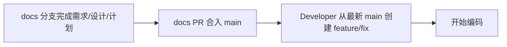

# Health Platform 研发流程与角色分工 PPT 规范

> 目的：给新员工快速理解“从需求到上线”的研发流程、角色分工、分支策略和交付标准。
> 使用方式：可直接作为 PPT 制作大纲，也可作为培训讲义底稿。

## 1. PPT 设计建议

- 页面比例：16:9
- 语言：中文
- 风格：简洁、流程化、少文字、多图表
- 颜色建议：
  - 主色：深蓝或蓝绿
  - 强调色：橙色或浅绿色
  - 风险/阻塞：红色
  - 完成/通过：绿色
- 字体建议：
  - 标题：黑体 / 思源黑体 Bold
  - 正文：思源黑体 / 微软雅黑
- 图表建议：
  - 流程图：Mermaid 或 PPT SmartArt 风格
  - 角色分工：表格 + 泳道图
  - 分支策略：Git Graph 或简单时间线

## 2. 受众与目标

- 受众：新入职研发、测试、产品、技术管理、项目协作人员
- 目标：
  - 了解研发流程的全貌
  - 理解各角色的职责边界
  - 知道文档、Issue、分支、PR 的关系
  - 能按规范快速开始协作

## 3. 建议页数

- 建议 12 到 15 页
- 培训时长：20 到 30 分钟
- Q&A：5 到 10 分钟

---

## Slide 1 封面

**标题：** Health Platform 研发流程与角色分工

**副标题：** 从需求到上线的协作规范

**页面内容：**
- 项目名称
- 培训对象
- 日期
- 版本号（可选）

**视觉建议：**
- 使用项目主色背景
- 加一个简洁的流程线图标

---

## Slide 2 为什么需要这套流程

**目标：** 说明为什么要有统一流程，而不是各自为战。

**页面内容：**
- 保证需求可追踪
- 保证 main 始终可部署
- 保证文档、代码、测试、发布能回链
- 降低多人协作中的沟通成本和返工

**建议图示：**
- 左侧：混乱协作的风险
- 右侧：标准流程带来的收益

---

## Slide 3 端到端总览

**目标：** 给出研发流程全景图。

**页面内容：**
- Product_Manager
- 需求审批
- System_Architect
- Tech_Lead_Planner
- Developer
- QA / Playwright
- Reviewer
- Release_Manager
- DevOps / CI/CD
- Staging / Production

**建议图示：**
- 一条从左到右的流程箭头图
- 可直接复用 Mermaid 流程图思路

**一句话总结：**
- 从“想法”到“上线”，每一步都有明确角色和产物。

---

## Slide 4 角色与职责总表

**目标：** 让新人快速知道“谁负责什么”。

**页面内容：**
| 角色 | 核心职责 | 主要产物 |
|---|---|---|
| Product_Manager | 澄清需求、定义价值、控制范围 | 需求文档、Issue |
| 需求审批 | 审核范围、风险、验收标准 | 评审结论、澄清问题 |
| System_Architect | 设计系统方案 | design 文档 |
| Tech_Lead_Planner | 拆任务、定阶段、定验证 | plan 文档 |
| Developer | 编码、测试、联调、提交 PR | 代码、测试、PR |
| QA / Playwright | 设计与维护 E2E | 测试计划、E2E 用例 |
| Reviewer | 代码审查 | Review 结论 |
| Release_Manager | 版本发布准备 | VERSION、CHANGELOG、Release Notes |
| DevOps / CI/CD | 构建、部署、回归 | 流水线、环境、报告 |

**视觉建议：**
- 表格右侧可放“责任边界”标签

---

## Slide 5 需求阶段：Product_Manager 做什么

**目标：** 讲清楚需求阶段的工作边界。

**页面内容：**
- 先确认问题是什么，再谈怎么做
- 创建或关联 GitHub Issue
- 输出需求文档 `req-*.md`
- 需求文档只讲 What / Why / 范围 / 验收
- 不讨论数据库、API 实现细节

**关键规范：**
- 需求阶段使用 `docs/<issue>-<slug>` 文档协作分支
- docs PR 只用 `Refs #<issue>`
- 不直接在 `main` 上写需求文档

**建议图示：**
- 需求澄清流程：问题 → Issue → 需求文档 → 审核

---

## Slide 6 需求审批：为什么要先审需求

**目标：** 让新人理解需求审批不是“走形式”，而是风险前移。

**页面内容：**
- 检查目标是否清楚
- 检查范围边界是否明确
- 检查验收标准是否可测试
- 检查风险、依赖、回滚是否有说明
- 阻塞项不通过，需退回修订

**建议图示：**
- 一个“通过 / 有条件通过 / 退回修订”的决策树

---

## Slide 7 架构设计与实施计划

**目标：** 讲清楚从需求到可执行任务的过渡。

**页面内容：**
- System_Architect 负责“怎么做”
- 输出 design 文档，说明后端、前端、测试影响
- Tech_Lead_Planner 将 design 拆成阶段和任务
- 计划文档要可执行、可验证、可排序

**建议图示：**
- 需求文档 → design 文档 → plan 文档
- 每一步都同步到同一个 Issue

**备注：**
- 设计与计划阶段仍在 `docs/<issue>-<slug>` 分支上完成
- docs PR 仍然只用 `Refs #<issue>`

---

## Slide 8 什么时候创建 Feature 分支

**目标：** 这是新员工最容易混淆的重点，必须单独一页。

**页面内容：**
- 不在需求刚开始时就创建 feature 分支
- 等需求、设计、计划批准后，再进入实现
- 统一从最新 `main` 创建 `feature/<scope>-<desc>` 或 `fix/<scope>-<desc>`
- 这样 feature 分支天然包含已批准文档

**建议图示：**

**一句话总结：**
- 文档先行，代码后跟。

---

## Slide 9 Developer 的完整闭环

**目标：** 让新人知道开发阶段的标准动作。

**页面内容：**
- 读取 plan
- 写测试，再写代码
- 本地验证
- 三终端模型：
  - Terminal 1：后端
  - Terminal 2：前端
  - Terminal 3：测试 / Git / 一次性命令
- 提交代码
- 创建 PR 到 `main`
- 合并后清理分支

**关键规范：**
- 使用 Conventional Commits
- PR 里写清背景、变更、测试证据、风险
- feature PR 只有在完全满足验收标准时才可用 `Closes/Fixes`

---

## Slide 10 PR 与 Issue 的关联规则

**目标：** 讲清楚 Issue 是主线，PR 是变更载体。

**页面内容：**
| PR 类型 | 推荐关联方式 | 是否关闭 Issue |
|---|---|---|
| docs PR | `Refs #123` | 否 |
| feature/fix PR | `Closes #123` / `Fixes #123` 或 `Refs #123` | 视情况 |
| release PR | `Refs #123` | 否 |
| follow-up PR | `Refs #123` | 否 |

**建议讲法：**
- 文档 PR 不关闭 Issue
- 只有真正完成验收的实现 PR 才关闭 Issue
- release PR 只是发布包装，不代表需求完成

---

## Slide 11 测试与质量门禁

**目标：** 让新人知道质量如何被卡住。

**页面内容：**
- 单元测试：Pytest
- UI 回归：Playwright E2E
- PR 校验：后端测试 + 前端 build
- 发布校验：版本文件、变更日志、发布说明
- 生产发布后自动回归

**建议图示：**
- 从开发到上线的质量闸门图

**一句话总结：**
- 每一层都有自己的验收点，任何一步不过都不能往下走。

---

## Slide 12 Staging 与 Production 发布

**目标：** 讲清楚合并到 main 后发生什么。

**页面内容：**
- 合并到 main 后自动部署 staging
- staging 上做 E2E 回归
- 发布前创建 release 分支并更新版本文件
- 使用 tag 触发生产发布
- 生产环境需要审批与回归

**建议图示：**
- main → staging → release tag → production

**要强调的点：**
- main 永远保持可部署
- 发布是 tag 驱动的
- 版本、CHANGELOG、Release Notes 必须一致

---

## Slide 13 分支策略总图

**目标：** 帮新人把分支类型和使用时机一次记住。

**页面内容：**
| 分支 | 用途 |
|---|---|
| `main` | 稳定主干 |
| `docs/<issue>-<slug>` | 需求/设计/计划协作 |
| `feature/<scope>-<desc>` | 新功能开发 |
| `fix/<scope>-<desc>` | 缺陷修复 |
| `release/<version>` | 发版准备 |
| `hotfix/<version>` | 紧急修复 |

**建议图示：**
- Git Graph 时间线
- 从 docs 到 feature 到 release 的完整路径

---

## Slide 14 新员工上手清单

**目标：** 给新人一个可执行的 onboarding checklist。

**页面内容：**
- 看懂当前流程图
- 知道 Issue、docs、feature、PR 的关系
- 知道每个角色的边界
- 会按三终端模型启动本地环境
- 知道 PR 必须写什么
- 知道什么时候可以关闭 Issue
- 知道上线前要看哪些门禁

**可做成勾选清单：**
- [ ] 已阅读流程总览
- [ ] 已理解角色分工
- [ ] 已理解 docs 分支和 feature 分支
- [ ] 已理解 Issue 关联规则
- [ ] 已理解本地验证方式
- [ ] 已理解 release 流程

---

## Slide 15 Q&A / 结束页

**标题：** Q&A

**副标题：** 现在可以开始参与一个真实项目了

**备注：**
- 结束页可加“下一步：跟着一个真实需求从 Issue 跑到 PR”

---

## 4. 可直接复用的补充素材

### 4.1 角色分工短句
- Product_Manager：定义问题和价值
- 需求审批：控制范围和风险
- System_Architect：定义系统如何做
- Tech_Lead_Planner：拆成能执行的任务
- Developer：实现并验证
- QA：补齐关键路径回归
- Reviewer：把关代码质量
- Release_Manager：把功能变成可发布版本
- DevOps / CI/CD：把发布流程自动化

### 4.2 一句话总纲
- 需求先行，Issue 贯穿，docs 先于 feature，feature 先于 release，质量门禁贯穿全程。

### 4.3 建议封面文案
- Health Platform 研发流程与角色分工
- 新员工入职快速上手指南
- 从需求到上线的完整协作路径

---

## 5. 备注

- 这份规范可以直接用于制作 PPT，也可以作为后续生成 PPTX 的底稿。
- 如果后续要正式生成 PPT 文件，建议在这份大纲基础上再做一次视觉主题统一和图表排版优化。
