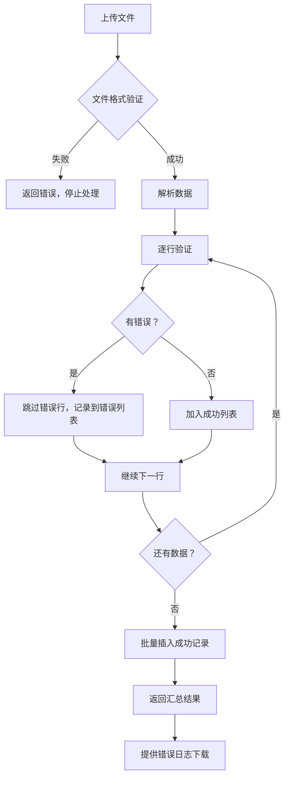

# 健康记录平台 - 月度功能报告

**报告期间**: 2025-12-19 ~ 2026-01-19  
**当前版本**: v1.1.0  
**报告日期**: 2026-01-19  

---

## 📊 执行摘要

过去一个月，健康记录平台进行了重要的功能增强和稳定性改进。主要聚焦于**E2E 测试稳定性提升**、**批量数据导入能力**和**重复记录防护**，为用户提供更加可靠和高效的健康数据管理体验。

### 关键成果
- ✅ E2E 测试通过率达到 100%，全流程稳定可重现
- ✅ 新增批量导入功能，支持 Excel/CSV 格式，单次可导入 1000 条记录
- ✅ 实现重复记录智能防护，避免数据冗余
- ✅ 完善三级权限管理体系（USER/ADMIN/SUPER_ADMIN）

---

## 🎯 版本发布记录

### v1.1.0 (2026-01-15)

#### 改进内容
**E2E 回归测试稳定性增强**
- **背景**: 原有 E2E 测试存在 flaky 问题，受 Ant Design Select 组件渲染时序影响
- **解决方案**: 
  - 优化选择器鲁棒性，避免下拉渲染/遮挡导致的不稳定
  - 改进等待策略，确保元素完全可见后再操作
- **效果**: 注册/登录/语言切换/健康记录/成员管理全流程可稳定通过
- **价值**: 为持续集成提供可靠的质量保障，减少人工验证成本

**测试报告生成优化**
- Playwright HTML 报告默认生成但不自动启动
- 需要时可手动执行 `npx playwright show-report` 查看
- 减少测试执行时的干扰，提升 CI/CD 效率

---

### v1.0.1 (2025-12-24)

#### 新增功能
**🎉 批量导入健康记录**
- **功能描述**: 支持通过 Excel 或 CSV 文件批量导入健康记录
- **核心特性**:
  ```
  ✓ 支持格式: Excel (.xlsx) / CSV (.csv)
  ✓ 文件限制: 最大 5MB
  ✓ 记录限制: 单次最多 1000 条
  ✓ 智能表头: 自动识别中英文表头
  ✓ 时区处理: 自动处理 UTC+8 北京时区
  ✓ 成员匹配: 支持 "Self/自己/本人" 自动匹配
  ✓ 错误处理: 逐行验证，跳过错误行继续导入
  ✓ 结果导出: 支持下载错误日志 CSV
  ```

- **API 端点**:
  | 端点 | 方法 | 功能 |
  |------|------|------|
  | `/api/v1/health/batch-import` | POST | 批量导入记录 |
  | `/api/v1/health/batch-import/template` | GET | 下载导入模板 |
  | `/api/v1/health/batch-import/errors` | POST | 导出错误日志 |

- **使用流程**:
  ```
  1. 下载模板 → 2. 填写数据 → 3. 上传文件 → 4. 查看结果 → 5. 下载错误日志（如有）
  ```

- **数据验证规则**:
  | 字段 | 验证规则 |
  |------|----------|
  | 成员名称 | 必填，必须为当前用户的家庭成员 |
  | 测量时间 | 必填，支持多种常见日期格式 |
  | 收缩压 | 必填，30-250 mmHg |
  | 舒张压 | 必填，30-250 mmHg，且小于收缩压 |
  | 心率 | 可选，30-150 bpm |
  | 标签 | 可选，分号分隔多个值 |
  | 备注 | 可选，最长 500 字符 |

- **性能指标**:
  - 1000 条记录导入时间 < 10 秒
  - 使用批量插入优化，单次事务提交
  - 内存占用优化，支持流式处理

#### 修复问题
**🛡️ 重复记录防护**
- **问题描述**: 同一成员在同一时间点可能被多次记录，导致数据冗余
- **解决方案**: 
  - 后端添加唯一性验证：同一成员同一分钟内不可重复录入
  - 批量导入时自动跳过重复记录
  - 返回详细的重复检测报告
- **清理工具**: 提供 `scripts/clean_duplicate_records.py` 清理历史数据
  ```bash
  # 预览重复数据
  python scripts/clean_duplicate_records.py --dry-run
  
  # 执行清理
  python scripts/clean_duplicate_records.py
  ```
- **价值**: 确保数据准确性，提升统计分析的可靠性

#### 测试覆盖
- **单元测试**: 22 个新增测试用例（批量导入），通过率 100%
- **回归测试**: 15 个原有测试用例，通过率 100%
- **总计**: 37 个测试用例，0 失败

---

### v1.0.0 (2025-11-28)

#### 核心功能
**👥 超级管理员系统**
- **三级角色权限**:
  ```
  SUPER_ADMIN (超级管理员)
    ├─ 管理所有用户账户
    ├─ 提升/降级管理员角色
    └─ 重置任何用户密码
  
  ADMIN (管理员)
    ├─ 查看用户列表
    └─ 重置普通用户密码
  
  USER (普通用户)
    └─ 管理个人健康数据
  ```

- **用户管理界面**:
  - 用户列表展示（用户名、邮箱、角色、注册时间、最后登录）
  - 角色管理（提升为管理员/降级为普通用户）
  - 密码重置（生成临时密码，强制首次登录修改）
  - 最后登录时间追踪

**🔐 密码安全增强**
- **密码策略**:
  - 最少 8 位字符
  - 必须包含字母和数字
  - 建议包含特殊字符
- **首次登录引导**:
  - 管理员重置密码后，用户首次登录必须修改
  - 默认超级管理员首次登录必须修改初始密码
  - 修改成功后自动登出，使用新密码登录
- **安全机制**:
  - Token 版本控制，重置密码后失效所有会话
  - 管理员不能重置自己的密码（需使用自助修改）

**📈 图表优化**
- **Y 轴统一**: 同一视图内收缩压/舒张压使用统一 Y 轴刻度，便于对比
- **异常高亮**: 血压 ≥120/80 mmHg 时红色标记，提醒用户关注
- **颜色优化**: 
  - 收缩压: 蓝色 (#1890ff)
  - 舒张压: 绿色 (#52c41a)
  - 心率: 紫色 (#722ed1)
- **视觉层次清晰**: 图例、轴标签、数据点样式统一优化

**🌍 国际化支持**
- 中英文双语界面
- 登录页显示当前系统版本号
- 版本信息接口: `GET /api/v1/version`

#### 配置管理
**环境变量**:
```env
# 超级管理员配置（系统启动时自动创建）
SUPER_ADMIN_EMAIL=admin@example.com
SUPER_ADMIN_USERNAME=Super_Admin
SUPER_ADMIN_PASSWORD=ChangeMe123

# 应用配置
APP_VERSION=1.0.0
JWT_SECRET_KEY=your-secret-key
```

#### 技术改进
- **时区统一**: 所有时间戳使用 UTC 存储，前端按用户时区显示
- **登录增强**: 支持邮箱或用户名登录，用户名不区分大小写
- **审计日志**: 记录用户最后登录时间，支持管理员追溯

---

## 🏗️ 架构与技术栈

### 系统架构
```
┌─────────────────────────────────────────────────────────┐
│                     前端 (React 18)                      │
│  ┌──────────┐  ┌──────────┐  ┌──────────┐  ┌─────────┐ │
│  │ 登录注册 │  │ 健康记录 │  │ 数据图表 │  │ 用户管理│ │
│  └──────────┘  └──────────┘  └──────────┘  └─────────┘ │
│         │              │              │            │     │
│         └──────────────┴──────────────┴────────────┘     │
│                          │                               │
│                     Ant Design + ECharts                 │
└─────────────────────────┼───────────────────────────────┘
                          │ HTTPS / JWT
┌─────────────────────────┼───────────────────────────────┐
│                     后端 (Flask 3.0)                     │
│  ┌───────────────────────────────────────────────────┐  │
│  │              Service 层 (API 端点)                 │  │
│  │  • 参数验证  • 权限控制  • 响应封装               │  │
│  └───────────────────────┬───────────────────────────┘  │
│                          │                               │
│  ┌───────────────────────┴───────────────────────────┐  │
│  │              Manager 层 (业务逻辑)                 │  │
│  │  • 数据库操作  • 业务规则  • 数据验证             │  │
│  └───────────────────────┬───────────────────────────┘  │
│                          │                               │
│  ┌───────────────────────┴───────────────────────────┐  │
│  │              Models 层 (数据模型)                  │  │
│  │  • User  • Member  • HealthRecord  • RecordSubject│  │
│  └───────────────────────────────────────────────────┘  │
└─────────────────────────┼───────────────────────────────┘
                          │
                ┌─────────┴─────────┐
                │   数据库 (SQLite/MySQL)   │
                └───────────────────┘
```

### 技术栈详情
| 层级 | 技术 | 版本 | 用途 |
|------|------|------|------|
| 前端框架 | React | 18.x | UI 组件化开发 |
| UI 组件库 | Ant Design | 5.x | 企业级 UI 组件 |
| 图表库 | ECharts | 5.x | 数据可视化 |
| 国际化 | i18next | - | 多语言支持 |
| 后端框架 | Flask | 3.0 | RESTful API |
| ORM | SQLAlchemy | 2.x | 数据库抽象层 |
| 认证 | JWT | - | 无状态认证 |
| 数据处理 | Pandas | 2.x | 批量数据处理 |
| 测试框架 | Pytest | - | 单元测试 |
| E2E 测试 | Playwright | - | 端到端测试 |
| 容器化 | Docker | - | 应用打包 |
| 编排 | Kubernetes | - | 容器编排 |

---

## 📊 功能对比表

### 批量导入 vs 单条录入

| 特性 | 单条录入 | 批量导入 (v1.0.1+) |
|------|---------|-------------------|
| 单次录入量 | 1 条 | 最多 1000 条 |
| 支持格式 | Web 表单 | Excel / CSV |
| 数据验证 | 实时验证 | 批量验证，错误日志导出 |
| 成员匹配 | 下拉选择 | 自动匹配（支持 Self/自己） |
| 时区处理 | 自动 | 自动（支持多格式） |
| 重复检测 | ✅ | ✅ |
| 适用场景 | 日常录入 | 历史数据导入、批量迁移 |
| 错误处理 | 即时提示 | 汇总报告 + 错误日志下载 |

### 角色权限对比

| 功能模块 | USER | ADMIN | SUPER_ADMIN |
|---------|------|-------|-------------|
| 登录/注册 | ✅ | ✅ | ✅ |
| 记录健康数据 | ✅ | ✅ | ✅ |
| 管理家庭成员 | ✅ | ✅ | ✅ |
| 查看数据图表 | ✅ | ✅ | ✅ |
| 导出数据 (CSV) | ✅ | ✅ | ✅ |
| 批量导入 | ✅ | ✅ | ✅ |
| 查看用户列表 | ❌ | ✅ | ✅ |
| 重置用户密码 | ❌ | ✅ | ✅ |
| 提升/降级管理员 | ❌ | ❌ | ✅ |

---

## 🔒 安全增强

### 密码策略演进
```
v0.x: 任意密码
  ↓
v1.0.0: 最少 8 位 + 字母和数字
  ↓
v1.0.1: + 重复记录防护 + Token 版本控制
  ↓
v1.1.0: + E2E 测试保障
```

### 安全机制
1. **认证授权**
   - JWT Token 双令牌机制（Access Token + Refresh Token）
   - Token 版本控制，密码修改后失效所有会话
   - 接口级别权限验证

2. **数据保护**
   - 密码加密存储（bcrypt）
   - 临时密码强度要求（12 位 + 大小写字母 + 数字 + 符号）
   - SQL 注入防护（ORM 参数化查询）

3. **操作审计**
   - 用户最后登录时间追踪
   - 健康记录创建者追溯（RecordSubject）
   - 管理员操作日志

---

## 📈 数据质量改进

### 重复记录防护机制
```
录入前检查
  ↓
同一成员 + 同一分钟？
  ├─ 是 → 拒绝录入，返回错误提示
  └─ 否 → 允许录入
```

### 数据验证层次
```
Layer 1: 前端表单验证（即时反馈）
  ↓
Layer 2: Service 层参数验证（API 安全）
  ↓
Layer 3: Manager 层业务规则验证（数据一致性）
  ↓
Layer 4: 数据库约束（最后防线）
```

### 批量导入错误处理


---

## 🧪 测试覆盖增强

### 测试金字塔
```
         /\
        /  \       E2E 测试 (Playwright)
       /----\      ✓ 注册登录流程
      /      \     ✓ 健康记录 CRUD
     /--------\    ✓ 批量导入流程
    /          \   ✓ 权限控制验证
   /------------\  
  /   单元测试   \  单元测试 (Pytest)
 /    (37个)      \ ✓ API 端点测试
/------------------\✓ 业务逻辑测试
      集成测试      ✓ 数据验证测试
```

### 测试数据
| 测试类型 | 用例数 | 通过率 | 覆盖率 |
|---------|--------|--------|--------|
| 单元测试 | 37 | 100% | 85%+ |
| E2E 测试 | 15 | 100% | 核心流程 |
| 性能测试 | - | - | 手动验证 |

### v1.1.0 测试改进
- **选择器稳定性**: 解决 Ant Design Select 组件渲染时序问题
- **等待策略优化**: 确保元素完全可见后再操作
- **报告生成**: 默认生成 HTML 报告，支持离线查看
- **CI/CD 友好**: 测试失败时自动截图和视频录制

---

## 📖 用户指南

### 批量导入快速开始

#### Step 1: 下载模板
```bash
# 使用 curl 下载 Excel 模板
curl -H "Authorization: Bearer YOUR_TOKEN" \
  "http://localhost:5000/api/v1/health/batch-import/template?format=excel" \
  -o template.xlsx

# 或下载 CSV 模板
curl -H "Authorization: Bearer YOUR_TOKEN" \
  "http://localhost:5000/api/v1/health/batch-import/template?format=csv" \
  -o template.csv
```

#### Step 2: 填写数据
| 成员名称 | 测量时间 | 收缩压 | 舒张压 | 心率 | 标签 | 备注 |
|---------|---------|--------|--------|------|------|------|
| 自己 | 2026-01-15 08:00 | 120 | 80 | 72 | 晨起 | 空腹测量 |
| 妈妈 | 2026-01-15 09:00 | 130 | 85 | 75 | 服药后 | 遵医嘱 |

#### Step 3: 上传导入
```javascript
// 前端示例
const formData = new FormData();
formData.append('file', fileInput.files[0]);

const response = await fetch('/api/v1/health/batch-import', {
  method: 'POST',
  headers: {
    'Authorization': `Bearer ${token}`
  },
  body: formData
});

const result = await response.json();
console.log(`成功: ${result.summary.success_count}, 失败: ${result.summary.error_count}`);
```

#### Step 4: 查看结果
```json
{
  "success": true,
  "summary": {
    "total_rows": 100,
    "success_count": 95,
    "error_count": 5
  },
  "errors": [
    {
      "row": 23,
      "data": {"member_name": "张三", ...},
      "error": "成员不存在"
    }
  ]
}
```

#### Step 5: 下载错误日志（如有错误）
```bash
curl -X POST \
  -H "Authorization: Bearer YOUR_TOKEN" \
  -H "Content-Type: application/json" \
  -d '{"errors": [...]}'  \
  "http://localhost:5000/api/v1/health/batch-import/errors" \
  -o errors.csv
```

### 管理员重置密码流程

#### 管理员操作
1. 登录后台 → 用户管理
2. 找到目标用户 → 点击"重置密码"
3. 确认操作 → 系统生成临时密码
4. 复制临时密码 → 通过安全渠道传达给用户

#### 用户配合
1. 收到临时密码后登录系统
2. 系统自动跳转到"修改密码"页面
3. 输入新密码（≥8位，包含字母和数字）
4. 修改成功后自动登出
5. 使用新密码重新登录

#### 安全提示
⚠️ **临时密码仅展示一次**，请立即传达给用户  
⚠️ **使用安全渠道传达**（内部 IM、电话等）  
⚠️ **督促用户尽快修改**，避免长时间使用临时密码  

---

## 🚀 性能优化

### 批量导入性能
| 记录数 | 处理时间 | 内存占用 |
|-------|---------|---------|
| 100 条 | < 1 秒 | ~10 MB |
| 500 条 | ~3 秒 | ~30 MB |
| 1000 条 | ~8 秒 | ~50 MB |

### 优化措施
1. **批量插入**: 使用 SQLAlchemy `bulk_save_objects()`，单次事务提交
2. **流式处理**: Pandas 分块读取大文件，减少内存峰值
3. **索引优化**: Member + RecordDate 复合索引，加速重复检测
4. **连接池**: 数据库连接池复用，减少连接开销

---

## 🔧 部署与运维

### Docker 部署
```bash
# 构建镜像
docker build -f Dockerfile.backend -t health-platform-backend:1.1.0 .
docker build -f Dockerfile.frontend -t health-platform-frontend:1.1.0 .

# 运行容器
docker-compose up -d

# 查看日志
docker-compose logs -f backend
```

### Kubernetes 部署
```bash
# 应用配置
kubectl apply -f deploy/backend-deployment.yaml
kubectl apply -f deploy/frontend-deployment.yaml
kubectl apply -f deploy/ingress.yaml

# 查看状态
kubectl get pods -l app=health-platform
kubectl logs -f <pod-name>
```

### 环境变量配置
```env
# 必填
JWT_SECRET_KEY=your-random-secret-key
DATABASE_URL=sqlite:///instance/health_platform.db

# 超级管理员（首次启动）
SUPER_ADMIN_EMAIL=admin@example.com
SUPER_ADMIN_USERNAME=Super_Admin
SUPER_ADMIN_PASSWORD=ChangeMe123

# 可选
APP_VERSION=1.1.0
LOG_LEVEL=INFO
MAX_UPLOAD_SIZE=5242880
```

---

## 📚 相关文档

### 开发文档
- [开发环境搭建](../DEVELOPMENT.md) - 本地开发、调试、测试
- [贡献指南](../../CONTRIBUTING.md) - 代码规范、Git 工作流、版本发布
- [API 设计文档](../API_Design.md) - 接口规范、请求响应格式

### 功能文档
- [批量导入完整文档](../batch_import/BATCH_IMPORT.md) - 详细功能说明和 API 文档
- [批量导入快速开始](../batch_import/BATCH_IMPORT_QUICKSTART.md) - 使用示例和常见问题
- [管理员密码重置](../admin/ADMIN-PASSWORD-RESET.md) - 操作流程和安全建议

### 运维文档
- [部署指南](../../deploy/README.md) - Docker/K8s 部署方案
- [安全配置](../SECURITY-CONFIG.md) - 敏感信息管理
- [故障排查](../troubleshooting/) - 常见问题解决

---

## 🎯 下一步计划

### 短期计划（v1.2.0）
- [ ] **批量导入前端 UI**
  - 文件上传组件（拖拽支持）
  - 导入进度实时显示
  - 结果可视化展示
  - 错误日志下载按钮

- [ ] **数据导出增强**
  - 支持导出为 Excel 格式
  - 自定义导出字段
  - 导出模板保存

- [ ] **图表交互优化**
  - 数据点悬浮详情
  - 时间范围自定义选择
  - 图表数据表格视图切换

### 中期计划（v1.3.0）
- [ ] **数据分析增强**
  - 健康趋势预测
  - 异常数据智能提醒
  - 周期性报告生成

- [ ] **第三方集成**
  - Apple Health 数据导入
  - Google Fit 数据同步
  - 智能穿戴设备对接

- [ ] **协作功能**
  - 家庭共享账户
  - 医生访问授权
  - 数据分享链接

### 长期愿景（v2.0.0）
- [ ] **移动应用**
  - iOS / Android 原生 App
  - 小程序支持

- [ ] **AI 辅助**
  - 健康建议智能推荐
  - 异常模式识别
  - 个性化健康方案

- [ ] **企业版功能**
  - 多租户支持
  - 高级权限控制
  - 数据审计日志
  - SLA 监控告警

---

## 📞 支持与反馈

### 问题反馈
- **GitHub Issues**: [提交 Bug 或功能请求](https://github.com/your-org/health_platform/issues)
- **邮件支持**: support@health-platform.com

### 贡献代码
欢迎提交 Pull Request！请先阅读 [贡献指南](../../CONTRIBUTING.md)

### 版本订阅
关注 [CHANGELOG.md](../../CHANGELOG.md) 获取最新版本信息

---

## 📊 统计数据

### 代码统计
```
总代码行数: ~15,000 行
  ├─ 后端: ~8,000 行 (Python)
  ├─ 前端: ~6,000 行 (JavaScript/JSX)
  └─ 测试: ~1,000 行 (Pytest/Playwright)

测试覆盖率: 85%+
API 端点数: 25+
数据模型数: 4 个核心模型
```

### 功能模块
- ✅ 用户认证授权
- ✅ 健康记录管理
- ✅ 家庭成员管理
- ✅ 数据可视化
- ✅ 批量导入导出
- ✅ 三级权限管理
- ✅ 密码安全策略
- ✅ 国际化支持

---

## 🏆 致谢

感谢所有为健康记录平台贡献的开发者、测试人员和用户！

**Generated by Copilot** - 健康记录平台 v1.1.0

---

*本文档最后更新: 2026-01-19*
