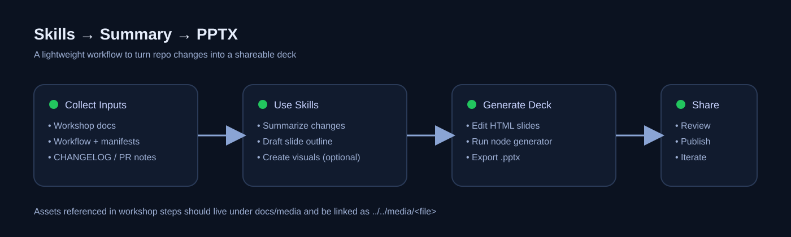

# 健康记录平台 - 全量功能清单与近期变化报告

**报告日期**: 2026-01-23  
**当前系统版本**: v1.1.0  
**范围说明**: 本报告覆盖 2026-01-08 ~ 2026-01-23 的主要变更，并给出截至 v1.1.0 的全量功能清单（面向业务/产品视角）。

---

## 1. 执行摘要（业务视角）

过去一段时间，平台的投入重点集中在三类价值：

1) **数据录入效率提升**：引入“健康记录批量导入（预览→提交）”能力，面向历史数据迁移、家庭成员多记录集中补录等场景，大幅减少手工录入成本。

2) **数据质量与可靠性增强**：完善重复记录防护、血压/心率/时间字段校验、导入错误报告下载，降低脏数据对趋势分析与决策的影响。

3) **交付稳定性提升**：E2E 回归测试“可稳定跑通”并沉淀为自动化工作流与报告资产，降低发版风险，提升持续交付效率。

---

## 2. 最近变更总结（从功能/业务影响出发）

### 2.1 功能发生变化的模块

| 模块 | 变化点 | 业务价值 |
|---|---|---|
| 批量导入（健康记录） | 增加 preview/commit 分段导入，支持未知成员处理、模板下载、导入报告下载 | 降低迁移成本；导入可控（先看再提交）；失败可追溯 |
| 健康记录（录入/查询/导出） | 更严格的血压/心率校验；重复记录防护；按成员过滤；标签过滤 OR 语义；CSV 导出 BOM + RFC5987 文件名 | 提升数据准确性；提升可用性（筛选/导出体验更一致） |
| 成员管理 | "Self/自己" 保护（不可编辑/删除）；Self 信息与用户 Profile 同步（如身高等） | 防止误操作破坏主档；更贴合家庭健康管理 |
| 质量体系（E2E/CI） | E2E 回归测试稳定性改进、报告生成与查看方式优化、CI 工作流健壮性修正 | 交付更稳定；减少 flaky；提升回归效率 |
| 报告资产沉淀 | 增加月报/周报 PPT 与素材生成脚本与 HTML slides | 便于对外/对内汇报，形成可复用展示资产 |

### 2.2 可视化材料（用于理解近期交付方向）

> 说明：以下图片来自仓库 `docs/media/`，用于展示近期对“流水线/自动化”方向的沉淀。

---

## 3. 当前全量功能清单（v1.1.0）

### 3.1 用户侧（普通用户/家庭使用）

**A. 账号与登录**
- 注册：用户名/邮箱/密码（密码强度校验：≥8位且含字母+数字）
- 登录：支持邮箱或用户名（用户名不区分大小写）
- Token：Access + Refresh；支持登出/登出全部会话
- 首次/重置密码：强制改密拦截（改密后发新 token）

**B. 个人信息（Profile）**
- 获取/更新个人档案：年龄、性别、体重
- 身高：以默认 Self 成员字段承载（Profile 更新时同步到 Self）

**C. 家庭成员管理**
- 成员列表、创建成员、更新成员、删除成员（软删除）
- **Self/自己 成员保护**：不可编辑/删除；用于承载个人默认记录

**D. 健康记录管理（血压/心率/标签/备注）**
- 新增记录：血压必填；心率可选；时间可传（默认当前 UTC 时间）
- 编辑记录：支持更新血压/心率/标签/备注/时间（含重复检测）
- 删除记录
- 列表查询：分页 `page + size`；支持日期区间 `date_from/date_to`
- 标签过滤：精确匹配 + OR 语义（tags=逗号分隔）
- 按成员筛选：`subject_member_id`；对历史数据做 Self 回填映射

**E. 导出**
- 健康记录导出 CSV：UTF-8 BOM；`Content-Disposition` 支持 RFC5987 `filename*`（适配中文文件名）

**F. 批量导入（健康记录）**
- 模板下载：CSV / Excel（Excel 依赖 `openpyxl`，不可用时可回退 CSV）
- 导入预览（Preview）：解析文件 + 表头映射 + 逐行校验 + 生成 session
- 未知成员处理：可“新建成员”或映射到已有成员
- 导入提交（Commit）：按 session 写入；跳过重复/非法行并生成结果汇总
- 导入报告：可下载错误/跳过行报告 CSV

---

### 3.2 管理侧（ADMIN/SUPER_ADMIN）

**A. 用户管理（Admin Portal / API）**
- 用户列表：用户名、邮箱、角色、注册时间、最后登录时间
- 密码重置：生成强临时密码；强制用户下次登录改密；并使旧会话失效
- 角色管理：SUPER_ADMIN 可提升/降级 ADMIN（禁止修改 SUPER_ADMIN）

**B. 系统版本**
- 版本接口：`GET /api/v1/version`（登录页等可展示版本号）

---

### 3.3 平台工程能力（研发/交付/运维）

- 后端：Flask 3 + SQLAlchemy；分层架构 Client → Service → Manager → Models
- 数据库：开发默认 SQLite；支持外部 DB（含可选 TLS、连接池健壮性）
- CLI：`flask db-info` / `flask db-create`
- Docker / K8s：仓库内提供部署脚本与配置模板
- 自动化测试：Pytest 单元测试；Playwright E2E 回归（中文 UI 主路径）
- 报告：沉淀 PPT/HTML slides 生成脚本与模板，用于周报/月报/专项报告

---

## 4. 关键业务规则与一致性约束（摘要）

- **Self 成员保护**：后端识别 "Self" 与 "自己"，不可编辑/删除
- **分页参数**：统一使用 `page` + `size`
- **血压校验**：30-250 mmHg，且收缩压 > 舒张压
- **心率校验**：可选，30-150 bpm
- **Tag 过滤**：精确匹配 + OR 语义
- **时间处理**：统一使用 `datetime.now(UTC)`（避免 `utcnow()`）
- **CSV 导出**：UTF-8 BOM + RFC5987 `filename*`

---

## 5. 建议的下一步（面向业务增量）

- 批量导入体验增强：导入模板个性化、错误定位到原始单元格、导入后对账统计
- 数据分析与趋势：按成员/标签的趋势对比、异常提醒、周/月报自动生成
- 协作与共享：家庭共享、医生授权、数据分享链接

---

**Generated by Copilot (GPT-5.2)**
