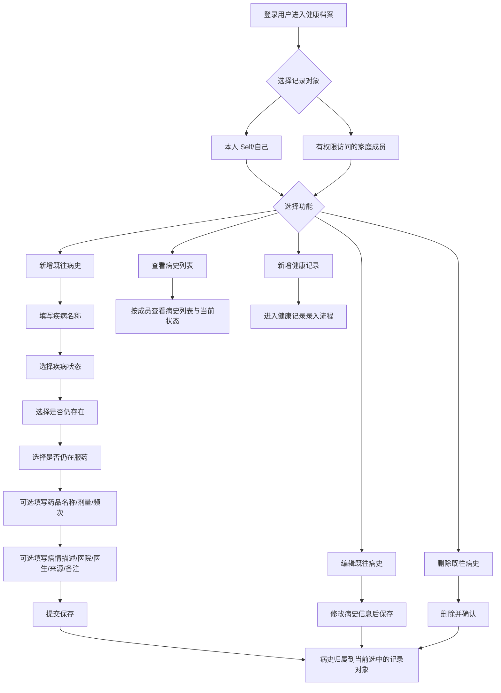

# Requirement: 家庭成员既往病史管理增强版

> 状态：Draft（已与需求方确认关键业务边界）
>
> 追踪：待绑定新的 GitHub Issue；保留历史 Issue #9 作为“仅本人既往病史管理”范围记录

## 1. 背景与价值
- **用户故事**：作为家庭健康平台用户，我希望可以为自己以及我有权限访问的家庭成员维护既往病史，并记录疾病当前状态和用药情况，这样我可以形成更完整的家庭健康档案。
- **业务价值**：
  - 平台从“健康指标记录”扩展为“家庭健康档案管理”。
  - 用户不仅能记录血压、心率等动态指标，也能沉淀长期疾病、治疗状态与恢复情况。
  - 为后续随访提醒、慢病管理、就诊资料整理和家庭健康分析提供基础数据。

## 2. 范围与边界

### 2.1 本期范围（In-Scope）
- 支持当前登录用户为以下对象维护既往病史：
  - 自己
  - 有权限访问的家庭成员
- 支持既往病史基础管理能力：
  - 新增
  - 列表查看
  - 详情查看
  - 编辑
  - 删除
- 支持在新增或编辑病史时明确选择记录对象。
- 支持记录疾病当前状态。
- 支持记录该疾病当前是否仍存在。
- 支持记录该疾病当前是否仍在服药。
- 支持按需补充药品信息，但药品信息不是必填项。
- 支持默认成员 “Self/自己” 维护病史。
- 病史与健康记录在“记录对象选择逻辑”上保持一致。

### 2.2 不在本期（Out-of-Scope）
- AI 自动诊断或医疗建议
- 用药提醒、库存管理、服药打卡
- 病历、检查报告、影像附件上传
- ICD 等标准疾病编码体系
- 医院、医生、来源字段的强制采集
- 家庭成员之间复杂协作授权流

## 3. 角色与权限规则
- **操作人**：当前登录用户。
- **记录对象**：操作人本人，或操作人有权限访问的家庭成员。
- 当前登录用户可以为自己创建既往病史。
- 当前登录用户可以为其有权限访问的家庭成员创建既往病史。
- 当前登录用户可以为自己创建健康记录。
- 当前登录用户可以为其有权限访问的家庭成员创建健康记录。
- 默认成员 “Self/自己” 可以作为病史记录对象，也可以作为健康记录对象。
- 所有记录都必须明确归属于一个记录对象。
- 用户不能查看、编辑、删除自己无权访问成员的病史或健康记录。

## 4. 关键数据字段

### 4.1 必填字段
- 记录对象
- 疾病名称
- 疾病状态

### 4.2 高优先级字段
- 发现时间或确诊时间
- 是否仍存在
- 是否仍在服药

### 4.3 选填字段
- 病情描述
- 备注
- 药品名称
- 剂量
- 频次
- 确诊医院
- 医生
- 信息来源

### 4.4 疾病状态枚举
- 已痊愈
- 长期稳定
- 持续中
- 复发中
- 待诊断

### 4.5 字段语义说明
- **疾病状态**：用于表达疾病当前所处阶段。
- **是否仍存在**：用于表达该疾病当前是否依然存在。
- **是否仍在服药**：用于表达围绕该疾病的治疗行为是否还在持续。
- 以上三个维度可以并存，不能相互替代。

## 5. 关键业务规则
- 一条既往病史必须明确归属到一个记录对象。
- 疾病名称不能为空。
- 疾病状态必须从预设选项中选择。
- “是否仍存在”与“是否仍在服药”应采用明确布尔选择，不使用自由文本代替。
- 当用户填写药品信息时，药品名称、剂量、频次允许部分填写，不要求全部同时必填。
- 医院、医生、来源等扩展字段当前可录入，但不做强约束。
- 病史与健康记录应共享一致的“选择记录对象”交互逻辑，避免用户学习两套规则。

## 6. 业务流程

### 6.1 文字流程
1. 用户进入健康档案或健康记录入口。
2. 用户先选择记录对象：自己或有权限访问的家庭成员。
3. 用户选择要执行的操作：新增病史、查看病史、编辑病史、删除病史，或新增健康记录。
4. 若选择新增或编辑病史，则填写疾病名称、疾病状态、是否仍存在、是否仍在服药等信息。
5. 用户可选补充药品信息、病情描述、医院、医生、来源和备注。
6. 提交后，系统将数据保存到当前所选记录对象名下。
7. 列表和详情页按记录对象展示既往病史及状态信息。

### 6.2 Mermaid 流程图

### 6.3 角色能力矩阵
| 能力 | 当前登录用户本人 | 有权限访问的家庭成员 |
|---|---|---|
| 为该对象新增既往病史 | 支持 | 支持 |
| 查看该对象病史列表 | 支持 | 支持 |
| 编辑该对象病史 | 支持 | 支持 |
| 删除该对象病史 | 支持 | 支持 |
| 为该对象新增健康记录 | 支持 | 支持 |

说明：以上能力均以“当前登录用户对该记录对象有访问权限”为前提。

## 7. 验收标准（Acceptance Criteria）
- [ ] AC1：登录用户可以为自己新增一条既往病史。
- [ ] AC2：登录用户可以为有权限访问的家庭成员新增一条既往病史。
- [ ] AC3：创建病史时，用户必须明确选择记录对象。
- [ ] AC4：用户可以查看某个记录对象下的病史列表，并区分不同疾病状态。
- [ ] AC5：用户可以记录该疾病当前是否仍存在。
- [ ] AC6：用户可以记录该疾病当前是否仍在服药。
- [ ] AC7：用户可以选择性填写药品名称、剂量、频次，但这些字段不是必填。
- [ ] AC8：用户可以编辑和删除自己有权限访问范围内的病史记录。
- [ ] AC9：默认成员 “Self/自己” 可正常作为病史管理对象。
- [ ] AC10：用户不能访问、编辑或删除无权限成员的病史记录。
- [ ] AC11：病史与健康记录在成员选择逻辑上保持一致。
- [ ] AC12：界面中应清晰展示疾病状态、是否仍存在、是否仍在服药三个维度，避免混淆。

## 8. 非功能要求
- **权限隔离**：不能出现跨账号、跨无权限成员的数据越权。
- **易用性**：界面需清晰区分“疾病状态”和“是否仍存在”，避免用户混淆。
- **一致性**：病史与健康记录的成员选择体验应保持一致。
- **国际化**：中英文文案需完整补齐。
- **可扩展性**：应支持后续平滑扩展更多病史字段，而不破坏现有流程。

## 9. 后续可扩展方向
- 增加药物开始时间、停药时间
- 增加病史附件上传
- 增加结构化医院与医生信息
- 增加病史筛选、统计与趋势分析
- 增加慢病跟踪与提醒能力