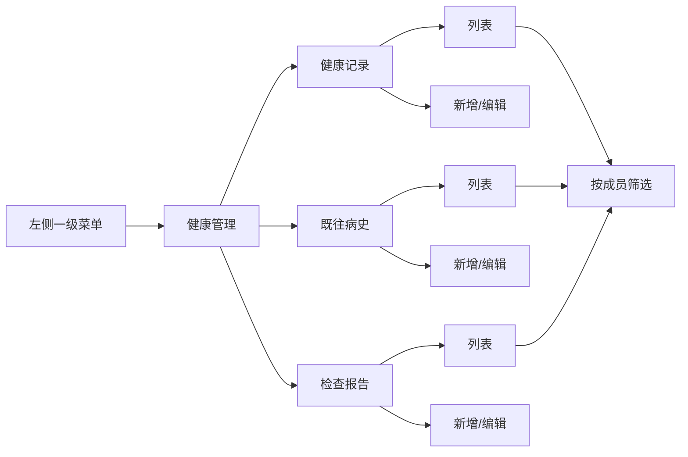

# Requirement: 健康管理入口重构与检查报告统一管理

> 状态：Draft
> GitHub Issue: #2 https://github.com/JumpStarGroup/health_platform/issues/2
> 说明：本需求用于统一承载健康记录、既往病史、检查报告三类健康资料，并重构左侧菜单入口。
> 关联：可作为 [req-family-member-medical-history.md](req-family-member-medical-history.md) 的上层入口需求。

## 1. 背景与价值
- **用户故事**：作为家庭健康平台用户，我希望在同一个健康管理入口下统一查看和维护健康记录、既往病史和检查报告，这样我可以更完整地管理家庭成员的健康资料，并在后续快速搜索、分析和回顾。
- **业务价值**：
  - 统一健康资料入口，降低用户在多个页面之间切换的认知成本。
  - 将检查报告从病史中独立出来，便于后续按时间、医院、项目、结论进行检索与统计。
  - 为后续报告分析、趋势分析、病史关联分析打下结构化基础。

## 2. 需求判断
- **不建议**：把检查报告直接塞进既往病史的明细里，作为病史内部子内容。
- **建议**：检查报告作为独立记录类型，与健康记录、既往病史并列管理。
- **原因**：
  - 一条病史可能对应多份报告，一份报告也可能关联多个病史。
  - 报告的检索维度更偏向时间、机构、项目、异常结果，而不是疾病本身。
  - 独立类型更利于后续搜索、筛选、分析和扩展。

## 3. 入口与导航方案

### 3.1 左侧菜单调整
- 一级菜单改为：**健康管理**
- 二级菜单建议为：
  - 健康记录
  - 既往病史
  - 检查报告

### 3.2 页面组织方式
- 进入“健康管理”后，用户先选择记录对象（自己或有权限访问的家庭成员）。
- 页面内按二级菜单切换不同记录类型。
- 原“新增记录”入口建议改名为更明确的动作，例如：
  - 新增健康记录
  - 新增既往病史
  - 新增检查报告

### 3.3 页面结构示意

## 4. 范围与边界

### 4.1 本期范围（In-Scope）
- 重构左侧菜单为“健康管理”二级菜单。
- 在健康管理页内支持三类记录的分组进入与切换。
- 新增检查报告独立记录类型。
- 保持“记录对象”逻辑一致，支持本人和有权限访问的家庭成员。
- 支持后续搜索、筛选、分析所需的基础字段设计。

### 4.2 不在本期（Out-of-Scope）
- AI 自动诊断或智能结论生成。
- 复杂医疗影像查看器。
- OCR 全自动抽取全部报告内容。
- 医院、科室、报告类型的标准化字典治理。
- 报告附件的多人协作审批流。

## 5. 检查报告的管理原则
- 检查报告应作为独立记录对象保存，不作为既往病史的从属字段。
- 检查报告可以后续关联一个或多个既往病史，但不要求创建时强绑定。
- 检查报告应优先支持“按成员、按时间、按医院、按类型、按关键词”检索。
- 检查报告应保留可用于分析的结构化字段，避免只保存纯文本。

## 6. 关键数据建议

### 6.1 检查报告建议字段
- 记录对象
- 报告标题 / 报告名称
- 检查时间
- 医院名称
- 科室
- 报告类型
- 检查结论
- 关键异常项
- 备注
- 报告来源
- 关联病史（可选）

### 6.2 搜索与分析优先字段
- 成员
- 时间范围
- 医院
- 科室
- 报告类型
- 结论关键词
- 异常标记

## 7. 业务规则
- 所有记录必须明确归属到一个成员。
- 健康记录、既往病史、检查报告三类数据的“记录对象选择逻辑”保持一致。
- 检查报告不能只以自由文本形式存在，至少应具备基础结构化字段。
- 如果未来要做报告与病史的关联，必须支持一对多或多对多思路，不能只按单一病史硬绑定。

## 8. 验收标准（Acceptance Criteria）
- [ ] AC1：左侧菜单中新增“健康管理”一级入口。
- [ ] AC2：健康管理下可看到“健康记录 / 既往病史 / 检查报告”三个二级菜单。
- [ ] AC3：用户可从同一入口进入三类记录的列表与新增页面。
- [ ] AC4：检查报告作为独立记录类型保存，不依附于既往病史。
- [ ] AC5：用户可按成员查看检查报告。
- [ ] AC6：用户可按时间、医院、类型等维度检索检查报告。
- [ ] AC7：检查报告支持后续与既往病史建立关联。
- [ ] AC8：健康记录、既往病史、检查报告在成员选择逻辑上保持一致。

## 9. 非功能要求
- **易用性**：入口命名要直观，避免“新增记录”这种过于泛化的文案。
- **可扩展性**：后续可在检查报告下扩展附件、标签、统计、分析能力。
- **一致性**：三类记录共享同一成员选择与权限规则。
- **可搜索性**：报告需保留足够结构化信息，便于筛选和分析。
- **国际化**：中英文文案预留扩展空间。

## 10. 建议的后续拆分
- 第一阶段：完成菜单重构与三类入口拆分。
- 第二阶段：上线检查报告基础录入与列表能力。
- 第三阶段：支持报告搜索、筛选与分析视图。
- 第四阶段：支持报告与病史的关联分析。
